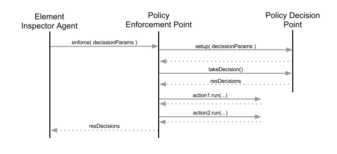
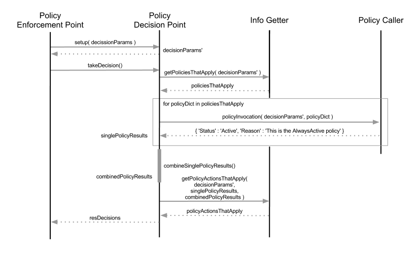

==========
Monitoring
==========

The monitoring part is the other half of RSS, and where most of the complexity lies.
This part handles the automatic status assessment for any Element registered on RSS.

-------------
State Machine
-------------

The state machine forces the transitions between valid states: Unknown, Active, Bad,
Probing, Banned and Error. In principle, the first and last states of the list should
not be visble. They are used to manage corner cases and crashes. The only restriction
is the following:

*any transition from Banned to Unknown, Active or Bad will be forced to go to Probing first*

The idea is that after a downtime, we check the health of the Element before setting
it as Active.

.. note :: The order in which statuses have been introduced is not trivial. Active is more restrictive that Unknown, which is less restrictive than Bad, and so on. This detail is crucial on `Policy Decision Point`_.

------------------------
Element Inspector Agents
------------------------

There is one InspectorAgent per family of elements: Site, Resource and Node. They run frequently
and get from the DB the elements that have not been checked recently. With other words, they
take elements following:

**LastCheckTime + lifetime( Status ) < now()**

where **LastCheckTime** is a timestamp column of the tables storing the element statuses and **lifetime( Status )**
corresponds to the next table. The healthier the element is, the less often is checked.

+----------+------------------+
| Status   | Lifetime ( min ) |
+==========+==================+
| Active   | 60               |
+----------+------------------+
| Degraded | 30               |
+----------+------------------+
| Probing  | 30               |
+----------+------------------+
| Banned   | 30               |
+----------+------------------+
| Unknown  | 15               |
+----------+------------------+
| Error    | 15               |
+----------+------------------+

When checked, it is passed as a dictionary that looks like the following to the Policy System. This dictionary is
the python representation of one row in the table.

.. _decisionParams:

.. code-block:: python

   decisionParams = {
                      'element'         : 'Resource',
                      'elementType'     : 'CE',
                      'name'            : 'some.ce',
                      'statusType'      : 'all',
                      'status'          : 'Active',
                      'reason'          : 'This is the AlwaysActive policy ###',
                      'dateEffective'   : datetime.datetime( ... ),
                      'lastCheckTime'   : datetime.datetime( ... ),
                      'tokenOwner'      : 'rs_svc',
                      'tokenExpiration' : datetime.datetime( ... )
                     }

-------------
Policy System
-------------

The Policy System is comprised by several modules ( listed by order of execution ).

  * Policy Enforcement Point ( PEP )
  * Policy Decision Point ( PDP )
  * Info Getter ( IG )
  * Policy Caller ( PC )

Policy Enforcement Point
========================

The Policy Enforcement Point is the main object, which will orchestrate the
status assessment and the actions taken. In order to do so, it will make use of the
Policy Decision Point to get the results of the policies run, and the actions
that must be taken. These are returned on a dictionary, *resDecisions* ( which will
be returned to the Element Inspector Agent as well ).

.. note :: running a policy does not trigger any update on the database. Are the **actions** which perform changes on the database, send alerts, etc.

Let's understand it with a sequence diagram:

Firstly, the Element Inspector Agent calls the PEP with a dictionary like the one shown above - :ref:`decisionParams <decisionParams>`.
The PEP will setup the PDP, which among other things will sanitize the input. Once done, the PDP will take a decision with the decision
parameters provided. Its reply is a dictionary consisting on three key-value pairs, that looks like the one below, :ref:`resDecisions <resDecisions>`.
Once resDecisions is known, the PEP runs the actions suggested by the PDP and exits.

.. _resDecisions:
.. code-block:: python

   resDecisions = {
                    'decissionParams'      : decisionParams,
                    'policyCombinedResult' : {
                                               'Status'       : 'Active',
                                               'Reason'       : 'A Policy that always returns Active ###',
                                               'PolicyAction' : [
                                                                 ( 'policyActionName1', 'policyActionType1' ),
                                                                 ]},
                    'singlePolicyResults'  : [ {
                                                 'Status' : 'Active',
                                                 'Reason' : 'blah',
                                                 'Policy' : {
                                                             'name'        : 'AlwaysActiveForResource',
                                                             'type'        : 'AlwaysActive',
                                                             'module'      : 'AlwaysActivePolicy',
                                                             'description' : 'A Policy that always returns Active'
                                                             'command'     : None,
                                                             'args'        : {}
                                                            }
                                                } ],
                   }

Complex ? Not really, just big ( can be quite ). What does it mean ? It has three keys:

* decissionParams : input dictionary received from the Element Inspector Agent.
* policyCombinedResult : dictionary with the computed result of the policies - **Status** and **Reason** - and a list of actions to be run - **PolicyAction**.
* singlePolicyResults : list with dictionaries, one per policy run. Explained on `Policy Caller`_

The PEP will iterate over the tuples in the PolicyAction value and executing the actions defined there.

.. _actions :

Actions
-------

DIRAC.RSS has the following actions:

* **EmailAction** : sends an email notification
* **SMSAction** : sends a sms notification ( not certified yet ).
* **LogStatusAction** : updates the <element>Status table with the new computed status
* **LogPolicyResultAction** : updates the PolicyResult table with the results of the policies in singlePolicyResults.

The last action should always run, otherwise there is no way to track what happened with the policies execution.
The others, depend on what we want to achieve. At the moment, there is no user case where LogStatusAction is not
run.

Policy Decision Point
=====================

The Policy Decision Point is the instance that will collect all results from the policies and decide what to do. However, it will not do anything,
that is the task of the PEP. You can see the PDP as a advisory service.

Its flow is depicted on the following sequence diagram:

Firstly it sanitizes the input parameters :ref:`decisionParams <decisionParams>` into :ref:`decisionParams' <decisionParams'>`

.. _decisionParams':
.. code-block:: python
   :emphasize-lines: 10,11,12,13

   # cannot name decisionParams' ( is not a valid python name ), decisionParams2 instead
   decisionParams2 = {
                      'element'         : decisionParams.get( 'element'    , None ),
                      'elementType'     : decisionParams.get( 'elementType', None ),
                      'name'            : decisionParams.get( 'name'       , None ),
                      'statusType'      : decisionParams.get( 'statusType' , None ),
                      'status'          : decisionParams.get( 'status'     , None ),
                      'reason'          : decisionParams.get( 'reason'     , None ),
                      'tokenOwner'      : decisionParams.get( 'tokenOwner' , None ),
                      #'dateEffective'   : datetime.datetime( ... ),
                      #'lastCheckTime'   : datetime.datetime( ... ),
                      #'tokenExpiration' : datetime.datetime( ... ),
                      'active'          : True
                     }

.. note:: the timestamps are not taken into account on decisionParams'. However, a new parameter is added *active*. Its meaning will be explained on `Info Getter`_.

which will be used internally by the PDP instead of the input dictionary. It contacts the Info Getter to find the policies that match the decission
parameters ( decisionParams' ). This means, decisionParams' is compared with all the policies metadata defined on the CS. Once PDP knows
which policies apply, it runs them, obtaining a list of dictionaries :ref:`singlePolicyResults <singlePolicyResults>`. Each dictionary contains the *Status* and *Reason*
proposed by a particular policy.

.. _singlePolicyResults:
.. code-block:: python

   singlePolicyResults = [ { 'Status' : 'Active', 'Reason' : 'reasonActive' }, { 'Status' : 'Bad', 'Reason' : 'reasonBad' }, { 'Status' : 'Bad', 'Reason' : 'reasonBad2' } ]

Knowing all the proposed statuses by the policies, they are sorted by status and picked the most restrictive ones ( as explained on `State Machine`_.
In this sense, the most restrictive status is Error ). As a result of the policies result computing, we have a dictionary :ref:`combinedPolicyResults <combinedPolicyResults>` with the most restrictive status
as **Status** and the concatenation of reasons paired with that *most restrictive status* separated by *###* as **Reason**.

.. _combinedPolicyResults:
.. code-block:: python

   combinedPolicyResults = { 'Status' : 'Bad', 'Reason' : 'reasonBad ### reasonBad2' }

More or less the same principle applies to get the actions that apply. The only difference is that the single policy results are taken
into account ( perhaps, no matter what we want to send an alert based on a policy ), as well as the combined results ( actions triggered
based on the proposed final result ). Once the PDP has a list of action tuples ( actionName, actionType ), builds the :ref:`resDecisions <resDecisions>`
dictionary and returns it to the PEP.

.. _info getter :

Info Getter
===========

Info getter is the piece of code that decides which policies and actions match. It reads from the CS ( /Operation/ResourceStatus/Policies ) and
gets a dictionary per policy defined there. The matching algorithm works as follows:

.. code-block:: python

   for key in decisionParams:

     # first case
     if not key in policyParams:
       # if the policy has not defined the parameter `key`, it is ignored for the matching
       continue

     # second case
     if decisionParams[ key ] is None:
       # None is assumed to be a wildcard (*)
       continue

     # Convert to list before intersection ( the algorithm is slightly different at this
     # point, but does not really matter in the InfoGetter explanation ).
     dParameter = [ decisionParams[ key ] ]

     # third case
     # At this point, we know that `key` is a parameter in decisionParams and policyParams.
     # if dParameter is not included in the list policyParams[ 'key' ], we have a False
     # match.
     if not set( dParameter ).intersection( set( policyParams[ key ] ) ):
       return False

   return True

Or with other words:
  * a policy with empty definition in the CS, will match any resource ( first case ).
  * a decisioniParams dictionary with values None, will match any policy ( second case ). However, this will never happen if called from ElementInspectorAgent. It is enforced to not have None values.
  * otherwise, we are on third case.

Do not forget about the Active parameter forced on the PDP ! It is very handy if we want to disable a policy on the CS completely without having to delete it. We just need to set active = False. As active
is set by default as True in the PDP, we will have a False match.

For the actions, same principle applies. The difference are the input and reference dictionaries. In this case, for every action we compare all dictionaries in singlePolicyResults, plus combinedPolicyResult
plus decisionParams. This allows us to triger actions based on the global result, on a particular policy result, on a kind of element, etc..

Policy Caller
=============

Given a :ref:`policyDict <policyDict>`, the Policy Caller imports the policy <Extensions>DIRAC.ResourceStatusSystem.Policy.<policyDict[ 'module' ]> and run it. In case there is a command specified,
it will be run using policyDict[ 'args' ] and :ref:`decisionParams' <decisionParams'>` as inputs.

.. _policyDict:
.. code-block:: python

   policyDict = {
                  'name'        : 'AlwaysActiveResource',
                  'type'        : 'AlwaysActive',
                  'args'        : None,
                  'description' : 'This is the AlwaysActive policy',
                  'module'      : 'AlwaysActivePolicy',
                  'command'     : None
                 }

Policy
======

A Policy is a simple piece of code which returns a dictionary like:

.. code-block:: python

   policyRes = { 'Status' : 'Active', 'Reason' : 'This is the AlwaysActive policy' }

If defined, it evaluates a command firstly, which will fetch information from the database cache of fresh from the source of information. To change
the behavior, add to :ref:`policyDict <policyDict>` the key-value pair ( this is done on the code: DIRAC.ResourceStatusSystem.Policy.Configurations ).

* 'args' : { 'onlyCache' : True }

Command
=======

Commands are the pieces of code in charge of getting the information from different information sources or caches in bulk queries, getting it individually
and storing it.

Commands are used with two purposes:

* Request with bulk queries the information to fill the cache tables ( commands issued by an agent called CacheFeederAgent ). This is the **master mode**.
* Provide policies with the information concerning the element they are evaluating.

Their basic usage is:

.. code-block:: python

   argsDict = { .. }
   # this command will query XYZ cache in RSS to get information about a particular element,
   # if there is nothing, it will query the original source of information
   CommandXYZ( argsDict ).doCommand()

   # this command will ONLY query XYZ cache about a particular element. This is the suggested
   # operation mode for policies to avoid hammering sources of information
   argsDict[ 'onlyCache' ] = True
   CommandXYZ( argsDict ).doCommand()

   # However, if we want to fill the caches, we use the master mode of the Command.
   # It will get the information and store it where it belongs
   c = CommandXYZ()
   c.masterMode = True
   c.doCommand()

------------
Ownership II
------------

So far, so good. But what if we want to take the control out from RSS for a given element. This is done making use of the token ownership. By
default, every element belongs to RSS ( token rs_svc ). However, we can request the token for a set of elements ( by default, it is one day ).
During that period, RSS will not apply any policy on them. If by the end of the 24 hours the owner of the token has not extended its duration,
RSS will gain again control of the element.
