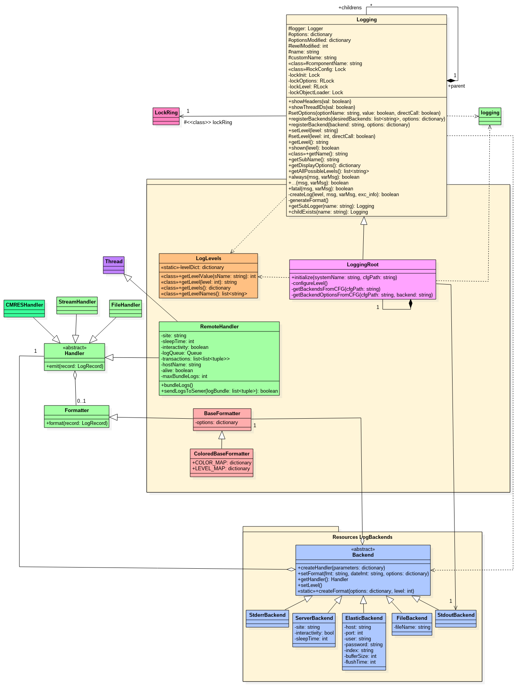

.. _gLogger_gLoggerDevelopment:

gLogger Development
===================

Here is the *gLogger* documentation for developer briefly presenting the
different components of the logging system and their locations.

The logging system package
--------------------------

The source code is contained in the
*FrameworkSystem/private/standardLogging* package. There, we can find
the *Logging*, *LoggingRoot* and *LogLevels* classes and the *Handler* and *Formatter* packages.
We can also find the *Backend* package that use the *Handler* and *Formatter* package in *Resources/LogBackends*.

*Logging*
~~~~~~~~~

*Logging* is a wrapper of the logger object from the standard *logging*
library which integrates some *DIRAC* concepts. It is the equivalent to
the *Logger* class in the old logging system.

It is used like an interface to use the logger object of the *logging*
library. Its purpose is to replace transparently the old *gLogger*
object in the existing code in order to minimize the changes.

*LoggingRoot*
~~~~~~~~~~~~~

*LoggingRoot* inherits from *Logging*. It is specific because it is the
first parent of the chain. In this context, it has more possibilities
because it is the one and the only that can initialize the root logger
of the standard *logging* library and it can configure it with the configuration
thanks to the *initialize* method.

*LogLevels*
~~~~~~~~~~~

*LogLevels* is used to integrate custom levels to the standard library.
Actually, it contains a class dictionary attribute named *levelDict*
containing all the level names and their associated integer values. Its
purpose is to make string-integer level conversion.

*LogBackend* package
~~~~~~~~~~~~~~~~~~~~

*Backend* objects are used to create an abstraction of the *Handler* and
*Formatter* concepts from the standard library. It is an equivalent of
the *Backend* concept of the old *gLogger*. All the existing *Backend*
objects are located in this package which currently contains:

-  ’stdout’: StdoutBackend

-  ’stderr’: StderrBackend

-  ’file’: FileBackend

-  ’server’: ServerBackend

In order to create custom *Backend* objects, we just
have to make a new class named *[Backendname]Backend* in
this package inheriting from *AbstractBackend*.
For instance, the class name of the *stdout Backend* is *StdoutBackend*.
We may also need to override *setHandlerParameters*, to get the Backend parameters
and pass them to the handler.

Then, to use it, we just have to add its name in the configuration as usual.

*Handler* package
~~~~~~~~~~~~~~~~~

The *Handler* package contains all the custom *Handler* objects created
for a *DIRAC* use. All these *Handlers* must inherit from the standard
*logging.Handler*.

In order to create custom *Handler* objects, we just have to write a new class
in this package inheriting from one of the *Handler* of the *logging* library.

*Formatter* package
~~~~~~~~~~~~~~~~~~~

The *Formatter* package contains all the custom *Formatter* objects
create for *DIRAC* use. All these *Formatter* must inherit from the
standard *logging.Formatter*. The package currently contains:

-  BaseFormatter: used only to add some attributes in the constructor

-  ColorBaseFormatter: used to color the log records

In order to create custom *Formatter* objects, we just have to create a new class
in this package inheriting from *BaseFormatter*.

*gLogger* use
-------------

To be used in all the existing code, this logging system has to be
instantiated in the name of *gLogger*.

*gLogger* instantiation
~~~~~~~~~~~~~~~~~~~~~~~

*LoggingRoot* is instantiated in the name of *gLogger* in
*FrameworkSystem/Client/Logger*.

*gLogger* import
~~~~~~~~~~~~~~~~

To call *gLogger* with the simple *from DIRAC import gLogger*, we have
to put our variable in the *\_\_init\_\_* file of *DIRAC*.

*gLogger* and the *DIRAC* components
~~~~~~~~~~~~~~~~~~~~~~~~~~~~~~~~~~~~

Once instantied, *gLogger* can be configured thanks to its *initialize*
method. Some components like the services, agents and executors use it.
You can retrieve the method usage in the
*ConfigurationSystem/Client/LocalConfiguration* file in the *initLogger*
method used by the *dirac-service*, *dirac-agent* and *dirac-executor*
scripts.

The class diagram
-----------------

Here is a class diagram presenting the system logging:

