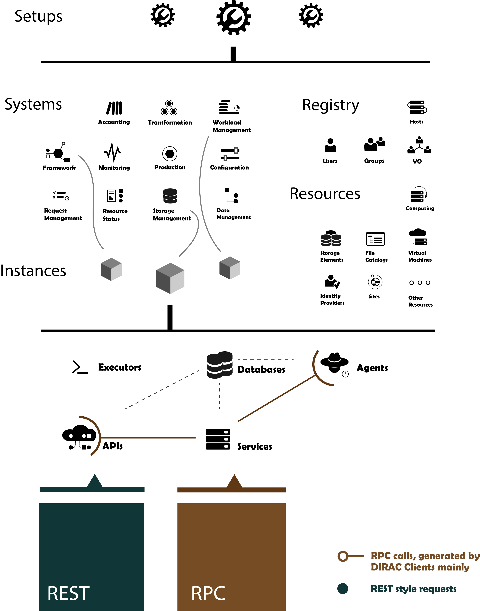

.. _dirac-setup-structure:

==========================================
DIRAC Setup Structure
==========================================

The basic DIRAC components are *Services*, *Agents*, and *Executors*.

  *Services*
    are passive components listening to incoming client requests and reacting accordingly by
    serving requested information from the *Database* backend or inserting requests on the
    *Database* backend. *Services* themselves can be clients of other *Services* from the same
    DIRAC *System* or from other *Systems*.

  *Agents*
    are active components, similar to cron jobs, which execution is invoked periodically.
    Agents are animating the whole system by executing actions, sending requests
    to the DIRAC or third party services.

  *Executors*
    are also active components, similar to consumers of a message queue system, which execution is invoked at request.
    Executors are used within the DIRAC Workload Management System.

These components are combined together to form *Systems*.
a *System* is delivering a complex functionality to the rest of DIRAC, providing a solution for a given class of tasks.
Examples of *Systems* are Workload Management System or Configuration System or Data Management System.

And then there are databases, which keep the persistent state of a *System*.
They are accessed by Services and Agents as a kind of shared memory.

To achieve a functional DIRAC installation, cooperation of different *Systems* is required.
A set of *Systems* provide a complete functionality to the end user.
Each *System* instance has a distinct name.

