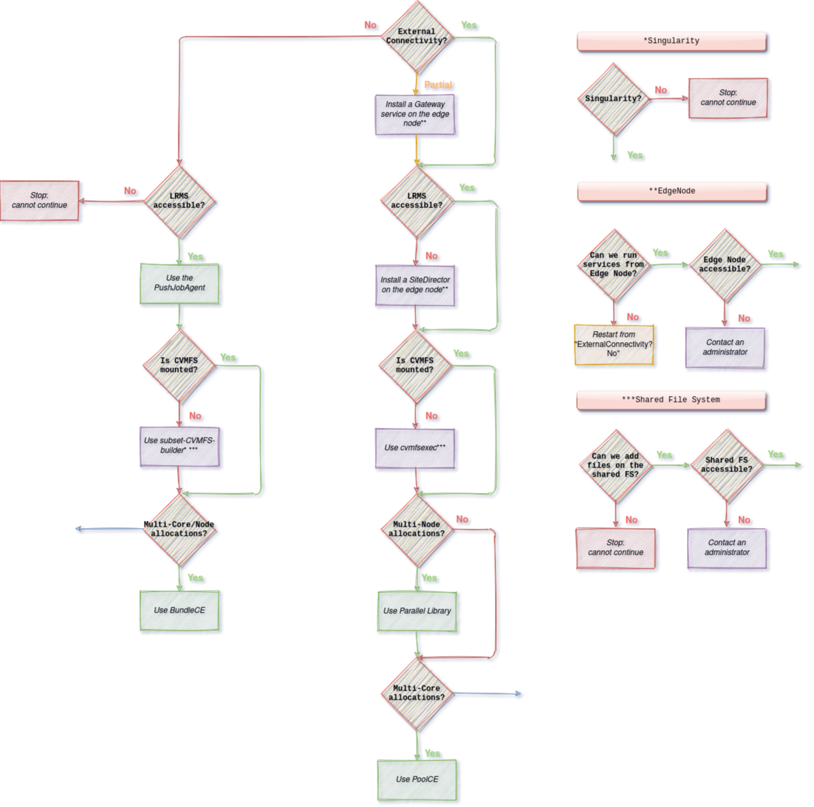

.. _supercomputers:

===========================
Dealing with Supercomputers
===========================

Supercomputers are highly heterogeneous infrastructures that can provide non-traditional architectures like:

 - non-x86 CPUs
 - accelerators (GPUs, FPGAs)

They might make use of modern multicore and manycore architectures and are built for applications running fast on a large number of resources, having fast node-interconnectivity.
They often have different policies from those of HEP Grid Sites:

 - no internet connectivity
 - no CVMFS
 - VPN access

This chapter aims to help administrators to configure DIRAC in order to deal with supercomputers according to their features.

.. toctree::
   :maxdepth: 1
   :numbered:

.. contents:: Table of contents
   :depth: 4

--------
Overview
--------

We have identified differences between a traditional HEP grid site and supercomputers.
To run workloads on supercomputers, administrators might need to perform and combine several changes.
Some can be very easy, such as an update in the CS, while some can require additional actions and analysis such as delivering a subset of CVMFS.

---------------------
Outbound connectivity
---------------------

Multi-core allocations
----------------------

Supercomputers often privilege workloads exploiting many cores in parallel during a short time (HPC).
This means they allow a small number of large allocations of resources.
Grid applications are usually not adapted: they are embarrassingly parallel, run on a single core for a long period (HTC).

To exploit the manycore nodes of supercomputers and avoid a waste of computing resources, DIRAC can leverage the fat-node partitioning mechanism.
This consists in submitting a Pilot-Job on a node, which can then fetch and run multiple workloads in parallel.
To set it up, one has to add two options in the CE configuration: ``LocalCEType=Pool`` and ``NumberOfProcessors=<N>``, ``N`` being the number of cores per worker node.

For further details about the CE options, consult :ref:`the Sites section <cs-site>`.

Multi-node allocations
----------------------

In the same way, some supercomputers have specific partitions only accessible for applications exploiting multiple manycore nodes simultaneously in the same allocation.
To exploit the many-node allocations, DIRAC allows to generate one sub-pilot per node allocated.
Sub-pilots run in parallel and share the same identifier, output and status.

This option is currently only available via :mod:`~DIRAC.Resources.Computing.BatchSystems.SLURM`.
To use sub-pilots in many node allocations, one has to add an additional options in the CE configuration: ``NumberOfNodes=<min-max>``.

For further details about the CE options, consult :ref:`the Sites section <cs-site>`.

CVMFS not available
-------------------

Workloads having thousands of dependencies are generally delivered via CVMFS on grid sites.
By default, CVMFS is not mounted on the nodes of supercomputers.
One can talk with the system administrators to discuss the possibility of having it mounted on the worker nodes.
If this is not possible, then one has to use `cvmfs-exec <https://github.com/cvmfs/cvmfsexec>`_.
It allows mounting CVMFS as an unprivileged user, without the CVMFS package being installed by a system administrator.

This action is purely a VO action: the package has to be installed on the worker node before starting the job.
The solution has not been integrated into DIRAC yet.

LRMS not accessible
-------------------

LRMS, also called Batch System, is the component that orchestrates the worker nodes and the workload on a site.
On grid sites, a LRMS is often accessible via a CE, and if a CE is not available, then one can interact directly with it via SSH: DIRAC handles both cases.

Nevertheless, supercomputers have more restrictive access policies than grid sites and may protect the facility access with a VPN.
In this situation, one can run a :mod:`~DIRAC.WorkloadManagementSystem.Agent.SiteDirector` combined to a :mod:`~DIRAC.Resources.Computing.LocalComputingElement` directly on the edge node of the supercomputer.
This allows submitting pilots from the edge of the supercomputer to the worker nodes directly.

Supercomputers often do not allow users to execute a program from the edge node for a long time.
To address this problem, one can call the Site Director in a cron job, executed every N minutes for 1 cycle.

Also, to generate pilot proxies, the Site Director has to rely on a host certificate: one has to contact a system administrator for that.

----------------------------------
Only partial outbound connectivity
----------------------------------

This case has not been addressed yet.

------------------------
No outbound connectivity
------------------------

Solutions seen in the previous section cannot work in an environment without external connectivity.
The well-known Pilot-Job paradigm on which the DIRAC WMS is based does not apply in these circumstances: the Pilot-Jobs cannot fetch jobs from DIRAC.
Thus, such supercomputers require slightly changes in the WMS: we reintroduced the push model.

To leverage the Push model, one has to add the :mod:`~DIRAC.WorkloadManagementSystem.Agent.PushJobAgent` to the ``Systems/WorkloadManagement/<Setup>/Agents`` CS section, such as::

   Systems
   PushJobAgent_<Name>
   {
          # Targeted Sites, CEs and/or type of CEs
          CEs = <CEs>
          Sites = <Sites>
          CETypes = <CETypes>
          # Required to generate a proxy
          VO = <VO>
          # Control the number of jobs handled on the machine
          MaxJobsToSubmit = 100
          Module = PushJobAgent
   }

One has also to authorize the machine hosting the :mod:`~DIRAC.WorkloadManagementSystem.Agent.PushJobAgent` to process jobs via the ``Registry/Hosts/<Host>`` CS section::

   Properties += GenericPilot
   Properties += FileCatalogManagement

One has to specify the concerned VO, the platform and the CPU Power in the targeted CEs as well as , such as::

   <CE>
   {
         # To match a <VO> job
         VO = <VO>
         # Required because we are on a host (not on a worker node)
         VirtualOrganization = <VO>
         # To match compatible jobs
         Platform = <platform>
         Queues
         {
            <Queue>
            {
               CPUNormalizationFactor = <CPU Power value>
            }
         }

   }

Finally, one has to make sure that job scheduling parameters are correctly fine-tuned. Further details in the :ref:`JobScheduling section <jobscheduling>`.

:mod:`~DIRAC.WorkloadManagementSystem.Agent.PushJobAgent` inherits from :mod:`~DIRAC.WorkloadManagementSystem.Agent.JobAgent` and proposes a similar structure: it fetches a job from the :mod:`~DIRAC.WorkloadManagementSystem.Service.MatcherHandler` service and submit it to a :mod:`~DIRAC.Resources.Computing.PoolComputingElement`.
 - It provides an additional parameter in ``/LocalSite`` named ``RemoteExecution`` that can be used later in the process to identify computing resources with no external connectivity.
 - There is no ``timeLeft`` attribute: it runs on the DIRAC side as an ``Agent``.
 - ``MaxJobsToSubmit`` corresponds to the maximum number of jobs the agent can handle at the same time.
 - To fetch a job, :mod:`~DIRAC.WorkloadManagementSystem.Agent.PushJobAgent` sends the dictionary of the target CE to the :mod:`~DIRAC.WorkloadManagementSystem.Service.MatcherHandler` service.

:mod:`~DIRAC.WorkloadManagementSystem.Agent.PushJobAgent` does not inherit from :mod:`~DIRAC.WorkloadManagementSystem.Agent.SiteDirector` but embeds similar features:
 - It supervises specific Sites/CEs/Queues.
 - If there is an error with a queue, it puts it on hold and waits for a certain number of cycles before trying again.

Internally, the workflow modules originally in charge of executing the script/application (:mod:`~DIRAC.Workflow.Modules.Script`) check whether the workload should be
sent to a remote location before acting.
:mod:`~DIRAC.WorkloadManagementSystem.Utilities.RemoteRunner` attempts to extract the value from the environment variable initialized by the :mod:`~DIRAC.WorkloadManagementSystem.JobWrapper.JobWrapper`.
If the variable is not set, then the application is run locally via ``systemCall()``, else the application is submitted to a remote Computing Element such as ARC.
:mod:`~DIRAC.WorkloadManagementSystem.Utilities.RemoteRunner` wraps the script/application command in an executable, gets all the files of the working directory that correspond to input files and submits the executable along with the input files. It gets the status of the application submitted every 2 minutes until it is finished and finally gets the outputs.

What if the :mod:`~DIRAC.WorkloadManagementSystem.Agent.PushJobAgent` is suddenly stopped while processing jobs? Jobs would be declared as ``Stalled``. Administrators would have to manually clean up input directories (by default, they should be located in ``/opt/dirac/runit/WorkloadManagement/PushJobAgent/<JobID>``).
Administrators may also have to kill processes related to the execution of the jobs: ``dirac-jobexec``.

Multi-core/node allocations
---------------------------

This case has not been addressed yet.

CVMFS not available
-------------------

Workloads depending on CVMFS cannot run on such infrastructure: the only possibility is to generate a subset of CVMFS, deploy it on the supercomputer,
and mount it to a container.
`subCVMFS-builder <https://gitlab.cern.ch/alboyer/subcvmfs-builder>`_ and `subCVMFS-builder-pipeline <https://gitlab.cern.ch/alboyer/subcvmfs-builder-pipeline>`_ are two projects aiming to assist VOs in this process.
They allow to trace applications of interest, build a subset of CVMFS, test it and deploy it to a remote location.

To integrate the subset of CVMFS with the DIRAC workflow, one can leverage the :mod:`~DIRAC.Resources.Computing.ARCComputingElement` ``XRSLExtraString`` option such as::

   XRSLExtraString = (runtimeEnvironment="ENV/SINGULARITY" "</path/to/singularity_container>" "" "</path/to/singularity_executable")

To mount the subset of CVMFS in the singularity container, one has to contact the ARC administrators to finetune the configuration or has to build a container image containing the subset with `subCVMFS-builder <https://gitlab.cern.ch/alboyer/subcvmfs-builder>`_.

LRMS not accessible
-------------------

In this case, nothing can be done.
