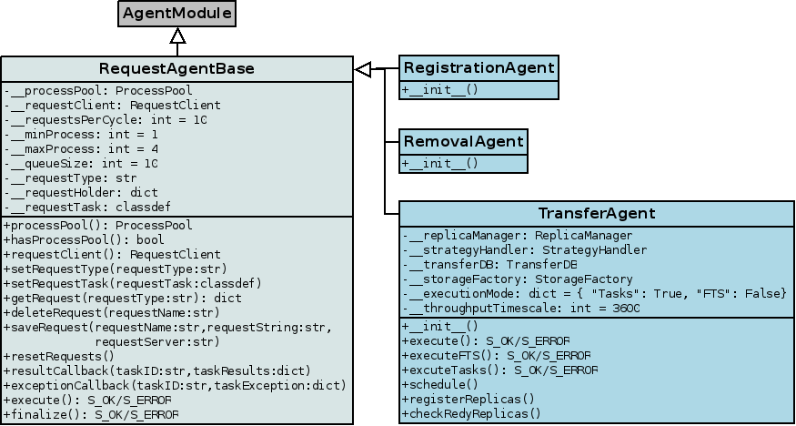
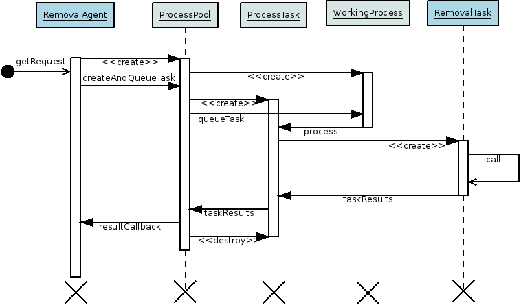
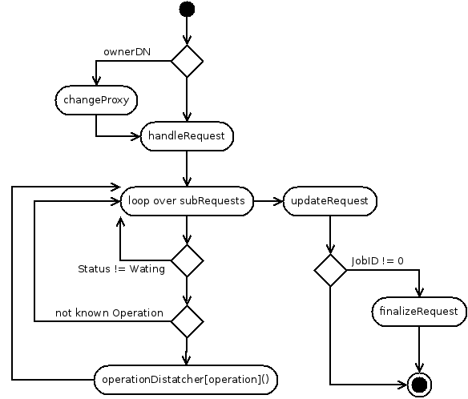

---------------------------
Requests' Processing Agents
---------------------------

:author:  Krzysztof Daniel Ciba <Krzysztof.Ciba@NOSPAMgmail.com>
:date:    Tue, 13th Mar 2012
:version: first and final

Requests types and operations
-----------------------------

There are three agents in the DIRAC DataManagementSystem dealing with requests, one for each request's type:
**TransferAgent**, processing *transfer* requests, **RemovalAgent**, processing *removal* requests and 
**RegistrationAgent** for handling *register* requests. The current implementation is able to handle the following operations:

 * *transfer*

   * *putAndRegister* 
   * *replicateAndRegister*

 * *removal*

   * *removeFile*
   * *replicaRemoval*
   * *reTransfer*

 * *register*

   * *registerFile*

The *putAndRegister* and *reTransfer* operations are only used in LHCb online environment, while all the others are 
of general use and can be executed for any DIRAC user.

Design
------

Base classes and inheritance
^^^^^^^^^^^^^^^^^^^^^^^^^^^^

The common functionality in all agents has been grouped and implemented inside a base class *RequestAgentBase*. This class is 
responsible for creating and managing of the **ProcessPool** and tasks, requests' retrieval and creation, execution of tasks 
and their callbacks. The inheritance diagram is presented below.
    

As you can see the *TransferAgent* is somehow special, as depending of configuration, it is able to execute requests in two modes:

 * task execution using sub-processes,
 * files scheduling for FTS.   

Same story applies to tasks, there are three specialized classes to handling particular requests types:
 
 * *TransferTask* for execution of transfer requests
 * *RegistrationTask* for execution of register requests
 * *RemovalTask* for execution of removal requests

and all of them are inherited from base class *RequestTask*, allowing common functionality, like operation dispatcher,
common tools, logging, monitoring, request execution and updating etc. The inheritance diagram for tasks classes is shown below: 

.. image:: ../../../_static/Systems/DMS/inheritance-dms-tasks.png
   :alt: uml schema
   :align: center 

As all *RequestTask*-inherited objects are executed in separate sub-processes and hence in pure and empty python 
environment, the the most important and common global DIRAC objects are created and *globalized* in *RequestTask* constructor.
This includes *gLogger*, *gConfig*, *gProxyManager*, *S_OK* and *S_ERROR*. The constructor also
imports a set of common modules: *os*, *sys*, *re*, *time* and everything from *types* module.

This *globalization* is made by attaching them to the *__builtins__* module symbols, using :makeGlobal: function::

 def makeGlobal( self, objName, objDef ):
    """ export :objDef: to global name space using :objName: name 

    :param self: self reference
    :param str objName: symbol name
    :param mixed objDef: symbol definition
    :throws: NameError if symbol of that name is already in
    """
    if objName not in __builtins__:
      if type( __builtins__) == type( {} ):
        __builtins__[objName] = objDef 
      else:
        setattr( __builtins__, objName, objDef )
      return True

where *objName* is a symbol's name used together with reference to its definition *objDef*. This technique will allow 
to use them in all functions of inherited classes like a global objects defined on a module level. 

All other DIRAC tools and clients (i.e. RequestManager) are private in RequestTask class and will
be imported and instantiated on demand during first call. They are accessible using facades - a proxied public methods, i.e.
if you are going to use ReplicaManager just call::

  self.replicaManager().someMethod()

The main reason for using facades is keeping the memory consumption low as modules are imported and objects are created only 
on demand. All currently proxied tools are:

 * DataLoggingClient -- self.dataLoggingClient()
 * ReplicaManager -- self.replicaManager()
 * RequestClient -- self.requestClient()
 * StorageFactory -- self.storageFactory()

The logger message handlers for all levels are also proxied, so you can directly use them in your code, i.e.::

  self.info("An info message")
  self.debug("This will be shown only in debug")

Concerning *MonitringClient* (or better known its global instance *gMonitor*), if someone wants to send
some metric over there, she has to put in agent's code registration of activity and then in a particular
task use *RequestTask.addMark* to save monitoring data. All monitored activities are held in
*RequestTask.__monitor* dict which at the end of processing is returned from *RequestTask.__call__*.
The values are then pushed to then the default callback function defined in *RequestAgentBase*, from where 
all of them are exported to *gMonitor* instance created in agent's module.  

Request execution
^^^^^^^^^^^^^^^^^

For handling sub-request one has to register their actions handlers using **RequestTask.addOperationAction**
method. This method checks if handler is defined as a method of inherited class and then puts its
definition into internal operation dispatcher dictionary with a key of sub-request's operation name.

Each operation handler should follow the signature::

  def operationName( self, index, requestObj, subRequestAttrs, subRequestFiles )

where index is a sub-request counter, requestObj is a **RequestContainer** instance,
subRequestAttrs is a dict with sub-request attributes and subRequestFiles is a dict with
files attached to the sub-request. Those handlers should always return *S_OK* with value of 
(modified or not) requestObj or *S_ERROR* with some error message otherwise.

The processing of request os done automatically in **RequestTask.__call__**, one doesn't have to worry about changing
credentials, looping over sub-requests or request finalizing -- only sub-request processing matters in all child classes.

Let's follow the path of request processing using 'removal' request example (there is no difference for 'registration' 
and 'transfer' in task execution mode):

Execution of request starts with retrieval of 'Waiting' request out of **RequestClient** using **RequestAgentBase.getRequest**. 
 
The request is then serialized to XML string and put into a kwargs dictionary of **ProcessPool.createAndQueueTask**. Copy of that 
information is also stored inside agent's **requestHolder** dictionary, used to clean up assigned requests during agent's finalization.

Once there is a free slot in **ProcessPool** task queue, **ProcessTask** is en-queued and lands in **WorkingProcess** instance, 
which is managing task execution in a separate sub-process. Inside its **run** method, an instance of **ProcessTask**  
is created together with its callable object -- our **RemovalTask** and immediately executed.

Inside **RequestTask.__call__** function request is checked against its owner: if *OwnerDN* and *OwnerGroup* attributes are set, 
proxy for this user is created ans swapped with the default (*DataManager*) proxy. After that processing 
enters the loop over sub-requests. If particular sub-request has 'Waiting' state and its operation matches registered one, 
the sub-request files and attributes are passed as parameters to the operation handler. After the handler's execution, the request 
is again serialized to the XML and updated using **RequestClient**. At this stage finalization of request is also triggered, but only if 
JobID attribute is different from 0.

The results of **RequestTask.__call__** are stored inside of **ProcessTask** instance, which 
again is en-queued into results queue of **ProcessPool**. Now processing is shifted to the **ProcessPool** instance again. 
The results are picked up and sent to the callback function, which is used to copy over the monitored records to the **gMonitor** 
and to clean up reference of original request from *requestHolder*.  

The motivation for adding *requestHolder* dictionary is to have in place a fail-over mechanism for tasks that have never returned 
any values from their sub-process execution (i.e. sub-process is stuck waiting for a signal, there is a never released lock 
in the underlying library, the sub-process has been killed by **ProcessPool** or evil and mad person from outside world). In that case, 
no matter what was the original occasion, the assigned requests are put back to the **RequestClient** at the end of last cycle 
of the agent, when **RequestAgentBase.finalize** method is called.
 

TransferAgent and FTS scheduling
^^^^^^^^^^^^^^^^^^^^^^^^^^^^^^^^

The **TransferAgent** has two modes of operation:

 * standalone, when all requests are handled using **ProcessPool** and **TransferTask**,
 * scheduling for FTS with fail-back **TransferTask** functionality.

By default FTS scheduling is disabled and all requests are processed using tasks. The fail-back mechanism is triggered in case that:

 * the FTS channels between SourceSE and TargetSE is not defined,
 * there is a trouble to define correct replication tree, 
 * request's owner is different from DataManager, 
 * sub-request operation isn't a 'replicateAndRegister'.

.. image:: ../../../_static/Systems/DMS/transfer-agent-processing.png
   :alt: uml schema
   :align: center 

Execution of the FTS mode is following (see above diagram):

 1. The request is checked against its owner, if OwnerDN and OwnerGroup attributes are set, request is passed to the task execution mode.
 2. The value Waiting sub-requests operation attributes are compared with the only one handled 'replicateAndRegister', if any of sub-request operation is different from 'replicateAndRegister', the request is passed to the task execution mode.
 3. Request is sent to **TransferAgent.schedule** function, where subsequent methods are called:
  
   * **TransferTask.checkReadyReplicas**: all files and their registered replicas are compared, if a particular file has been already replicated, its status is set to 'Done'
   * **TransferAgent.registerFiles**: fail-over registration mechanism for files that have been already replicated (in *FTSSubmitAgent*) but not registered (error in registration in *FTSMonitorAgent*)
   * **TransferAgent.scheduleFiles**: for all 'Waiting' files the replication tree is constructed using **StrategyHandler**, when it is ready, *TransferDB.Channels*, *TransfeDB.FileToCat* and *TransferDB.ReplicationTree* records are pushed into *TransferDB* and file status is set to 'Scheduled', if for any reason *ReplicationTree* cannot be created, the request is put into task execution mode.  
 
 4. When all statuses of files are set to 'Done' in previous methods, sub-request status is  set to 'Done' and the same check is repeated for all sub-requests and request itself. At this stage request is also finalized, if JobID attribute is different from 0.
  
The request is going to be executed many times, until all replicas are created, but please notice, that FTS scheduling is done only once, 
during first execution, when there are still 'Waiting' files in sub-request. All following operations are only repeating 
**TransferTask.checkReadyReplicas** and **TransferAgent.registerFiles** calls to update files statuses.   

Configuration and installation
------------------------------

Options common to all agents
^^^^^^^^^^^^^^^^^^^^^^^^^^^^

+-------------------------+---------------------------------------------------+-------------------------------------------------------+
| Option name             | Meaning                                           | Default value                                         |
+=========================+===================================================+=======================================================+
| LogLevel                | Logging level                                     | LogLevel = INFO                                       |
+-------------------------+---------------------------------------------------+-------------------------------------------------------+
| LogBackends             | Logging handlers                                  | LogBackends = stdout                                  |
+-------------------------+---------------------------------------------------+-------------------------------------------------------+
| PollingTime             | Time period in seconds for agent's polling        | PollingTime = 60                                      |
+-------------------------+---------------------------------------------------+-------------------------------------------------------+
| ControlDirectory        | Control directory location                        | ControlDirectory = control/DataManagement/<AgentName> |
+-------------------------+---------------------------------------------------+-------------------------------------------------------+
| RequestsPerCycle        | Number of requests to process in one agent cycle  | RequestperCycle = 10                                  |
+-------------------------+---------------------------------------------------+-------------------------------------------------------+
| MinProcess              | Minimal number of sub-processes running           | MinProcess = 1                                        |
+-------------------------+---------------------------------------------------+-------------------------------------------------------+
| MaxProcess              | Maximal number of sub-processes running           | MaxProcess = 4                                        |
+-------------------------+---------------------------------------------------+-------------------------------------------------------+
| ProcessPoolQueueSize    | Capacity of task queue in ProcessPool             | ProcessPoolQueueSize = 10                             |
+-------------------------+---------------------------------------------------+-------------------------------------------------------+
| shifterProxy            | Default proxy used to process request             | shifterProxy = DataManager                            |
+-------------------------+---------------------------------------------------+-------------------------------------------------------+
| RequestType             | Request type:                                     | RequestType = <requestType>                           |
|                         |  * register for RegistrationAgent                 |                                                       |
|                         |  * removal for RemovalAgent                       |                                                       |
|                         |  * transfer for TransferAgent                     |                                                       |
+-------------------------+---------------------------------------------------+-------------------------------------------------------+
| **<TaskName> subsection** (<TaskName> = RegistrationTask, RemovalTask, TransferTask)                                                |
+-------------------------+---------------------------------------------------+-------------------------------------------------------+
| LogLevel                | Logging level                                     | LogLevel = INFO                                       |
+-------------------------+---------------------------------------------------+-------------------------------------------------------+
| LogBackends             | Logging handlers                                  | LogBackends = stdout                                  |
+-------------------------+---------------------------------------------------+-------------------------------------------------------+

TransferAgent specific options
^^^^^^^^^^^^^^^^^^^^^^^^^^^^^^

+-------------------------+---------------------------------------------------+-------------------------------------------------------+
| Option name             | Meaning                                           | Default value                                         |
+=========================+===================================================+=======================================================+
| TaskMode                | Flag to disable/enable tasks for processing       | TaskMode = True                                       |
+-------------------------+---------------------------------------------------+-------------------------------------------------------+
| FTSMode                 | Flag to disable/enable FTS scheduling             | FTSMode = True                                        |
+-------------------------+---------------------------------------------------+-------------------------------------------------------+
| ThroughputTimescale     | Time period used to monitor FTS transfer history  | ThroughputTimescale = 3600                            |
+-------------------------+---------------------------------------------------+-------------------------------------------------------+
| **StrategyHandler subsection**                                                                                                      |
+-------------------------+---------------------------------------------------+-------------------------------------------------------+
| HopSigma                | Acceptable time shift to start of FTS transfer    | HopSigma = 0.0                                        |
+-------------------------+---------------------------------------------------+-------------------------------------------------------+
| SchedulingType          | Transfer speed calculation:                       | SchedulingType = Files                                |
|                         |  * number of files per hour (Files)               |                                                       |
|                         |  * amount of data per hour (Throughput)           |                                                       |
+-------------------------+---------------------------------------------------+-------------------------------------------------------+
| ActiveStrategies        | List of active strategies to use:                 | ActiveStrategies = MinimiseTotalWait                  | 
|                         | DynamicThroughput, MinimiseTotalWait, Simple,     |                                                       |
|                         | Swarm                                             |                                                       |
+-------------------------+---------------------------------------------------+-------------------------------------------------------+
| AcceptableFailureRate   | Percentage limit of success rate in monitored FTS | AcceptableFailureRate = 75                            |
|                         | transfers to accept/reject FTS channel from       |                                                       | 
|                         | scheduling.                                       |                                                       |
+-------------------------+---------------------------------------------------+-------------------------------------------------------+

Default options
^^^^^^^^^^^^^^^

Default configuration for all agents::  

  TransferAgent {
      LogLevel = INFO
      LogBackends = stdout
      PollingTime = 60
      ControlDirectory = control/DataManagement/TransferAgent
      RequestsPerCycle = 10
      MinProcess = 1
      MaxProcess = 4
      ProcessPoolQueueSize = 10
      RequestType = transfer
      shifterProxy = DataManager
      TaskMode = True
      FTSMode = True
      ThroughputTimescale = 3600
      StrategyHandler {
        LogLevel = INFO
        LogBackends = stdout
        HopSigma = 0.0
        SchedulingType = File
        ActiveStrategies = MinimiseTotalWait
        AcceptableFailureRate = 75
      }
      TransferTask {
        LogLevel = INFO
        LogBackends = stdout
      }
   }

  RegistrationAgent {
    LogLevel = INFO
    LogBackends = stdout
    PollingTime = 60
    ControlDirectory = control/DataManagement/RegistrationAgent
    RequestsPerCycle = 10
    MinProcess = 1
    MaxProcess = 4
    ProcessPoolQueueSize = 10
    RequestType = register
    shifterProxy = DataManager
    RegistrationTask {
      LogLevel = INFO
      LogBackends = stdout
    }
  }

  RemovalAgent {
    LogLevel = INFO
    LogBackends = stdout
    PollingTime = 60
    ControlDirectory = control/DataManagement/RemovalAgent
    RequestsPerCycle = 50
    MinProcess = 1
    MaxProcess = 4
    ProcessPoolQueueSize = 10
    RequestType = removal
    shifterProxy = DataManager
    RemovalTask {
      LogLevel = INFO
      LogBackends = stdout
    }
  }

Installation procedure
^^^^^^^^^^^^^^^^^^^^^^

1. On a fresh DIRAC installation procedure is very simple:

 * **RegistrationAgent** and **RemovalAgent**
   
 Follow the normal installation procedure, but make sure the new configuration sections is in place and updated.
 
 * **TransferAgent** in mixed mode (*FTSMode* and *TaskMode*)

  This is the default configuration that can be used i.e. in LHCb DIRAC prod system.

  Make sure FTS agents and databases are installed and properly configured (*TransferDB*, *FTSMonitorAgent*,  
  *FTSSubmitAgent* and *FTSCleanupAgent*). Install **TransferAgent**.

 * **TransferAgent** in *TaskMode* only

  This mode should be used in LHCb online version of DIRAC or for VOs without FTS service available.

  Install **TransferAgent**, disable *FTSMode* in its configuration section. 

2. Upgrading exisiting DIRAC installation:

 * stop **TransferAgent**, **ReplicationScheduler**, **RegistrationAgent** and **RemovalAgent** agents

 * update configuration sections by replacing **TransferAgent**, **RemovalAgent** and **RegistrationAgent** 
   and deleting **ReplicationScheduler** fragments 

 * start new agents using *runsvctrl u* command
