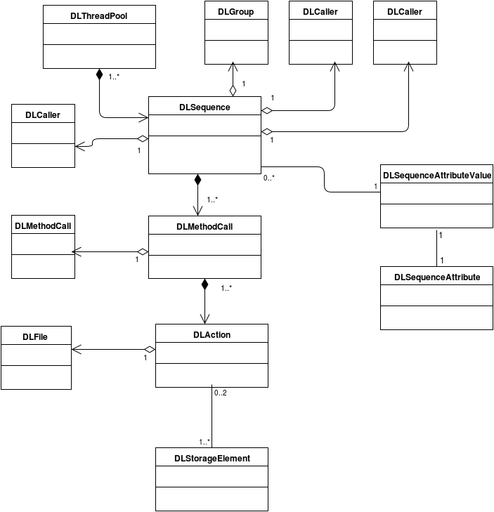

Data Logging System
==================================
:author:  Berger Corentin
:date:    Thu, 20th Aug 2015 

----
Goal
----
The goal of the DLS is to track all operations made on data files. The DLS is totally transparent and it is flexible.

Many methods make operations about LHCb data files and it is not possible to change all of them. A decorator is the best option for that. Moreover StorageElement and FileCatalog classes use __getattr__ function to forward calls to the correct storage element or catalog. 

Architecture
------------
This is the architecture chosen for the Data Logging System:

   
The different classes are:
* DLMethodCall: this class is used to save the data related to a method's call. Method's name is saved. There is an attribute to know the parent method call and the order of call. Thank to this two attributes, it is possible to construct the sequence.
* DLAction: an action is a method call on one LFN. DLMethodCall can have many DLAction. For example for the method replicateAndRegister, it is possible to pass a list of LFN to replicate all LFNin the storage element. The status of the operation can be find here to know if the operation was a success or a failure.
* DLSequence: a sequence of method call. For example, the first method call is "A" which calls "B" and "C", this is a sequence. Each DLMethodCall has a reference on its DLSequence and vice versa. DLSequence objects have a stack, we will see after how this stack is used.
* DLCaller: a name of a caller. It is needed to know "who", i.e. which method, which script, called the first decorated method method.*
* DLFile: an LFN
* DLStorageElement: an SE
* DLThreadPool: this class contains a dictionary whose keys are thread id and  whose values are DLSequence objects. This class is necessary because DLSequence object are accessed from different methods for a same thread. The system is thread safe thanks to this class.

Decorator
---------

This section will explain how the decorator of the Data Logging System works.

The DLS decorator is a class and there are some specific features for that type of decorator. Here is the minimum for a decorator written as a class:

.. code-block:: python

  def DataLoggingDecorator( function = None, **kwargs ):
    if function:
        return _DataLoggingDecorator( function )
    else:
      def wrapper( function ):
        return _DataLoggingDecorator( function, **kwargs )
      return wrapper

  class _DataLoggingDecorator( object ):
    def __init__( self, func , **kwargs ):
      self.func = func
      functools.wraps( func )( self )

    def __get__( self, inst, owner = None ):
      return types.MethodType( self, inst )

    def __call__( self, *args, **kwargs ):
      # do something
      ret = self.func(*args, **kwargs )
      # do something else
      return ret

Function DataLoggingDecorator allows to pass some arguments to the decorator. A test is made to know if a function is passed. "function" argument is always passed in first position during the decoration, by default it is None. If function is not None, an object of class _DataLoggingDecorator is returned. Else, a wrapper is needed because the decoration of the function is like that: DataLoggingDecorator(\*\*kargs)(func). It is not possible to use \*args because of the default value of parameter function.

In the __init__ method of _DataLoggingDecorator class the function is saved as an instance attribute because there will be as many instances of _DataLoggingDecorator class as decorated methods. The second line in this method is a special feature. It replaces special information like docstring or function name of the object by the special information of the decorated method.

The __get__ method is called everytime the _DataLoggingDecorator class is accessed as a class attribute. "types.MethodType( self, inst )" binds the new method or function to the inst object. For example, we replace the replicateAndRegister method in class DataManger by the decorated method. This avoids any change of the code for that method.

The __call__ method is called every time that a decorated method or function is called. This is where all data will be saved, where object will be created, etc. Here is the code of the __call__ method in the _DataLoggingDecorator class:

.. code-block:: python

   def __call__( self, *args, **kwargs ):
   """ method called each time when a decorate function is called
       get information about the function and create a sequence of method calls
   """
    result = None
    exception = None
    isCalled = False
    isMethodCallCreate = False
    try:
      self.setCaller()
      localArgsDecorator = self.getAttribute( args[0] )
      methodCallArgsDict = self.getMethodCallArgs( localArgsDecorator, *args )
      actionArgs = self.getActionArgs( localArgsDecorator, *args, **kwargs )
      methodCall = self.createMethodCall( methodCallArgsDict )
      isMethodCallCreate = True
      self.initializeAction( methodCall, actionArgs )
      try :
        isCalled = True
        result = self.func( *args, **kwargs )
      except Exception as e:
        exception = e
        raise
    except NoLogException :
      if not isCalled :
        result = self.func( *args, **kwargs )
    except DLException as e:
      if not isCalled :
        result = self.func( *args, **kwargs )
      gLogger.error( 'unexpected Exception in DLDecorator.call %s' % e )
    finally:
      if isMethodCallCreate :
        self.setActionStatus( result, methodCall, exception )
        self.popMethodCall()
      if self.isSequenceComplete() :
        self.insertSequence()
    return result
    
The different steps are:

* Call of setCaller method: this method get the sequence from the DLThreadPool class. If there is no sequence associated to this thread id, a DLSequence object is created and we get the caller from the stack of calls.
* Call of getAttribute method: in the __init__ method, all parameters passed to the decorator are saved into a dictionnary called argsDecorator. Sometimes attributes from objects, which called the decorated method, need to be saved .They will be retrieved here and added in a local argsDecorator dictionary. A local dictionary is needed because of the different calls from different thread. For example when the decorated method is a dynamic method, the real method's name called is contained into the object as an attribute.
* Call of getMethodCallArgs method: this method returns dictionary with all data about method call. For now, just the name of the function is retrieved.
* Call of getActionArgs method: this method returns a list of dictionaries with all information that needs to be saved. Dictionaries have 4 keys: "file" which is a LFN, "srcSE' which is a source SE, "targetSE" which is the target SE, and "extra" which is all other information that it is possible to get from parameters passed to the decorated method when it is called.
* Call of createMethodCall method: creates a DLMethodCall with the arguments retrieved before, and adds it into the list of DLMethodCall of the DLSequence object associated to the current thread id.
* Call of initializeAction method: adds as many DLAction object to the actions list of DLMethodCall created before as dictionaries constructed. Set the status of the DLAction objects to "Unknown".
* Call of the decorated method or function: save the return in a variable.
* Call of setActionStatus method: set the status of actions from the return of the decorated method.
* Call of popMethodCall method: pop of the DLMethodCall object from the stack of DLSequence object associated to the current thread ID, it will be explain a little bit after how the DLSequence class works.
* Call of isSequenceComplete method: to know if the sequence is complete. If it is, call of insertSequence method which passes the sequence to the data base for insertion.

All these method calls are in a block "try except" because if an exception is raise from a method of the decorator, we do not want it to be raised to the caller. The DLS has its own exceptions. The first one is the  "NoLogException" which is raised when the system does not need to log this method. This is possible because some decorated method are very generics and dynamic. Because it is generic, sometimes it calls a read method and it is not needed to log it.

The second type of exception that can be raised by the decorator is "DLException". If we passed in the "except" part, a DLException is raised with a value of the original exception.

There are two flags in the __call__ method of the _DataLoggingDecorator class:

* isMethodCallCreated: this flag is True if a DLMethodCall has been created and added to the sequence. Like that we know if we have to set the status of actions and to pop it from sequence.*
* isCalled: this flag is set to true when the method or function is called. Like that if there is an exception from the decorator, we know whether the method has already been called or not.*
 

The decoration
--------------

Because there are many methods to decorate and each has its own prototype, some information must be passed as arguments of the decorator:

* argsPosition: this is a list of strings and tuples. It is used to know the name of all method's arguments for their extraction :

 - String : use a string when the argument's name is the name we want to save
 - Tuple : use a tuple when the argument can be passed both in \*args and \*\*kwargs, and when the name of the argument is not the name we want to save. The structure of tuples shall be ('nameWanted', 'nameInPrototype').
 
* getActionArgsFunction: a string to know which function will be called to extract arguments passed ot the decorated method.

There are five special key-words for the argsPosition list because their names can be different for a same parameter in prototype and because there are interesting arguments:

* dl_file: this is the keyword when the argument of a method is a LFN, a file on which operation will be made.
* dl_srcSE: the keyword when a parameter is a source Storage Element.
* dl_targetSE: the keyword when the parameter is a target Storage Element.
* dl_tuple: key_word when the parameter is an instance of tuple.
* dl_ignore_argument: key_word when the parameter has to be ignored.
   
These key-words are variables that can be find in DIRAC/DataManagementSystem/Client/DataLogging/DLUtilities file.

Default case
^^^^^^^^^^^^

Here is an example when the prototype of a method is simple, no tuple, no dictionary except for the lfn parameter:

.. code-block:: python

   @DataLoggingDecorator( argsPosition = ['self', dl_files, 'fileName', dl_targetSE, 'guid', 'path', 'checksum'] )
   def putAndRegister( self, lfn, fileName, diracSE, guid = None, path = None, checksum = None ):

"getActionArgsFunction" is not passed to the decorator here because the default function to extract arguments is the right one.

Here is an other example:

.. code-block:: python

  @DataLoggingDecorator( argsPosition = ['self', dl_files, dl_targetSE, ( dl_srcSE, 'sourceSE' ), 'destPath', 'localCache', 'catalog' ] )
  def replicateAndRegister( self, lfn, destSE, sourceSE = '', destPath = '', localCache = '' , catalog = '' ):

In this prototype the argument named sourceSE is a nominal one. For this parameter, the name wanted to be saved is in the variable dl_srcSE and its name in the prototype is sourceSE. The tuple in the argsPosition list for this parameter is ( dl_srcSE, 'sourceSE' ).

Tuple case
^^^^^^^^^^

Some methods take in paramaters a tuple, there is some specifics futures for this. Here is an example of a decoration:

.. code-block:: python

 @DataLoggingDecorator( argsPosition = ['self', dl_tuple, 'catalog'], getActionArgsFunction = 'Tuple',
	 tupleArgsPosition = [dl_files, 'physicalFile', 'fileSize', dl_targetSE, 'fileGuid', 'checksum' ] )
 def registerFile( self, fileTuple, catalog = '' ):
	
It is necessary to use a special function to extract arguments. This is specify with the parameter getActionArgsFunction = 'Tuple'.

It also mecessary to specify the structure of the tuple with the argument tupleArgsPosition. This one is a list of strings like the argsPosition parameter.

Execute File Catalog case
^^^^^^^^^^^^^^^^^^^^^^^^^

This class is special because the decorated method is very generic, it is the w_execute method. This method forwards the call to the right catalog. To know the name of method and their arguments, a dictionnary is needed:

.. code-block:: python

   dataLoggingMethodsToLog = {
    'addFile' :
      {'argsPosition' : ['self', dl_files],
       'keysToGet' : { 'PFN':'PFN', 'Size':'Size', dl_targetSE:'SE', 'GUID':'GUID', 'Checksum':'Checksum'} },
    'setFileStatus' :
      {'argsPosition' : ['self', dl_files],
       'valueName' : 'Status'},
    'addReplica' :
      {'argsPosition' : ['self', dl_files],
       'keysToGet' : { 'PFN':'PFN', dl_targetSE:'SE'} },
    'removeReplica' :
      {'argsPosition' : ['self', dl_files],
       'keysToGet' : { 'PFN':'PFN', dl_targetSE:'SE'} },
    'removeFile' :
      {'argsPosition' : ['self', dl_files] },
    'setReplicaStatus' :
      {'argsPosition' : ['self', dl_files],
       'keysToGet' : { 'PFN':'PFN', dl_targetSE:'SE', 'Status':'Status'} },
    'setReplicaHost' :
      {'argsPosition' : ['self', dl_files],
       'keysToGet' : { 'PFN':'PFN', dl_targetSE:'NewSE', dl_srcSE:'SE', 'Status':'Status'} },
    'setReplicaProblematic' :
      {'argsPosition' : ['self', dl_files],
       'specialFunction' : 'setReplicaProblematic' },
    'createDirectory' :
      {'argsPosition' : ['self', dl_files] },
    'removeDirectory' :
      {'argsPosition' : ['self', dl_files]},
    'changePathMode' :
      {'argsPosition' : ['self', dl_files] },
    'changePathOwner' :
      {'argsPosition' : ['self', dl_files]},
    'changePathGroup' :
      {'argsPosition' : ['self', dl_files] }
    }
 
 
Here the only arguments of all method wanted to be logged are self and dl_files. It is a dictionnary in which the keys are lfn and values can be:
 * String, in that case the name of the string has to be specified by using the parameter 'valueName'.
 * Dictionary, in that case, the keys needed to get value and the name of the value should be known. This is the aim of the 'keysToGet' argument.
 
 
Here is how the w_execute method is decorated:

.. code-block:: python

    @DataLoggingDecorator( getActionArgsFunction = 'ExecuteFC', attributesToGet = {'methodName' : 'call'}, methods_to_log = dataLoggingMethodsToLog )
    def w_execute( self, *parms, **kws ):

The function to use for extracting arguments is a special one for the FileCatalog class.

Execute Storage Element case
^^^^^^^^^^^^^^^^^^^^^^^^^^^^

It is more or less the same as the File Catalog class, just the function for extracting argument change.

.. code-block:: python

  @DataLoggingDecorator( getActionArgsFunction = 'ExecuteSE', attributesToGet = {'methodName' : 'methodName', 'targetSE' : 'name' },
        className = 'StorageElement', methods_to_log = dataLoggingMethodsToLog )
  def __executeMethod( self, lfn, *args, **kwargs ):
  
Future features
---------------

If there is no case for the method you want to decorate, it is possible to add new features. All arguments passed to the decorator shall be nominated. The function to extract argument shall started by 'extractArgs'. In the decoration, you just need to pass what is after  'extractArgs' in the name of the function to the "getActionArgsFunction" argument.

