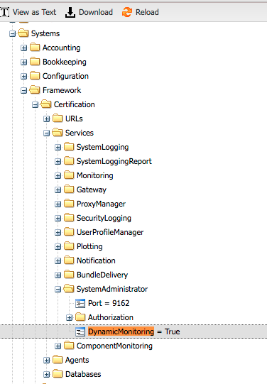

.. _monitoring_system:

=================
Monitoring System
=================

.. contents:: Table of contents
   :depth: 3

Overview
=========

The Monitoring system is used to monitor various components of DIRAC. Currently, we have three monitoring types:

  - WMSHistory: for monitoring the DIRAC WMS
  - Component Monitoring: for monitoring DIRAC components such as services, agents, etc.
  - RMS Monitoring: for monitoring the DIRAC RequestManagement System (mostly the Request Executing Agent).

It is based on Elasticsearch distributed search and analytics NoSQL database.
If you want to use it, you have to install the Monitoring service, and of course connect to a ElasticSearch instance.

Install Elasticsearch
======================

This is not covered here, as installation and administration of ES are not part of DIRAC guide.
Just a note on the ES versions supported: ES7 and ES6 are supported, the support for ES5 is not assured.

Configure the MonitoringSystem
===============================

You can run your Elastic cluster even without authentication, or using User name and password. You have to add the following parameters:

  - User
  - Password
  - Host
  - Port

The User name and Password must be added to the local cfg file while the other can be added to the CS using the Configuration web application.
You have to handle the ES secret information in a similar way to what is done for the other supported SQL databases, e.g. MySQL

For example::

   Systems
   {
     NoSQLDatabases
     {
       User = test
       Password = password
     }
   }

The following option can be set in `Systems/Monitoring/<Setup>/Databases/MonitoringDB`:

   *IndexPrefix*:  Prefix used to prepend to indexes created in the ES instance. If this
		   is not present in the CS, the indexes are prefixed with the setup name.

For each monitoring types managed, the Period (how often a new index is created)
can be defined with::

   MonitoringTypes
   {
     ComponentMonitoring
     {
       # Indexing strategy. Possible values: day, week, month, year, null
       Period = month
     }
     RMSMonitoring
     {
       # Indexing strategy. Possible values: day, week, month, year, null
       Period = month
     }
     WMSHistory
     {
       # Indexing strategy. Possible values: day, week, month, year, null
       Period = day
     }
   }

The given periods above are also the default periods in the code.

Enable WMSHistory monitoring
============================

You have to install the WorkloadManagemet/StatesMonitoringAgent.
This agent is used to collect information using the JobDB and send it to the Elasticsearch database.
If you install this agent, you can stop the StatesAccounting agent, that was reporting to the MySQL backend of the Accounting system.

You can use RabbitMQ for failover. This is optional as the agent already has a failover mechanism.
You can configure RabbitMQ in the local dirac.cfg file where the agent is running::

   Resources
   {
     MQServices
     {
       hostname (for example lbvobox10.cern.ch)
       {
         MQType = Stomp
         Port = 61613
         User = monitoring
         Password = seecret
         Queues
         {
           WMSHistory
           {
             Acknowledgement = True
           }
         }
       }
     }
   }

Enable Component monitoring
===========================

You have to set DynamicMonitoring=True in the CS::

   Systems
   {
      Framework
      {
          SystemAdministrator
           {
              ...
              DynamicMonitoring = True
            }
         }
       }

Accessing the Monitoring information
=====================================

After you installed and configured the Monitoring system, you can use the Monitoring web application.
