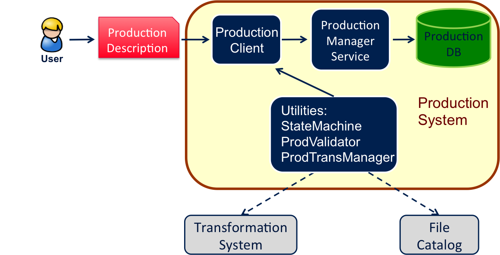

.. _adminPS:

=====================
Production System
=====================

.. toctree::
   :maxdepth: 2

.. contents:: Table of contents
   :depth: 4

The Production System (PS) is an high-level system built on the top of the Transformation System (add ref). 
It is used to automatically instantiate the different transformations that compose a workflow, later also called "production".
The PS is a data-driven system where transformations are "linked" on the basis of their input and output meta-data characterization.
A production is essentially defined as a set of transformations with their associations (or links). In practice, a production is specified through a "description", consisting of a number of "production steps".
Each production step contains the description of a specific transformation with the eventual specification of a "parent" production step (i.e. a parent transformation). 
Two transformations are considered as linked if they have a parent-child relation.
We call "Input/OutputMetaQuery", the query on the meta-data selecting the input/output data of a transformation.
If the OutputMetaQuery of a transformation logically intersects the InputMetaQuery of another transformation, the first can be declared as parent of the second.
A production step can have multiple parents (or no parents) and one or multiple child steps. With these definitions, the PS supports different types of workflows, i.e. sequential, with splitting or merging.
Starting from the production description, a dedicated utility checks the production validity. A production is considered as valid if the production step descriptions are valid and if the parent-child transformations are linked in the sense specified above. 

------------
Architecture
------------
The PS is a standard DIRAC system and therefore it is composed of components in the following categories: Service, DB (while there are no Agents).
Three utilities accomplish specific tasks and interact with the TS and the DFC: 
1) ProdValidator; 
2) ProdTransManager; 
3) StateMachine. 
A technical drawing explaining the interactions between the various components follows. First, the user provides a production description through the Production Client. 
Then, the ProdValidator utility checks the description validity by verifying the links between the different parent-child production steps. 
This utility also interacts with the DFC to ensure that the meta-data used in the Input/OutputMetaQueries are well defined. 
If the description is validated, the corresponding production is inserted into the Production DB, otherwise an error is returned. 
This mechanism prevents human errors that may occur when the user has to manually create several transformations composing a production. 
Once the production is created, the user actually activates it using the Production Client, thus triggering the creation of the corresponding transformations by the ProdTransManager utility. 
The main actions on productions that are supported by the Production Client are:
start, stop, clean and delete. The ProdTransManager utility manages all the interactions with the TS to perform the corresponding action on the production transformations. 
Production monitoring is also supported and it consists of getting the status and the progress of all the associated transformations. 
Finally, the State Machine utility prevents forbidden transitions between different production statuses.

* **Service**

  * ProductionManagerHandler:
    DISET request handler base class for the ProductionDB

* **DB**

  * ProductionDB:
    It permanently stores the production descriptions and the links between the transformations. It is accessed by the Production Client through the Production Manager Service. 
    Here below the DB tables:

  ::

      mysql> use ProductionDB;
      Database changed
      mysql> show tables;
      +------------------------------+
      | Tables_in_ProductionDB       |
      +------------------------------+ 
      | Productions           	     |
      | ProductionTransformations    |
      | ProductionTransformationLinks|
      +------------------------------+

* **Client**

  * ProductionClient: class that contains client access to the production service/DB. It exposes the functionalities available in the DIRAC/ProductionHandler. 
    This inherits the DIRAC base Client for direct execution of server functionality.

-----
Usage
-----

We give here an example illustrating how to build a production corresponding to a simple sequential workflow consisting of 3 production steps, i.e. 3 transformations.
In this example we assume that a number of meta fields (*e.g.* metaA, metaB, metaC, metaD) are defined within the DFC. 

* Example:

  ::
  
		import json
		from DIRAC.ProductionSystem.Client.ProductionClient import ProductionClient
		from DIRAC.ProductionSystem.Client.Production import Production
		from DIRAC.ProductionSystem.Client.ProductionStep import ProductionStep
		from DIRAC.Interfaces.API.Job import Job

		# Define the production
		prod = Production()
    
		# Define the first ProductionStep    
		# Note that there is no InputQuery, since jobs created by this steps don't require any InputData
		prodStep1 = ProductionStep()
		prodStep1.Name = 'Sim_prog'
		prodStep1.Type = 'MCSimulation' # This corresponds to the Transformation Type
		prodStep1.Outputquery = {"metaA": "valA", "metaB": {'in': ["valB1", "valB2"]}}
    
		# Here define the job description (i.e. Name, Executable, etc.) to be associated to the first ProductionStep, as done when using the TS
		job1 = Job()
		...
		prodStep1.Body(job1.workflow.toXML())

		# Add the step to the production
		prod.addStep(prodStep1)
	
		# Define the second ProductionStep
		prodStep2 = ProductionStep()
		prodStep2.Name = 'Reco_prog'
		prodStep2.Type = 'DataProcessing' # This corresponds to the Transformation Type
		prodStep2.ParentStep = prodStep1
		prodStep2.Inputquery = {"metaA": "valA", "metaB": "valB1"}
		prodStep2.Outputquery = {"metaA": "valA", "metaB": "valB1", "metaC": "valC", "metaD": {'in': ["valD1", "valD2"]}}
    
		# Here define the job description to be associated to the second ProductionStep
		job2 = Job()
		...
		prodStep2.Body(job2.workflow.toXML())

		# Add the step to the production
		prod.addStep(prodStep2)

		# Define the third step of the production
		prodStep3 = ProductionStep()
		prodStep3.Name = 'Analyis_prog'
		prodStep3.Type = 'DataProcessing'
		prodStep3.ParentStep = prodStep2

		prodStep3.Inputquery = {"metaA": "valA", "metaB": "valB1", "metaC": "valC", "metaD": "metaD2"}
		prodStep3.Outputquery = {"metaA": "valA", "metaB": "valB1", "metaC": "valCb", "metaD": "metaD2"}
    
		# Here define the job description to be associated to the third ProductionStep
		job3 = Job()
		...
		prodStep3.Body(job3.workflow.toXML())
    
		# Add the step to the production
		prod.addStep(prodStep3)

		# Get the production description
		prodDescription = prod.prodDescription

		# Create the production
		prodClient.addProduction('SeqProd', json.dumps(prodDescription))
    
		# Start the production, i.e. instatiate the transformation steps
		prodClient.startProduction('SeqProd')
	
	
Other types of workflows, with different connections between the transformations can be built by choosing different Input/Output Queries.

Command Line Interface
----------------------
Once the production is created it can be monitored using the CLI:

  ::
  
    dirac-prod-get [prodID]

The CLI provides commands to monitor/start/stop/delete productions. Transformations can also be added to existing productions using:

  ::
  
    dirac-prod-add-trans prodID transID [parentTransID]
    
All CLI commands to interact with PS start with dirac-prod*.
