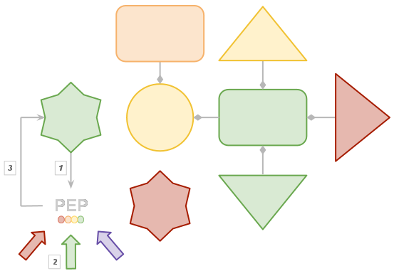
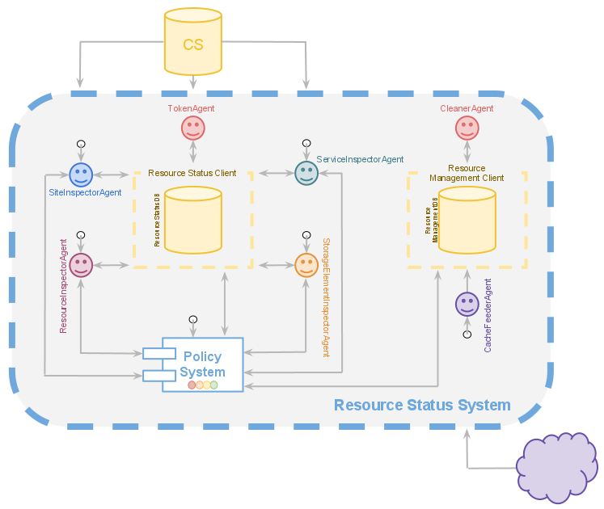

=======
Baptism
=======
   
.. contents:: Table of contents
   :depth: 3

------------
Introduction
------------

The **Resource Status System**, from now **RSS**, is an autonomous policy 
system acting as a central status information point for grid elements.

The *DIRAC* **RSS** is a monitoring and generic policy system that 
enforces managerial and operational actions automatically. As a matter of example, 
the status of a grid entity can be evaluated against a number of policies, which 
make assessments relative to monitoring information. Individual results can be 
combined to propose a new status for the resource. This proposal goes through a 
validation step governed by a state machine and an external validation system. 
Once validated, actions can be triggered accordingly.

Motivation
==========

There is a big, huge, enormous variety of monitoring information sources, such 
as:

  - Dashboard_
  - Lemon_
  - GocDB_
  - SLS_
  - SAM_
  - `IT support service status`_
  - ServiceMap_
  - `Lb Run Status`_
  - ...

and the list continues until a number of ~30 links, exposing all them at least 
one end-point and if we are unlucky, several. Moreover, if we step back and look 
at all the end points, there is no single easy recognisable pattern on their APIs, 
information display, etc... Let's say it is an environment that has a very high 
entropy.

On one hand, that list is checked every day by shifters, sites contact persons, 
etc... The need for a monitoring information aggregator is clear. On the other,
how do we interpret the information on that list will determine our knowledge
of the environment. This is done following well known procedures, that can be
easily automated converting them into policies.

---------------------
Underlying components
---------------------

Any *DIRAC System* makes use of databases, services, clients and agents, which are
the four pillars of *DIRAC* architecture. But in order to achieve its goal, the 
**RSS** makes use of a few concepts which are the heart of this system:

  - `Grid ontology`_
  - `State machine`_
  - `Policies`_
  - `Policy system`_
  - `Token ownership`_

The configuration applied to those three concepts will determine the behavior of
the *RSS* and the results we will get out of it.

.. seealso:: If you want to know more about the configuration, this is your link.

On our ontology we define a set of classes that will model accurately the grid
for the **RSS** purposes. Each individual belongs to a single class, and may be
related or not with other individuals of different classes. A common attribute
for every individual is the status, which may not be unique, but at least every
one will have one type of status. The transitions between the different values
for the status type of every individual are narrowed, or better, forced by a state
machine. Here is where policies come in; they are in charge of triggering the
state changes for individuals. 

Let's take a closer look !

On the image above we have a dummy ontology, which represents a dummy environment.
The ontology has four different classes: *circle*, *rectangle*, *triangle* and *star*, which
are connected, in this case, by composition relations. But, of course, any relation that is
suitable to model the environment fits on **RSS**. 

.. note::   
  
    Let's take as an example the circle and the two rectangles: we could say the 
    rectangles are part of the circle, but it would not be accurate enough, that is 
    an aggregation relationship. The composition relation we are talking about makes 
    senseless to have rectangles without a circle. The rectangles are part of the
    circle life cycle.
 
Four classes, one individual of class *circle*, two individuals of class *star*,
two individuals of class *rectangle* and three of class *triangle*. Each one of them
has at least one status type, which is the property of having a color, being the 
color itself the status. The initial statuses on the environment are *green*, *yellow*, 
*orange* and *red*. Moreover, if we look at the triangles, we will see they have another
status type, which is position. The values for this status type are *+90*, *+0* and *-90*
for the individuals shown.

.. note::
  
    All the individuals of the same class have the same status types, it may sound 
    too obvious, but just in case. So, all triangles have color and position status
    types.
    
At this point, we have a simplified version of the policies, the policy system and
the state machine. The Policy Enforcement Point, PEP from now, is the visible part
of the policy system, and collects per individual its status plus the outputs of the
relevant policies. In this case, we have three policies returning statuses *red*, *green* 
and *purple*. The PEP makes it's magic, and a new status for the status type color is proposed.
Finally, but not less important, the state machine integrated with the policy system
will ensure that the color *purple* never reaches the individual, as only *red*, *orange*,
*yellow* and *green* are allowed.

Grid ontology
=============

The grid ontology taken by default, a slightly simplified version, looks like the
one shown on the image below, showing the hierarchy of classes.  

.. image:: ../../../_static/Systems/RSS/gridOntology.png  
   :alt: grid ontology
   :align: center   

The image is self explanatory, but just in case: the grid is made of Sites, which 
expose Services, which are abstractions of Resources ( nodes ) that may have Storage
Elements.

.. seealso:: 

    You may have noticed that the relation between Resources and Storage Elements
    is *aggregation* and not *composition*. It is a very specific detail of the 
    implementation, which will not be explained here. The link you are looking 
    for is this one.

The relations between the classes are the following: site to many services, service 
to resource, and resource to storage element if any.

Last comment, but not less important. Services and Resources are defined by their 
type. There is a set of predefined flavors for Services and for Resources, and which
in practice has the following limitations:

  - No more than one Service of the same flavor per Site.
  - Resource flavor must be a ( badly called ) sub-type of the Service type.

The image below is an example of this behavior. There is a Site with three Services
out of the four drawn on the figure. As the Service is an aggregation of all Resources
with a type matching the Service type, it is a waste to define the service of the
same type twice. If higher granularity is needed, just define new flavors for the 
Services. With respect to the Resources, please keep the database tidied unless you
want infinite fun. It is easy, if Resource is of type A.*, do not mix it with Services
of type C.  

.. image:: ../../../_static/Systems/RSS/gridOntologyExample.png  
   :alt: grid ontology example
   :align: center  

State Machine
=============

The default state machine has four states: *Active*, *Bad*, *Probing* and *Banned*,
ordered by severity, but it can be extended to accommodate its states and transitions
to the VO needs. The behavior it shows out of the box is depicted on the image below.

.. image:: ../../../_static/Systems/RSS/stateMachine.png  
   :alt: state machine
   :align: center  

We have four states and almost every possible transition allowed ( note that the
transitions on the left side of the image are unidirectional ). But, let's understand
what do the states actually mean.

*Active* and *Banned* are almost self explanatory, the first one implies that the
individual is on good shape and no single problem / quality degradation has been 
reported. On the other hand, the second one implies the individual is, basically,
out of order.

*Bad* and *Probing* are slightly more complex states. *Bad* is a status that an individual
gets when problems are observed but "not so important" to rush directly to ban.
The individual in **DIRAC** is still *InMask*, which means it does not work at
100%, but we can still get a reasonable performance out of it.

Finally *Probing*, is a status where we knew there were problems with the resource
serious enough to have it banned. The original reason went away but we want to test
the individual before unbanning in real life. The individual in **DIRAC** is still
*Banned*.

.. note:: You may be wondering the following..
  these guys said that "*Probing, is a status where we knew there were problems 
  with the resource serious enough to have it banned*", but I see that the status
  *Probing* can be reached as well from *Active* and *Bad*. You are right ! By design,
  the state machine allows such transitions, but in real life we will never get
  that unless our policies have been badly set up / corrupted.

States are few and more or less clear, so they are not a big deal, but what kind 
of event triggers a transition between them ? Let's explain it with an example:

+---------+---------+--------------------------------------------------------------------------------------------+
| State 0 | State 1 | Reason                                                                                     |
+=========+=========+============================================================================================+
| A       | A       | Individual was Ok, and is still Ok                                                         |
+---------+---------+--------------------------------------------------------------------------------------------+
| A       | B       | Individual was Ok, but shows small degradation                                             |       
+---------+---------+--------------------------------------------------------------------------------------------+
| A       | P       | Individual was Ok, now is out of order. Allowed on theory, not on practice.                |
+---------+---------+--------------------------------------------------------------------------------------------+
| A       | X       | Individual was Ok, now is out of order.                                                    |
+---------+---------+--------------------------------------------------------------------------------------------+
| B       | A       | Individual showed small degradation, is Ok now.                                            |
+---------+---------+--------------------------------------------------------------------------------------------+
| B       | B       | Individual showed small degradation and still does.                                        |
+---------+---------+--------------------------------------------------------------------------------------------+
| B       | P       | Individual showed small degradation, now out of order. Allowed on theory, not on practice. |
+---------+---------+--------------------------------------------------------------------------------------------+
| B       | X       | Individual showed small degradation, now is out of order.                                  |
+---------+---------+--------------------------------------------------------------------------------------------+
| P       | A       | Individual validation is Ok.                                                               |
+---------+---------+--------------------------------------------------------------------------------------------+
| P       | B       | Individual validation shows small degradation.                                             |
+---------+---------+--------------------------------------------------------------------------------------------+
| P       | P       | Individual validation outcome unclear.                                                     |
+---------+---------+--------------------------------------------------------------------------------------------+
| P       | X       | Individual validation failed.                                                              |
+---------+---------+--------------------------------------------------------------------------------------------+
| X       | A       | This transition is redirected to Probing.                                                  |
+---------+---------+--------------------------------------------------------------------------------------------+
| X       | B       | This transition is redirected to Probing.                                                  |
+---------+---------+--------------------------------------------------------------------------------------------+
| X       | P       | Individual not anymore out of order, but we did not verify it.                             |
+---------+---------+--------------------------------------------------------------------------------------------+
| X       | X       | Individual is still out of order.                                                          |
+---------+---------+--------------------------------------------------------------------------------------------+

Out of 16 transitions ( 2^4 ) we have 14 transitions allowed, being 12 used on practice.
Transitions X->B and X->A will never happen, after being *Banned*, each individual
is forced to go through a validation step, which in this case is *Probing*. The reasons
why it was set as *Banned* are gone, but we do not trust it completely, so we validate
it before setting it either to *Active* or *Bad*. 
Transitions A->P and B->P will never happen if our policies are properly set up.
If an individual is degraded enough to be set as *Probing*, is also degraded enough
to be set as *Banned*.

.. note:: Active (A), Bad (B), Probing (P), Banned (X).

.. note:: Here is small summary of the RSS State Machine.

  +--------------+------------+----------------------------------+------------+----------------+-----------------+
  | Status       | DIRACMask  | Description                      | Usage      | In connections | Out connections |              
  +==============+============+==================================+============+================+=================+
  | Active       | InMask     | no problems reported             | full       | A,B,P,-        | A,B,P,X         |
  +--------------+------------+----------------------------------+------------+----------------+-----------------+
  | Bad          | InMask     | some problems reported           | throttled  | A,B,P,-        | A,B,P,X         |
  +--------------+------------+----------------------------------+------------+----------------+-----------------+
  | Probing      | Banned     | testing or investigation ongoing | restricted | A,B,P,X        | A,B,P,X         |
  +--------------+------------+----------------------------------+------------+----------------+-----------------+
  | Banned       | Banned     | problems or maintenance reported | none       | A,B,P,X        | -,-,P,X         |
  +--------------+------------+----------------------------------+------------+----------------+-----------------+

Policies
========

Without any doubt, policies are the most important part of RSS. There are many
components here and there to make it work, but the knowledge, the interpretation
of the monitoring information spread round the different third party systems is
done here. A good set up of every single policy is crucial for RSS. Basically, no policies,
no RSS. 

But, what is a policy ?

A policy can be divided in two parts, meta-data and the policy itself. The policy
itself is a set of rules, that given an input, return a status. You can see it 
as a reactive policy given an input:

::

    if input > 50:
      return 'Green'
    else:
      return 'Blue'  

Typically, the input is the output of a command, which connects to a particular
monitoring system and returns whatever is stored there. Moreover, a policy not 
necessarily works with only a single command, they can use different commands if
needed ( one at a time ). So, each policy, given an input, purposes a status for
the given conditions.  

But, how do we know which policies and which commands apply to a particular individual ?
Meta-data is our friend, and the answer to this question ! On one hand, every individual
has a set of attributes, going back to the dummy ontology, in the case of a triangle,
position and color. But we know that that individual is a triangle, so on out policies meta-data
we should specify which ones are applicable to triangles, or even more, which ones are
applicable to blue triangles.

.. seealso:: the configuration of policies meta-data is done on the CS 
  ( *Operations/RSSConfiguration/Policies* ). But here is a link with much more
  detailed information.

Policy System
=============

The *Policy System* is in charge of given meta-data information: get all applicable
policies, run them, evaluate all the purposed statuses by the policies and select
the most reasonable one. Having taken a decision, last step is to take actions
accordingly.

Below there is depicted a simplified version of the *Policy System* components
diagram.   

.. image:: ../../../_static/Systems/RSS/simplifiedPolicySystem.png  
   :alt: simplified policy system
   :align: center  

.. note:: Policy Enforcement Point ( **PEP**), Policy Decision Point ( **PDP**) 
  and Policy Information Point ( **PIP** ).
  
- *Policy Enforcement Point*: it is the visible part of the *Policy System*, and
  gets as input the meta-data information considered to be checked. Also, once
  it has an answer from the inner *Policy System* modules, it applies predefined
  actions if applicable.  
  
- *Policy Decision Point*: it is the core of the *Policy System*. First of all,
  finds matches between the meta-data given as input and the policies meta-data
  stored on the CS. If there are positive matches, policies are evaluated, and
  out of their results a decision taken. The decision is taken the "worst-first"
  approach. Given the purposed statuses of three different policies, the PDP will
  take the worst of them ( if we got *Active*, *Bad* and *Banned*, it will return
  *Banned* ).    
  
- *Policy Information Point*: it is the module in charge of getting policies 
  meta-data from the CS and returning the positive matches. The meta data
  can be sometimes "wild" and heterogeneous. In order to prevent that, there is
  a limited number of types that apply ( but easily extensible on the CS ! ).
  It also returns per policy which actions must be applied in case of the policy
  output is considered. Actions can vary from adding log messages, sending a sms,
  changing the status of the individual or restarting the universe if needed.
   
     
The image is labeled with six numbers, which correspond with the casual flow:

- 1: PEP calls PDP to take a decision with respect a given meta-data.
- 2: PDP calls PIP to get applicable policies.
- 3: PIP gets all policies meta-data from the CS and returns the matches.
- 4: PDP calls the chosen policies.
- 5: PDP applies "worst first" and returns the decision.
- 6: PEP applies actions once it knows the decision taken.

Easy, isn't it ?

Token Ownership
===============

Token ownership is a small lock that every individual on the grid ontology has.
By default, it is "**RS_SVC**" ( Resource Status system SerViCe ).

This token locks / unlocks the access of the *Policy System* to the individuals, 
or with other words, any individual with a token different than **RS_SVC** will never
be evaluated by the PEP.

Also, each token has an expiration value. After that, whatever value it had will
be reverted to the default one.

Tokens turn to be quite handy when operators need to keep an individual, or a set
of them away from the "Policy System".

--------------------
State Storage ( DB )
--------------------

The *Resource Status System* has two databases, namely **ResourceStatusDB** and
**ResourceManagementDB**.

- *ResourceStatusDB*: it is the main database, and stores per class in the ontology
  four tables. One with the definition of the individuals, the second one with
  their status types and their values. A third one with the historical rows and
  a last one, not in use yet, with the scheduled statuses.
  
- *ResourceManagementDB*: has the cached values, plus the summaries extracted from
  the history tables of the *ResourceStatusDB*. It also stores information of the
  tests performed to validate the individuals when they are at probing.
  
.. seealso:: If you want to know more, please take a look to the developers documentation.    

Access to state storage 
=======================

The *Resource Status System* provides a well defined Client per database. All the queries
to the database MUST be done though the Client, which will give you the best performance
possible. 

The entry points of the Client are:

- *ResourceStatusClient*: front end for the *ResourceStatusDB*.
- *ResourceManagementClient*: front end for the *ResourceManagementDB*.

or if you prefer, you can access the database functions directly though the client gates:

- *ResourceStatusClient.gate*: front end for the *ResourceStatusDB*.
- *ResourceManagementClient.gate*: front end for the *ResourceManagementDB*.

.. seealso:: The API is documented here.
.. warning:: Consider this an advice from a friend. If you don't want to use the Client and
   connect directly to the DB or the Service, well, have fun if something goes bananas.

------
Agents
------

The *Resource Status System* has three main types of agents: *InspectorAgents*,
*CacheAgents* and *CleanerAgents*.

InspectorAgents
===============

InspectorAgents are the glue of the RSS, the point where all pieces are put together,
and its magic done. There is an agent per class in the grid ontology, named <className>InspectorAgent.
This means that by default we have four *InspectorAgents* ( *Site*, *Service*, *Resource* and
*StorageElement* ).

Each one of them queries the ResourceStatusDB with the Client in order to get all individuals
not checked recently

.. note:: Recently checked ? Well, take a look to the developers documentation.

Each agent sets a thread pool to process all individuals. In order to do that, instantiates
a *PEP* object, and runs it. The *PEP*, as the front end of the *Policy System* will do
all dirty work. Simple, isn't it ?

CacheAgents
===========

CacheAgents are used to, as it name says, to cache information from the monitoring
systems and keep a recent snapshot of it. In a early stage of *RSS* it turned out
that under certain conditions it could almost kill some monitoring systems because
a very high polling rate.

CleanerAgents
=============

Every house needs to be tidied from time to time. The same applies to databases.
It summarizes and removes old entries on the databases.

A particular implementation of a *CleanerAgent* is the *TokenAgent*, which sets
to default any token with expiration date in the past.

---------------
System overview
---------------

Now you have all we need to compose a mental picture of the RSS, without going into
details. If you are not one of those who like mental pictures, the following image 
may guide you.

   
As per reminder:

  - 4 classes on the ontology: *Site*, *Service*, *Resource* and *StorageElement*.
  - 4 allowed statuses on the Status Machine: *Active*, *Bad*, *Probing* and *Banned*.
  - Policies metadata stored in CS.
  - Policy System comprises: PEP, PDP and PIP.
  - Token ownership by default *RS_SVC*.
  - Two databases, with their Clients: *ResourceStatusClient* and *ResourceManagementClient*.
  - Four inspector agents, one per class in the ontology.
  - Two cleaner agents.
  - One cache feeder agent.   

.. seealso:: If you are still hungry of information, you can also take a look to the developers guide.

------------

:Author:  Federico Stagni <federico.stagni@SPAMNOTcern.ch>, Mario Ubeda Garcia <mario.ubeda.garcia@SPAMNOTcern.ch>, Vincent Bernardoff <vincent.bernardoff@SPAMNOTcern.ch>
:Date:    Thu, 20 Oct 2011
:Version: v0r1

.. IMAGES

.. |DIRACfavicon| image:: ../../../_static/favicon.ico
 
        
.. HYPERLINKS

.. _Dashboard: http://dashb-lhcb-ssb.cern.ch/dashboard/request.py/siteviewhome?view=Job%20Activities
.. _Lemon: http://lemonweb.cern.ch/lemon-web/
.. _GocDB: https://goc.egi.eu/portal/
.. _SLS: http://sls.cern.ch/sls/index.php
.. _SAM: http://dashb-lhcb-sam.cern.ch/dashboard/request.py/latestresultssmry-sum
.. _`IT support service status`: http://itssb.web.cern.ch/
.. _ServiceMap: http://servicemap.cern.ch/ccrc08/servicemap.html
.. _`Lb Run Status`: http://lbrundb.cern.ch/
  
