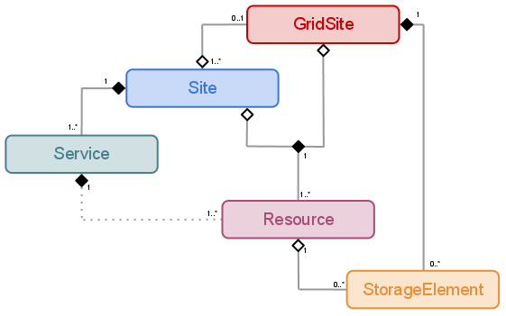

======
Design
======
   
.. contents:: Table of contents
   :depth: 3

------------
Introduction
------------

In this section you will get more specific details about how RSS works internally.
After having read this page, you should know enough to tweak RSS and get the best 
of it.

---------
DB Schema
---------

The RSS has a well defined onthology, which translated into SQL tables looks like
this ( please, read the baptism part before getting a headache with this pseudo uml ! ).

 
Due to the nature of the Grid, which is little bit heterogeneous, the UML relationships
were slightly modified from the original path: Site -> Service -> Resource -> StorageElement.

Let's see why the exotic relationships.

We have LCG and DIRAC sites. The first ones are matched with GridSites, being possible to
have more than one site belonging to a GridSite. On the other hand, DIRAC sites have
no GridSite.

A site has Services, one per ServiceType ( at most ). Now, comes the exotic part. 

Resources belong to a service, well, to be exact, to a ServiceType. And also, they
belong to either a GridSite or a Site. This is explained if we take into account the 
StorageElements into this explanation. The Resources of type Storage are binded with
GridSites, not with Sites ( a GridSite can point to more than one Site, so that would
mean that there are a couple of sites that use the same Storage Resource ). For the
rest of the Resources, they are binded with a site. Last comment is related with
the way they are linked with the services. For the non Storage Resources it is fine,
they are linked to the service <serviceType>@<siteName>. If <siteName> is None, then
the service will be a list of services, one per site that belongs to the GridSite. 

Finally, the StorageElements. If the Resource is of type Storage, then there is a
StorageElement binded, which belongs to a GridSite, as said before. 

After that *schema in a nutshell*, we have that each element follows a pretty similar
structure, composed by four tables and a view. In fact, all tables are equal among the
different elements, except the *Element* table, which stores the particularilites of the
element.

.. note ::

  Elements are: Site, Service, Resource and StorageElement.
  
The most important table is ElementStatus, where all information related with the current
status of the element is stored. Consequently, the ElementHistory table keeps the old
ElementStatus entries ( updated automatically by the client when a new ElementStatus is added ).

Finally the ElementPresent, which is a view of three of the tables, it speeds up some
queries.

For the time being, ElementScheduledStatus is not used. You can ignore it. 
  

.. image:: ../../../_static/Systems/RSS/elementSchema.png
   :alt: element schema
   :align: center

------------
Architecture
------------

DIRAC in general has a client-server architecture, but ( almost ) every system
has a different approach to that model. That architecture has clients, servers and
databases. In fact, the client name can be misleading sometimes, but that is a 
different business. 

The approach used by RSS is to give full access to the data through the client.
In practice this means your life is easy if you do not care about details, and just
want your thing working quickly. As the image shows, the client acts as a big black
box. The idea is to ALWAYS access the RSS databases through the clients, independently
of your condition: human being, DIRAC agent, etc...

.. image:: ../../../_static/Systems/RSS/client-server-db.png
   :alt: client server db
   :align: center

Most of the users do not care about how data is accessed, making the client good
enough for them. If you are one of those that do not like black boxes, here is what
happens behind the scenes: the client establishes a connection - either a MySQL connection
with the database or a RPC procedure with the server. The policy is to always try to
connect to the DB, and if not possible ( access not granted for example ) connect
to the server. This approach gives the client the best possible connection.

.. note::
  
    We encourage you to use the client, but if you prefer to connect directly to 
    the db or the server, you can do it. You will simply not find it documented. 

The fact of connecting either to the server or the database triggers the following
question: how do we connect to the server and the database without fattening our
code every time we add something to the API ?

The first solution is to have the server and db wrapper exposing the same methods,
this is just for coherence. But to solve the fattening problem, both were provided
with four methods, flexible enough to accommodate any query. The four methods are
*insert*, *get*, *update* and *delete*. Hum, do they sound familiar to you ?

Going back to the client, we know it will give us the best connection to the data
possible, and that all we need is there. Which kind of methods can we find there ?
Not surprisingly, we will always have ( well, think on always as a light promise )
the following five methods: *insert*, *update*, *get* and *delete*, plus *addOrModify*
- being he last one is a helper to do *'INSERT ... ON DUPLICATE KEYS UPDATE'* using the
insert and update methods. In fact, out of the five, most probably you will only 
use the last three.

.. note::
  
    The addOrModify may not only do an *insert / update*, so do not be surprised if
    you get different results doing *insert / update* and *addOrModify*. To be safe,
    use the last one - it might update history tables, for example.
    
Apart from those five methods, you will get a selection of potentially useful methods.
If it lacks any, just ask for them ( or cook them by yourself ! ). Most of these
methods are doing some processing on top of the basic five methods, so, you will
find the client calling the client before returning a result.

--------------
Accessing data
--------------

Now you have an idea of how RSS looks internally. Now, lets get some data. We will
use as example, the ResourceStatusClient - one of the two clients that follow this
structure.

::
    
    # firstly, the usual black magic ( you should have a valid proxy )
    from DIRAC.Core.Base.Script import parseCommandLine
    parseCommandLine() 

    from DIRAC.ResourceStatusSystem.Client.ResourceStatusClient import ResourceStatusClient
    rsc = ResourceStatusClient()

If at this point you get an exception, please jump to next section *Configuration*
and then come back.

::

    # let's take a look to the client
    help( rsc )
    
As you can see, all methods provide some information about the types they are 
expecting, and a brief description. Let's play with the *Site* methods.

::

    # get all information about all sites
    rsc.getSite()
    { 'OK' : True, 'Value' : [['DIRAC.Barcelona.es', 'T2', 'NULL'], ['LCG.CERN.ch', 'T0', 'CERN-PROD'],... ] }
    # maybe too much info, let's narrow our query
    rsc.getSite( siteName = [ 'DIRAC.Barcelona.es' ] )
    { 'OK' : True, 'Value' : [['DIRAC.Barcelona.es', 'T2', 'NULL']] }
    # or the equivalent
    rsc.getSite( siteName = 'DIRAC.Barcelona.es' )
    { 'OK' : True, 'Value' : [['DIRAC.Barcelona.es', 'T2', 'NULL']] }
    # maybe is not enough info, let's get all the sites of type T0 and T1
    rsc.getSite( siteType = [ 'T0', 'T1' ] )
    { 'OK' : True, 'Value' : [['LCG.CERN.ch', 'T0', 'CERN-PROD'], ['LCG.NIKHEF.nl', 'T1', 'NIKHEF-ELPROD'],... ] }     
    # or all sites of grid 
    # of course, you can narrow even more the query with multiple selectors
    rsc.getSite( siteType = 'T0', gridSiteName = [ 'CERN-PROD' ])
    {'OK': True, 'Value': [['LCG.CERN.ch', 'T0', 'CERN-PROD']]}
    
So far, no complications at all. The get method is the simplest one. Let's move into
the insert method.

::  

    # let's insert a new site
    rsc.insertSite( 'AwesomeSite', 'T0', 'GRID-KPAX' )
    {'OK': True, 'Value': 1L}
    
    # users tend to be clamcy or evil from time to time
    rsc.insertSite( [1], 'T0', 'GRID-KPAX' )
    {'Message': 'Exception in the RSS DB: \'Non varchar value "1"\'', 'OK': False}
    rsc.insertSite( 'True; drop ...', 'a', 'b' )
    {'OK': True, 'Value': 1L}
    # the output of the above will be whatever the MySQL escape function returns
    # in this case, we have a new site with a horrible name
    rsc.getSite( siteName = 'True; drop ...' )
    { 'OK' : True, 'Value' : [['True; drop ...', 'a', 'b']] }
    
Next method is update, which is very similar to insert.

::

    # let's update our AwesomeSite
    rsc.updateSite( 'AwesomeSite', 'T2', 'GRID-PAX' )
    {'OK': True, 'Value': 1L}
    
If you are wondering how comes this works, here we go. To perform an update, we
need to know beforehand how the table in the database looks like ( or at least, 
read the method documentation, which will tell you which parameter will be used
to do the update ). In the case of updateSite, is siteName, which will give us a 
SQL statement like this: *'UPDATE Site SET SiteType = "T2", GridSiteName = "GRID-PAX" 
WHERE SiteName = "AwesomeSite" '*. Of course, you can modify that, but will come later.

::

    # but we can be stupid as well - it will not crash, simply will do nothing
    rsc.updateSite( 'AwesomeSiteThatDoesNotExist', 'T2', 'GRID-PAX' )
    {'OK': True, 'Value': 0L}

Delete, is probably the most dangerous method. It follows the same idea of the get
method, but it deletes instead of selects. There is only one exception:

::

    # what will happen if we execute the following ?
    rsc.deleteSite()
    {'Message': "Execution failed.: ... ", 'OK' : False }
    # we are aware of it ;), deleting a whole table my mistake ensures you great fun.
    
    # let's delete our AwesomeSite
    rsc.deleteSite( siteName = 'AwesomeSite' )
    {'OK': True, 'Value': 1L}
    # and again ... - nothing to do
    rsc.deleteSite( siteName = 'AwesomeSite' )
    {'OK': True, 'Value': 0L}
    # or all sites of type 'T3' and 'T2'
    rsc.deleteSite( siteType = [ 'T2','T3' ] )
    {'OK': True, 'Value': 1L}

And so on and so forth..

At this point, I hope the explanation of *addOrModifySite* is not really necessary.

::

  # let's add a new site
  rsc.addOrModifySite( 'AwesomeSite2', 'T1', 'GRID-KPAX' )
  {'OK': True, 'Value': ''}
  # that should be {'OK': True, 'Value': 1L} -- INVESTIGATING
  # update nothing
  rsc.addOrModifySite( 'AwesomeSite2', 'T1', 'GRID-KPAX' )
  {'OK': True, 'Value': 0L}
  # update site tier
  rsc.addOrModifySite( 'AwesomeSite2', 'T0', 'GRID-KPAX' )
  {'OK': True, 'Value': 1L}
  
Enough ! Or not ?
*addOrModifySite* has added records on other two tables of the *Site family*, as it
was mentioned, it is not only an *insert / update*. This should not discourage you
to not use it, in fact, you will get on trouble if you don't do it. But, what if we 
want to wipe out of the map a site ?

::

  # remove all dependencies of a site
  rsc.removeElement( 'Site', 'AwesomeSite2' )
  # the possibilities for the first argument are *['Site','Service','Resource','StorageElement']* by default 
  {'OK': True, 'Value': 1L}
  # elements "only inserted" are removed properly too, even if they have no other relations
  rsc.removeElement( 'Site', 'AwesomeSite1' )
  {'OK': True, 'Value': 1L}
  
So, here we got five plus one methods. 

----------------
Accessing data 2
----------------

Now you have an idea of how does the ResourceStatus clients work. Pretty simple once
you know the mechanics. Only two great little details:

Element tables
--------------

What we call element tables are the tables of type *'Site','Service','Resource','StorageElement'*.
There are four tables per element, plus one view. So far, we only defined a site,
but what about its status ? We do care a bout that !

When we *addOrModify* an element, we are - apart from insert / updating the Site table -
modifying the SiteStatus table in case of insertion, with an initial state for the Site
( 'Banned' by default ).
 
Once we have the sites on the database, the obvious action is to modify their statuses.
For that purpose, there are the following methods:

  - insertElementStatus
  - updateElementStatus
  - getElementStatus
  - deleteElementStatus
  
.. note::
  
    Being strict with the RSS design, them should be 'insertSiteStaus', 'insertServiceStatus', etc... but it 
    was decided to save some lines of code - the XStatus tables are identical.
    
Being back to our Site example, we have the following:

::

  # add a new site
  rsc.insert( 'NewSite', 'T2', 'GRID-A' )
  {'OK': True, 'Value': 1L}
  # and let's get it's status
  rsc.getElementStatus( 'Site', elementName = 'NewSite' )
  {'OK': True, 'Value': []}
  # Oops, we should have used addOrModify
  rsc.addOrModifySite( 'MySite', 'T2', 'GRID-A' )
  {'OK': True, 'Value': 1L}
  # now it works
  rsc.getElementStatus( 'Site', 'MySite' )
  {'OK': True, 'Value': [[108L, 'MySite', '', 'Banned', 'Init', ...]]}
  
Wow ! That is quite a lot of information. What does every field mean ?
  
  - SiteStatusID : id on the table.
  - SiteName : name of the site.
  - StatusType : type of status. Remember the colors and the position of the triangles ?
  - Status : status of the element for the type statusType.
  - Reason : why do we have this status.
  - DateCreated : datetime the entry was created.
  - DateEffective : ignore this now.
  - DateEnd : ignore this now.
  - LastCheckTime : last time this row was updated - because this element was checked.
  - TokenOwner - ignore this now.
  - TokenExpiration - ignore this now.
  
Do you the *addOrModify* methods ? For the statuses we have *modifyElementStatus*.
Remember that the status is added automatically by the *addOrModify* method, so
after we only need to modify the status. In the case we have a new statusType, then
we will have to use *insertElementStatus* - but that is infrequent.

::

  # let's set the status as active - do not forget to specify the statusType
  rsc.modifyElementStatus( 'Site', elementName = 'MySite', statusType = '', status = 'Active' )
  {'lastRowId': 916L, 'OK': True, 'Value': 1L}
  # and voila !
  rsc.getElementStatus( 'Site', 'MySite' )
  {'OK': True, 'Value': [[108L, 'MySite', '', 'Active', 'Init', ...]]}
  
.. note::
  
    If we do not have a good reason to give a name to the statusType, we leave it empty.
    As a result, we have ( in lhcb ) empty statusTypes for Sites, Services and Resources.
    The direct conclusion is that the Site and the SiteStatus tables have the same number
    or rows - if not, there is something wrong. In fact, the size of the XStatus table must be
    size_of( X ) x number_of_status_types_of( X ).  

To *updateElementStatus* applies the same reasoning that we used with *insertElementStatus*.
Do not use unless you have a good reason to do it. Finally *deleteElementStatus*, do you
remember *removeSite* method ?

::

  # let's delete the status, but leave history and site definition - potential source of problems in Status processing
  rsc.deleteElementStatus( 'Site', elementName = 'MySite', statusType = '' )
  {'OK': True, 'Value': 1L}
  # we cannot delete if it does not exist
  rsc.deleteElementStatus( 'Site', elementName = 'MySite', statusType = '' )
  {'OK': True, 'Value': 0L}
  # but the site is still there
  rsc.getSite( siteName = 'MySite' )
  {'OK': True, 'Value': [['MySite', 'T2', 'GRID-A']]}
  # let's clean the DB !
  rsc.deleteSite( siteName = 'MySite' )
  {'OK': True, 'Value': 1L}
  # and the history tables too
  rsc.deleteElementHistory( 'Site', elementName = 'MySite', statusType = '' )
  {'OK': True, 'Value': 2L}
  # if you do not get 0L, there was some record you forgot to delete
  rsc.removeElement( 'Site', elementName = 'MySite' )
  {'OK': True, 'Value': 0L}
      
  
Narrowing SQL statements
------------------------

In the examples we sometimes got very long outputs from the SQL queries, what if we 
only need the SiteName field form the sites table ? Or we want to limit the output to
5 elements ? Or need to include boolean sentences on the where clause ?

Most of the methods described above, have as last keyworded argument an empty dictionary
named meta. Here you can narrow your SQL where clauses.

The options allowed are:

  - columns
  - sort
  - order
  - limit
  - group
  - count
  - not 
  - minor
  - or 
  - uniqueKeys
  - onlyUniqueKeys
  
The last three keys are little bit more exotic, so will be explained on next revision
of the document. Of course, there are missing keys ( like *greater* or *like* ), but
as were not needed for the normal usage of the RSS, were not implemented. Find a good
reason, and them will be put on place ;).   

COLUMNS: list ( or string ) with the columns we want the query to return.
::

    # let's get all the siteNames
    rsc.getSite( meta = {'columns' : 'SiteName' } )
    {'OK': True, 'Value': [['LCG.AUVER.fr'],...] }
    # or the equivalent
    rsc.getSite( meta = {'columns' : ['SiteName']} )
    {'OK': True, 'Value': [['LCG.AUVER.fr'],...] }
    # and now SiteName and SiteType
    rsc.getSite( meta = {'columns' : ['SiteName', 'SiteType']} )
    {'OK': True, 'Value': [['LCG.AUVER.fr','T2'],...] }
    # and now SiteName and SiteType for LCG.CERN.ch
    rsc.getSite( siteName = 'LCG.CERN.ch', meta = {'columns' : ['SiteName', 'SiteType']} )
    {'OK': True, 'Value': [['LCG.CERN.ch','T0']] }

SORT: column(s) we want to use to sort the query.
::

    # let's get all the siteNames sorted by SiteType
    rsc.getSite( meta = { 'sort' : 'SiteType' } )
    {'OK': True, 'Value': [['LCG.CERN.ch', 'T0', 'CERN-PROD'],...]}

ORDER: either ascendant ( ASC ) or descendant ( DESC ). Must be used together with sort.
::

    # if there is no sort, nothing changes...
    rsc.getSite( meta = {'order' : 'ASC' } ) == rsc.getSite( meta = {'order' : 'DESC' } )
    True
    # order ascendant ( same as by default )
    rsc.getSite( meta = {'order' : 'ASC', 'sort' : 'SiteName' } )
    {'OK': True, 'Value': [['DIRAC.Barcelona.es', 'T2', 'NULL'],...]}
    # and descendant order.
    rsc.getSite( meta = {'order' : 'DESC', 'sort' : 'SiteName' } )
    {'OK': True, 'Value': [['LCG.WEIZMANN.il', 'T2', 'WEIZMANN-LCG2'],...]}

LIMIT: limit the number of records returned.
::

    # get one site, not very useful without sorting. Try yourself !
    rsc.getSite( meta = { 'limit' : 1 } )
    {'OK': True, 'Value': [['DIRAC.Barcelona.es', 'T2', 'NULL']]}

GROUP: group records ( not very useful without count ).
::

    # group sites by SiteType
    rsc.getSite( meta = { 'group' : 'SiteType' } )
    {'OK': True, 'Value': [['LCG.CERN.ch', 'T0', 'CERN-PROD'], ...]}

COUNT: count number of records ( boolean flag ).
::

    # try this out
    rsc.getSite( meta = { 'count' : True, 'group' : 'SiteType', 'columns' : 'SiteType' } )
    {'OK': True, 'Value': [['T0', 1L], ['T1', 7L], ['T2', 98L], ['T3', 1L]]}
    
NOT: negate bool sentence
::

    # get all siteTypes but T0
    rsc.getSite( meta = { 'not': { 'SiteType' : 'T0' }, 'columns' : 'SiteType' } )
    {'OK': True, 'Value': [['T1'], ['T1'], ['T1'],...]} 
    # get all siteTypes but T0, T1,
    rsc.getSite( meta = { 'not': { 'SiteType' : [ 'T1','T2'] }, 'columns' : 'SiteType' } )
    {'OK': True, 'Value': [['T0'], ['T3'],...]}

MINOR: value minor than
::

    # get all modified before now ( all of them ).  
    from datetime import datetime
    rsc.getElementStatus( 'Site', meta= { 'minor' : { 'LastCheckTime' : datetime.utcnow() }, 'columns' : 'SiteName' } )  
    {'OK': True, 'Value': [['LCG.CNAF-T2.it'],..] }   
    
-------------
Configuration
-------------

The RSS can be set up from the CS, modifying the default values it provides. If
you just want to use it as a status storage, very probably you will not need to
modify it.

Here is how the simplest default looks like:

::

    Operations
    {
      RSSConfiguration
      {
        GeneralConfig
        {
          Status = 'Active','Bad','Probing','Banned'
          Resources
          {
            'Site'
            {
              'StatusType' = ''
            },
            'Service'{
              'StatusType' = ''
            },
            'Resource'{
              'StatusType' = ''
            },
            StorageElement
            {  
              'StatusType' = 'Read', 'Write', 'Remove', 'Check'
            }
          },
          SiteType = 'T0','T1','T2','T3'
          ServiceType = 'Computing','Storage','VO-BOX','VOMS','CondDB'
          ResourceType = 'CE','CREAMCE','SE','LCF_C','LFC_L','FTS','VOMS' 
        }
      }
    }

In fact, this is what the RSS assumes you want as setup if you do not specify it.
If you want to run the agents, then a more detailed configuration is needed. On the
meantime, this is good enough.

----
Aims
----

Status server
-------------

Status processing
-----------------
  
-----------------
Development guide
-----------------