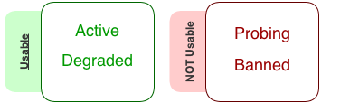

============
Introduction
============

.. contents:: Table of contents
   :depth: 3

The **Resource Status System**, from now **RSS**, is an autonomous policy system acting
as a central status information point for Grid Elements. Due its complexity, it has been
split into two major sections:

1. Status Information Point
2. Monitoring System

On this section, the *Status Information Point* for grid elements is documented.

Looking backwards, there were two end-points where information regarding Grid
Elements statuses was stored. The first one, the :doc:`../Configuration/index` ( CS ) stored the
*Storage Element* ( SE ) status information mixed with static information like the SE
description among other things. The second one, the :doc:`../WorkloadManagement/index` ( WMS )
stored the *Site* status information ( more specifically, on a dedicated table on
ResourceStatusDB called *SiteStatus* ).

The case of the SEs was particularly inconvenient due to the changing nature of a SE
status stored on a almost dynamic container as it is the CS. In spite of being a working
solution, it was pointing out the bounds of the system. The CS had not been designed for
such purpose.

With that problem in hand, it was very easy to abstract it and include the site status
information stored on the SiteStatus. And that was just the beginning... Nowadays the DIRAC
interware offers a formal description to describe grid elements and their status information
using two complementary systems:

* CS, which holds the descriptions and hierarchy relationships ( no need to say they are static )
* RSS, which takes care of the status information.

You can find the details on the `RFC5`_.

-------
Element
-------

An *Element* in the RSS world represents a Grid Element as described on the `RFC5`_. It can be any of the following:

* Node
* Resource
* Site

Elements are the information unit used on RSS. Everything is an Element, and all are treated equally, simplifying the design
and reducing the complexity of the system. If all are treated equally, the reader may be wondering why three flavors instead
of just an Element type. The answer for that question is simply to keep them separated. On the RSS they are treated equally,
but in Real they have very different significance. Marking as unusable a Site or a CE on the RSS requires the same single and
unique operation. However, the consequences of marking as unusable a Site instead of one if its CEs by mistake are not negligible.
So, you can also add "safety" as a secondary reason.

-----------
ElementType
-----------

The Grid topology is not part of the RSS itself, but is worth mentioning the relations underneath to have a full picture. The Grid
is composed by a "un"certain number of Sites. Those sites are registered with their respective descriptions on the DIRAC CS as follows:

::

 /Resources/Sites
                /CERN.ch
                ...
                /IN2P3.fr
                        /Domains = EGI, LCG
                        /ContactEmail = someone@somewhere
                        /MoreDetails = blah, blah, blah
                        /Computing
                               /...
                        /Storage
                               /...
                /PIC.es
                ...

Each Site can have any number of Resources, grouped into categories. In terms of RSS, those categories are *ElementTypes*. For the
Resources Element, we have the following Element Types:

* ComputingElement
* StorageElement
* ...

And if we take a look to the ComputingElement Resources, we can see the pattern happening again.

::

    .../Computing/some.cream.ce
                         /CEType = CREAM
                         /Host = some.cream.ce
                         /Queues
                                 /cream-sge-long
                                           /Communities = VO1, VO2
                                           /Domains = Grid1, Grid2
                                           /MaxCPUTime =
                                           /SI00 =
                                           /MaxWaitingJobs =
                                           /MaxTotalJobs =
                                           /OutputURL =
                                 ...
                         ...

Each CE Resource has any number of Nodes, in this case of the ElementType Queue.

The list of ElementTypes per Element may vary depending on the CS/Resources section !

-----
State
-----

Each Element has an associated State, which is what will be used to mark the Element
as usable or not. In principle, looks like a binary flag would solve the problem,
either ON or OFF. On practice, a fine-grained granularity for the States has been implemented.

There are four major states, plus two corner-cases states which do not apply on the basic
implementation:

If the Element status is:

* Active, it is 100% operative.
* Degraded, its performance is affected by X reason, but still usable.
* Probing, is recovering from a Banned period, but still has not been certified to be Ok.
* Banned, is basically down.

----------
StatusType
----------

It may happen that an Element requires more than one Status. A very clear example are the
StorageElement Resources, which require several Statuses in order to specify the different
data accesses ( ReadAccess, WriteAccess, etc ... ).

By default, every Element has only one StatusType - "all". However, this can be modified on
the CS to have as many as needed. Please, take a look to :doc:`configuration` for further
( setup ) details.

---------
Ownership
---------

RSS includes and extends the concept of ownership, already in place for the mentioned *SiteStatus*.
It makes use of **tokens**, which are simply a tuple composed with the *username* and a *timestamp*.

They have two main functions:

* identify who has put his / her hands on that particular Element.
* bind the Status of that Element to the user.

By default, RSS is the owner of all Elements with an ALWAYS timestamp and username *rs_svc*.
However, if there is a manual - "human" - intervention, the Element will get a 1-day-valid token
for that user, and it will be recorded like that.

The second function is new in what respects the *SiteStatus* implementation, but its purpose is not part
of the basic usage of RSS. Please continue reading here: `Ownership II`_.

----------
Parenthood
----------

As it was already explained on `ElementType`_, Elements of different flavors are linked as stated on the CS.
As it can be incredibly tedious getting those relations constantly, the most common operations have been
instrumented inside the Resources() helper.

Resources() Helper
==================

.. warning:: The Resources() Helper still needs to be developed.

---------------
Database schema
---------------

The database used for the basic operations is *ResourceStatusDB* and consists on three sets of identical tables,
one for *Site*, another for *Resource* and the last one for *Node* Elements ( as explained on `Element`_ ).

On each set there is a main table, called <element>Status ( replace <element> with Site, Resource or Node ), which
contains all status information regarding that Elements family. The Status tables are enough to start running the RSS.
However, if we need to keep track of the History of our Elements, the next two tables come into scene: <element>Log
and <element>History.

.. image:: ../../../_static/Systems/RSS/ElementSchemaDB.png
   :alt: element schema
   :align: center

Every change on <element>Status is automatically recorded on <element>Log and kept for a :doc:`configurable amount of time <configuration>`.
The last table, <element>History summarizes <element>Log table, removing consecutive entries where the Status for a given
tuple ( ElementName, StatusType ) has not changed.

.. note :: There are no Foreign Keys on the ResourceStatusDB tables.

------------
Synchronizer
------------

The Synchronizer is the code linking the CS and the RSS ( in that direction, not viceversa ! ). Every change on the CS in terms of
Element addition or deletion is reflected on the RSS. With other words, it populates the ResourceStatusDB Status tables with the information
in the CS. In order to do so, it makes use of the `Resources() Helper`_, which is aware of the CS structure. Every time there is an update of the
CS information, this object will look for discrepancies between the database and what is on the CS and fix them consequently.

------------
Architecture
------------

DIRAC in general has a client-server architecture, but ( almost ) every system
has a different approach to that model. That architecture has clients, servers and
databases. In fact, the client name can be misleading sometimes, but that is a
different business.

The approach used by RSS is to give full access to the data through the client.
In practice this means your life is easy if you do not care about details, and just
want your thing working quickly. As the image shows, the client acts as a big black
box. The idea is to ALWAYS access the RSS databases through the clients, independently
of your condition: human being, DIRAC agent, etc...

.. image:: ../../../_static/Systems/RSS/client-server-db.png
   :alt: client server db
   :align: center

Most of the users do not care about how data is accessed, making the client good
enough for them. If you are one of those that do not like black boxes, here is what
happens behind the scenes: the client establishes a connection - either a MySQL connection
with the database or a RPC procedure with the server. By default, it connects through the
server.

.. note::

    We encourage you to use the client, but if you prefer to connect directly to
    the db or the server, you can do it as well.

The fact of connecting either to the server or the database triggers the following
question: how do we connect to the server and the database without fattening our
code every time we add something to the API ?

Easy, we just expose the same methods the server and db wrapper exposing. That keeps
the interfaces clean and tidied. However, every time a new functionality is added to
the system, a new set of methods must be written in the db & service modules... or maybe not !
Database and service are provided by 4 low level methods:

* *insert*
* *select*
* *update*
* *delete*

plus three little bit smarter methods making use of the first four:

* *addOrModify*
* *addIfNotThere*
* *modify*

The first four methods are the abstraction of the MySQL statements *INSERT*, *SELECT*,
*UPDATE* and *DELETE*. The last three include few extras:

* log the status to the <element>Log tables
* addOrModify behaves as *'INSERT ... ON DUPLICATE KEY UPDATE'*
* addIfNotThere is an insert logging to the <element>Log tables.
* modify is an update logging to the <element>Log tables.

.. note::

    In most cases, you will only need the methods *addOrModify*, *modify* and *select*.

.. External links

.. _RFC5: https://github.com/DIRACGrid/DIRAC/wiki/RFC-%235:-Resources-CS-section-structure
.. _Ownership II : monitoring.html#ownership-ii
