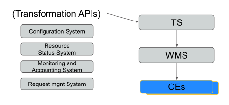
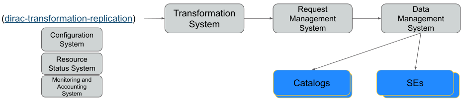
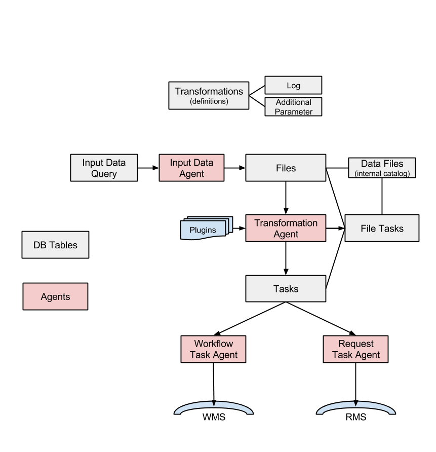

.. _adminTS:

=====================
Transformation System
=====================

.. toctree::
   :maxdepth: 2

.. contents:: Table of contents
   :depth: 4

The Transformation System (TS) is used to automatise common tasks related to production activities.
Just to make some basic examples, the TS can handle the generation of Simulation jobs,
or Data Re-processing jobs as soon as a 'pre-defined' data-set is available,
or Data Replication to 'pre-defined' SE destinations as soon as the first replica is registered in the Catalog.

The lingo used here needs a little explanation:
throughout this document the terms "transformation" and "production" are often used to mean the same thing:

- A *"production"* is a transformation managed by the TS that is a "Data Processing" transformation (e.g. Simulation, Merge, DataReconstruction...). A Production ends up creating jobs in the WMS.
- A "Data Manipulation" transformation replicates, or remove, data from storage elements. A "Data Manipulation" transformation ends up creating requests in the RMS (Request Management System).

For each high-level production task, the production manager creates a transformation.
Each transformation can have different parameters. The main parameters of a Transformation are the following:

- Type (*e.g.* Simulation, DataProcessing, Removal, Replication)
- Plugin (Standard, BySize, etc.)
- The possibility of having Input Files.

Within the TS a user can (for example):

- Generate several identical tasks, differing by few parameters (e.g. Input Files list)
- Extend the number of tasks
- have one single high-level object (the Transformation) associated to a given production for global monitoring

Disadvantages:

- For very large installations, the submission may be perceived as slow, since there is no use (not yet) of Parametric jobs.

  .. versionadded:: v6r20p3
     Bulk submission of jobs is working for the transformations, so job submission can be sped up considerably.

Several improvements have been made in the TS to handle scalability, and extensibility issues.
While the system structure remains intact, "tricks" like threading and caching have been extensively applied.

It's not possible to use ISB (Input Sandbox) to ship local files as for 'normal' Jobs (this should not be considered, anyway, a disadvantage).

------------
Architecture
------------

The TS is a standard DIRAC system, and therefore it is composed by components in the following categories: Services, DBs, Agents. A technical drawing explaining the interactions between the various components follow.

* **Services**

  * TransformationManagerHandler:
    DISET request handler base class for the TransformationDB

* **DB**

  * TransformationDB:
    it's used to collect and serve the necessary information in order to automate the task of job preparation for high level transformations. This class is typically used as a base class for more specific data processing databases. Here below the DB tables:

  ::

      mysql> use TransformationDB;
      Database changed
      mysql> show tables;
      +------------------------------+
      | Tables_in_TransformationDB   |
      +------------------------------+
      | AdditionalParameters         |
      | DataFiles                    |
      | TaskInputs                   |
      | TransformationFileTasks      |
      | TransformationFiles          |
      | TransformationInputDataQuery |
      | TransformationLog            |
      | TransformationTasks          |
      | Transformations              |
      +------------------------------+

  **Note** that since version v6r10, there are important changes in the TransformationDB, as explained in the `release notes <https://github.com/DIRACGrid/DIRAC/wiki/DIRAC-v6r10#transformationdb>`_ (for example the Replicas table can be removed). Also, it is highly suggested to move to InnoDB. For new installations, all these improvements will be installed automatically.

* **Agents**

  * TransformationAgent: it processes transformations found in the TransformationDB and creates the associated tasks, by connecting input files with tasks given a plugin. It's not useful for MCSimulation type

  * WorkflowTaskAgent: it takes workflow tasks created in the TransformationDB and it submits to the WMS. Since version `v6r13 <https://github.com/DIRACGrid/DIRAC/wiki/DIRAC-v6r13#changes-for-transformation-system>`_  there are some new capabilities in the form of TaskManager plugins.

  * RequestTaskAgent: it takes request tasks created in the TransformationDB and submits to the RMS. Both RequestTaskAgent and WorkflowTaskAgent inherits from the same agent, "TaskManagerAgentBase", whose code contains large part of the logic that will be executed. But, TaskManagerAgentBase should not be run standalone.

  * MCExtensionAgent: it extends the number of tasks given the Transformation definition. To work it needs to know how many events each production will need, and how many events each job will produce. It is only used for 'MCSimulation' type

  * TransformationCleaningAgent: it cleans up the finalised Transformations

  * InputDataAgent: it updates the transformation files of active Transformations given an InputDataQuery fetched from the Transformation Service

  * ValidateOutputDataAgent: it runs few integrity checks prior to finalise a Production.

The complete list can be found in the `DIRAC project GitHub repository <https://github.com/DIRACGrid/DIRAC/tree/integration/TransformationSystem/Agent>`_.

* **Clients**

  * TaskManager: it contains WorkflowTasks and RequestTasks modules, for managing jobs and requests tasks, i.e. it contains classes wrapping the logic of how to 'transform' a Task in a job/request. WorkflowTaskAgent uses WorkflowTasks, RequestTaskAgent uses RequestTasks.

  * TransformationClient: class that contains client access to the transformation DB handler (main client to the service/DB). It exposes the functionalities available in the DIRAC/TransformationHandler. This inherits the DIRAC base Client for direct execution of server functionality

  * Transformation: it wraps some functionalities mostly to use the 'TransformationClient' client

-------------
Configuration
-------------

* **Operations**

  * In the Operations/[VO]/[SETUP]/Transformations or Operations/Defaults/Transformations section, *Transformation Types* must be added
  * By default, the WorkflowTaskAgent will treat all the *DataProcessing* transformations and the RequestTaskAgent all the *DataManipulation* ones
  * An example of working configuration is give below::

        Transformations
        {
          DataProcessing = MCSimulation
          DataProcessing += CorsikaRepro
          DataProcessing += Merge
          DataProcessing += Analysis
          DataProcessing += DataReprocessing
          DataManipulation = Removal
          DataManipulation += Replication
        }

* **Agents**

  * Agents must be configured in the Systems/Transformation/[SETUP]/Agents section
  * The *Transformation Types* to be treated by the agent must be configured if and only if they are different from those set in the 'Operations' section. This is useful, for example, in case one wants several agents treating different transformation types, *e.g.*: one WorkflowTaskAgent for DataReprocessing transformations, a second for Merge and MCStripping, etc. Advantage is speedup.
  * For the WorkflowTaskAgent and RequestTaskAgent some options must be added manually
  * An example of working configuration is give below, where 2 specific WorkflowTaskAgents, each treating a different subset of transformation types have been added. Also notice the different shifterProxy set by each one.

  ::

        WorkflowTaskAgent
        {
          #Transformation types to be treated by the agent
          TransType = MCSimulation
          TransType += DataReconstruction
          TransType += DataStripping
          TransType += MCStripping
          TransType += Merge
          TransType += DataReprocessing
          #Task statuses considered transient that should be monitored for updates
          TaskUpdateStatus = Submitted
          TaskUpdateStatus += Received
          TaskUpdateStatus += Waiting
          TaskUpdateStatus += Running
          TaskUpdateStatus += Matched
          TaskUpdateStatus += Completed
          TaskUpdateStatus += Failed
          shifterProxy = ProductionManager
          #Flag to enable task submission
          SubmitTasks = yes
          #Flag for checking reserved tasks that failed submission
          CheckReserved = yes
          #Flag to enable task monitoring
          MonitorTasks = yes
          PollingTime = 120
          MonitorFiles = yes
        }
        WorkflowTaskAgent-RealData
        {
          TransType = DataReconstruction
          TransType += DataStripping
          shifterProxy = DataProcessing
          Module = WorkflowTaskAgent
        }
        WorkflowTaskAgent-Simulation
        {
          TransType = Simulation
          TransType += MCSimulation
          shifterProxy = SimulationProcessing
          Module = WorkflowTaskAgent
        }
        RequestTaskAgent
        {
          PollingTime = 120
          SubmitTasks = yes
          CheckReserved = yes
          MonitorTasks = yes
          MonitorFiles = yes
          TaskUpdateStatus = Submitted
          TaskUpdateStatus += Received
          TaskUpdateStatus += Waiting
          TaskUpdateStatus += Running
          TaskUpdateStatus += Matched
          TaskUpdateStatus += Completed
          TaskUpdateStatus += Failed
          TransType = Removal
          TransType += Replication
        }

-------
Plugins
-------

There are two different types of plugins, i.e. TransformationAgent plugins and TaskManager plugins. The first are used to 'group' the input files of the tasks according to different criteria, while the latter are used to specify the tasks destinations.

TransformationAgent plugins
---------------------------

* Standard: group files by replicas (tasks create based on the file location)
* BySize: group files until they reach a certain size (Input size in Gb)
* ByShare: group files given the share (specified in the CS) and location
* Broadcast: take files at the source SE and broadcast to a given number of locations (used for replication)

TaskManager plugins
-------------------

By default the standard plugin (BySE) sets job's destination depending on the location of its input data.

One possibility is represented by the **ByJobType** TaskManager plugin,
that allows to specify different rules for site destinations for each JobType.
This plugin allows so-called "mesh processing",
i.e. depending on the job type, some sites may become eligible for "helping" other sites
to run jobs that normally would only be running at the site where data is located.
In order to use the ByJobType plugin, one has to:

* Set CS section Operations/Transformations/DestinationPlugin = ByJobType
* Set the JobType in the job workflow of the transformation, *e.g.*:

  ::

        from DIRAC.TransformationSystem.Client.Transformation import Transformation
        from DIRAC.Interfaces.API.Job import Job

        t = Transformation()
        job = Job()
        ...

        job.setType('DataReprocessing')
        t.setBody ( job.workflow.toXML() )

* Define the actual rules for each JobType in the CS section Operation/JobTypeMapping, as in the following example:

  ::

        JobTypeMapping
        {
          AutoAddedSites = LCG.CERN.cern
          AutoAddedSites += LCG.IN2P3.fr
          AutoAddedSites += LCG.CNAF.it
          AutoAddedSites += LCG.PIC.es
          AutoAddedSites += LCG.GRIDKA.de
          AutoAddedSites += LCG.RAL.uk
          AutoAddedSites += LCG.SARA.nl
          AutoAddedSites += LCG.RRCKI.ru
          DataReconstruction
          {
            Exclude = ALL
            AutoAddedSites = LCG.IN2P3.fr
            AutoAddedSites += LCG.CNAF.it
            AutoAddedSites += LCG.PIC.es
            AutoAddedSites += LCG.GRIDKA.de
            AutoAddedSites += LCG.RAL.uk
            AutoAddedSites += LCG.RRCKI.ru
            Allow
            {
              CLOUD.CERN.cern = LCG.CERN.cern, LCG.SARA.nl
            }
          }
          DataReprocessing
          {
            Exclude = ALL
            Allow
            {
              LCG.NIKHEF.nl = LCG.SARA.nl
              LCG.UKI-LT2-QMUL.uk = LCG.RAL.uk
              LCG.CPPM.fr = LCG.SARA.nl
              LCG.USC.es = LCG.PIC.es
              LCG.LAL.fr = LCG.CERN.cern
              LCG.LAL.fr += LCG.IN2P3.fr
              LCG.BariRECAS.it = LCG.CNAF.it
              LCG.CBPF.br = LCG.CERN.cern
              VAC.Manchester.uk = LCG.RAL.uk
            }
          }
          Merge
          {
            Exclude = ALL
            Allow
            {
              LCG.NIKHEF.nl = LCG.SARA.nl
            }
          }
        }

  * By default, all sites are allowed to do every job
  * "AutoAddedSites" contains the list of sites allowed to run jobs with files in their local SEs.

  If it contains 'WithStorage', all sites with an associated local storage will be added automatically.

  * Sections under "JobTypeMapping" correspond to the different JobTypes one may want to define, *e.g.*: DataReprocessing, Merge, etc.
  * For each JobType one has to define:

    * "Exclude": the list of sites that will be removed as destination sites ("ALL" for all sites).
    * Optionally one may redefine the "AutoAddedSites" (including setting it empty)
    * "Allow": the list of 'helpers', specifying sites helping another site.

    For each "helper" one specifies a list of sites that it helps, i.e. if the input data is at one of these sites, the job is eligible to the helper site.

  * In the example above all sites in "AutoAddedSites" are allowed to run jobs with input files in their local SEs.

  For DataReprocessing jobs, jobs having input files at LCG.SARA.nl local SEs can run both at LCG.SARA.nl and at LCG.NIKHEF.nl, etc.
  For DataReconstruction jobs, jobs will run at the Tier1 where the input data is, except when the data is at CERN or SARA, where they will run exclusively at CLOUD.CERN.cern.

---------
Use-cases
---------

Transformations can have Input Files (*e.g.* Data-processing transformations), or not (*e.g.* MC Simulation transformations).

MC Simulation
-------------
Generation of many identical jobs which don't need Input Files and having as varying parameter a variable built from @{JOB_ID}.

* **Agents**

  ::

    WorkflowTaskAgent, MCExtensionAgent (optional)

The WorkflowTaskAgent uses the TaskManager client to transform a 'Task' into a 'Job'.

* Example:

  ::

    from DIRAC.TransformationSystem.Client.Transformation import Transformation
    from DIRAC.Interfaces.API.Job import Job
    j = myJob()
    ...
    t = Transformation( )
    t.setTransformationName("MCProd") # this must be unique
    t.setTransformationGroup("Group1")
    t.setType("MCSimulation")
    t.setDescription("MC prod example")
    t.setLongDescription( "This is the long description of my production" ) # mandatory
    t.setBody ( j.workflow.toXML() )
    t.addTransformation() # transformation is created here
    t.setStatus("Active")
    t.setAgentType("Automatic")

Data-processing
---------------
Generation of identical jobs with varying Input Files.

* **Agents**

  ::

    TransformationAgent, WorkflowTaskAgent, InputDataAgent

Input Files can be attached to a transformation in two ways:

* Through a static list of files:

    * when the transformation is created, all the tasks necessary to treat the list of files are also created

* Through a catalog query:

    * when the transformation is created, all the tasks the tasks necessary to treat the files matching the catalog query are created. As soon as new files matching the catalog query are registered, new tasks are created to treat the new files

Using a static list of files
^^^^^^^^^^^^^^^^^^^^^^^^^^^^^

* Example:

  ::

    from DIRAC.TransformationSystem.Client.Transformation import Transformation
    from DIRAC.TransformationSystem.Client.TransformationClient import TransformationClient
    from DIRAC.Interfaces.API.Job import Job
    j = myJob()
    ...
    t = Transformation( )
    tc = TransformationClient( )
    t.setTransformationName("Reprocessing_1") # this must be unique
    t.setType("DataReprocessing")
    t.setDescription("repro example")
    t.setLongDescription( "This is the long description of my reprocessing" ) # mandatory
    t.setBody ( j.workflow.toXML() )
    t.addTransformation() # transformation is created here
    t.setStatus("Active")
    t.setAgentType("Automatic")
    transID = t.getTransformationID()
    tc.addFilesToTransformation(transID['Value'],infileList) # files are added here

Using a catalog query
^^^^^^^^^^^^^^^^^^^^^^

There are two methods to add Input Files to a transformation through a catalog query:

* Using the InputDataQuery Agent
* Using the TSCatalog interface (starting from v6r17)

From the user point of view the two methods are equivalent, but the internal behaviour of the TS is different. In the first case, the InputDataQuery agent continuously queries the catalog
to look for new files matching the defined query (called 'InputDataQuery'). In the second case, the files matching the defined query (called 'FileMask'), are directly added to the transformation through the TSCatalog interface (see `RFC 21 <https://github.com/DIRACGrid/DIRAC/wiki/Transformation-System-evolution>`_ for more details).
Here below we give an example to create a data-processing transformation for each of these two methods.

* Example using the InputDataQuery Agent

  ::

    from DIRAC.TransformationSystem.Client.Transformation import Transformation
    from DIRAC.TransformationSystem.Client.TransformationClient import TransformationClient
    from DIRAC.Interfaces.API.Job import Job
    j = myJob()
    ...
    t = Transformation( )
    tc = TransformationClient( )
    t.setTransformationName("Reprocessing_1") # this must be unique
    t.setType("DataReprocessing")
    t.setDescription("repro example")
    t.setLongDescription( "This is the long description of my reprocessing" ) # mandatory
    t.setBody ( j.workflow.toXML() )
    t.addTransformation() # transformation is created here
    t.setStatus("Active")
    t.setAgentType("Automatic")
    tc.createTransformationInputDataQuery(transID['Value'], {'particle': 'proton','prodName':'ConfigtestCorsika','outputType':'corsikaData'}) # files are added here

* Example using the TSCatalog interface

  Both the TSCatalog and FileCatalog plugins must be configured in the Resources and Operations sections, *e.g.*:

  ::

    Operations
    {
        Services
        {
            Catalogs
            {
            CatalogList = DIRACFileCatalog, TSCatalog
            DIRACFileCatalog
            {
            CatalogType = FileCatalog
            AccessType = Read-Write
            Status = Active
            CatalogURL = DataManagement/FileCatalog
            }
            TSCatalog
            {
            CatalogType = TSCatalog
            AccessType = Write
            Status = Active
            CatalogURL = Transformation/TransformationManager
            }

  ::

    import json
    from DIRAC.TransformationSystem.Client.Transformation import Transformation
    from DIRAC.Interfaces.API.Job import Job
    j = myJob()
    ...
    t = Transformation( )
    t.setTransformationName("Reprocessing_1") # this must be unique
    t.setType("DataReprocessing")
    t.setDescription("repro example")
    t.setLongDescription( "This is the long description of my reprocessing" ) # mandatory
    t.setBody ( j.workflow.toXML() )
    mqJson = json.dumps( {'particle':'gamma_diffuse', 'zenith':{"<=": 20}} )
    t.setFileMask(mqJson) # catalog query is defined here
    t.addTransformation() # transformation is created here
    t.setStatus("Active")
    t.setAgentType("Automatic")

**Note:**

  * *Transformation Type* = 'DataReprocessing'
  * If the 'MonitorFiles' option is enabled in the agent configuration, failed jobs are automatically rescheduled

Data management transformations
-------------------------------

Generation of bulk data removal/replication requests from a fixed file list or as a result of a DFC query.

* **Agents**

  ::

    TransformationAgent, RequestTaskAgent, InputDataAgent (for DFC query)

  Requests are then treated by the RMS (see `RequestManagement <http://diracgrid.org/files/docs/AdministratorGuide/Systems/RequestManagement/rms.html>`_):

  * Check the logs of RequestExecutingAgent, *e.g.*:

    ::

      2014-07-08 08:27:33 UTC RequestManagement/RequestExecutingAgent/00000188_00000001   INFO: request '00000188_00000001' is done

  * Query the ReqDB to check the requests

* Example of data removal

  ::

    from DIRAC.TransformationSystem.Client.Transformation import Transformation
    from DIRAC.TransformationSystem.Client.TransformationClient import TransformationClient

    infileList = []
    ...

    t = Transformation( )
    tc = TransformationClient( )
    t.setTransformationName("DM_Removal") # this must be unique
    #t.setTransformationGroup("Group1")
    t.setType("Removal")
    t.setPlugin("Standard") # not needed. The default is 'Standard'
    t.setDescription("dataset1 Removal")
    t.setLongDescription( "Long description of dataset1 Removal" ) # Mandatory
    t.setGroupSize(2) # Here you specify how many files should be grouped within the same request, e.g. 100
    t.setBody ( "Removal;RemoveFile" ) # mandatory (the default is a ReplicateAndRegister operation)
    t.addTransformation() # transformation is created here
    t.setStatus("Active")
    t.setAgentType("Automatic")
    transID = t.getTransformationID()
    tc.addFilesToTransformation(transID['Value'],infileList) # files are added here

**Note:**

  * It's not needed to set a Plugin, the default is 'Standard'
  * It's mandatory to set the Body, otherwise the default operation is 'ReplicateAndRegister'
  * It's not needed to set a SourceSE nor a TargetSE
  * This script remove all replicas of each file. We should verify how to remove only a subset of replicas (SourceSE?)
  * If you add non existing files to a Transformation, you won't get any particular status, the Transformation just does not progress

* Example for Multiple Operations

  .. code:: python

    from DIRAC.TransformationSystem.Client.Transformation import Transformation
    from DIRAC.TransformationSystem.Client.TransformationClient import TransformationClient

    infileList = []
    ...

    t = Transformation( )
    tc = TransformationClient( )
    t.setTransformationName("DM_Moving") # Must be unique
    #t.setTransformationGroup("Moving")
    t.setType("Moving")
    t.setPlugin("Standard") # Not needed. The default is 'Standard'
    t.setDescription("dataset1 Moving")
    t.setLongDescription( "Long description of dataset1 Moving" ) # Mandatory
    t.setGroupSize(2) # Here you specify how many files should be grouped within he same request, e.g. 100

    transBody = [ ( "ReplicateAndRegister", { "SourceSE":"FOO-SRM", "TargetSE":"BAR-SRM" }),
                  ( "RemoveReplica", { "TargetSE":"FOO-SRM" } ),
                ]

    t.setBody ( transBody ) # Mandatory
    t.addTransformation() # Transformation is created here
    t.setStatus("Active")
    t.setAgentType("Automatic")
    transID = t.getTransformationID()
    tc.addFilesToTransformation(transID['Value'],infileList) # Files are added here

Data replication based on catalog query
^^^^^^^^^^^^^^^^^^^^^^^^^^^^^^^^^^^^^^^^

* Example of data replication (file list as a result of a DFC query, example taken from CTA)

  ::

    from DIRAC.TransformationSystem.Client.Transformation import Transformation
    from DIRAC.TransformationSystem.Client.TransformationClient import TransformationClient
    t = Transformation( )
    tc = TransformationClient( )
    t.setTransformationName("DM_ReplicationByQuery1") # this must vary
    #t.setTransformationGroup("Group1")
    t.setType("Replication")
    t.setSourceSE(['CYF-STORM-Disk','DESY-ZN-Disk']) # a list of SE where at least 1 SE is the valid one
    t.setTargetSE(['CEA-Disk'])
    t.setDescription("data Replication")
    t.setLongDescription( "data Replication" ) # mandatory
    t.setGroupSize(1)
    t.setPlugin("Broadcast")
    t.addTransformation() # transformation is created here
    t.setStatus("Active")
    t.setAgentType("Automatic")
    transID = t.getTransformationID()
    tc.createTransformationInputDataQuery(transID['Value'], {'particle': 'gamma','prodName':'Config_test300113','outputType':'Data','simtelArrayProdVersion':'prod-2_21122012_simtel','runNumSeries':'0'}) # Add files to Transformation based on Catalog Query

--------------------------
Actions on transformations
--------------------------

* **Start**
* **Stop**
* **Flush:** It has a meaning only depending on the plugin used, for example the 'BySize' plugin, used *e.g.* for merging productions, creates a task if there are enough files in input to have at least a certain size: 'flush' will make the 'BySize' plugin to ignore such requirement. When a transformation is flushed also its replica cache will be re-created (instead of after 24 hours).
* **Complete:** The transformation can be archived by the TransformationCleaningAgent. Archived means that the data produced stay, but not the entries in the TransformationDB
* **Clean:** The transformation is cleaned by the TransformationCleaningAgent: jobs are killed and removed from WMS. Produced and stored files are removed from the Storage Elements, when "OutputDirectories" parameter is set for the transformation.

------
HowTos
------

How to derive a production
--------------------------

**Example of use case**: when a production is running, and a new version of the application is released, which should substitute the current one. So, the input files are the same, but we want that the input files that have not yet been processed by the current production will be picked up by the new one.

When a new production is derived all *Unused* files of the parent will be picked up by the derived production. This happens ONLY at the moment of deriving the production, so this process is static. So, in case a production needs to be derived e.g. because of an improved version of the application the procedure should be the following:

1. Stop the "parent" production.
2. Create a new duplicate production with the improved application version
3. Wait for the parent production to have no more files in *Assigned*
4. Reset all files in the parent which are NOT in Status *Processed* (e.g. *MaxReset*) to *Unused*
5. Create a new production with *setInheritedFrom* calls:

  ::

    from DIRAC.TransformationSystem.Client.Transformation import Transformation

    ...

    t = Transformation()
    t.setTransformationName("derived_123") # this must be unique
    t.setInheritedFrom(123)

    ...

The status of 123 will be changed to status *Completing* and the new one *Active*. The files already assigned to the old one, will be processed by the old one. If a job fails, the input file is reset as Unused and will be picked up by the new one.

Important: if the old production has some files already in MaxReset status, then they should be set as Unused, so they will be picked up by the new production.

.. _trans-multi-vo:

----------------------
Multi VO Configuration
----------------------

.. versionadded:: v6r20p5

There are two possibilities to configure the agents of the transformation system for the use in a multi VO installation.

 - Use the same WorkflowTaskAgent and RequestTaskAgents for multiple VOs, no
   *shifterProxy* or *ShifterCredential* must be set for these agents. If
   neither of those options are set the credentials of the owner of the
   transformations are used to submit Jobs or Requests.

 - Use a set of WorkflowTaskAgent and RequestTaskAgent for each VO. This
   requires that each VO uses a distinct set of Transformation Types,
   e.g. MCSimulation_BigVO. This allows one to set VO specific
   shifterProxies. This setup is recommended to create a dedicated
   WorkflowTaskAgent or RequestTaskAgent for a VO that will create a large
   number of jobs or requests.

 It is possible to mix the two configurations and have one WorkflowTaskAgent
 treat transformations of many smaller VOs, while installing a dedicated
 instance for the larger ones::

        WorkflowTaskAgent
        {
          ...
          TransType = MCSimulation
          TransType += MCReconstruction
          ...
          #No shifterProxy / ShifterCredentials
        }
        WorkflowTaskAgent-BigVO
        {
          ...
          TransType = MCSimulation_BigVO
          TransType += MCReconstruction_BigVO
          Module = WorkflowTaskAgent
          ...
          #shifterProxy / ShifterCredentials are optional
        }
