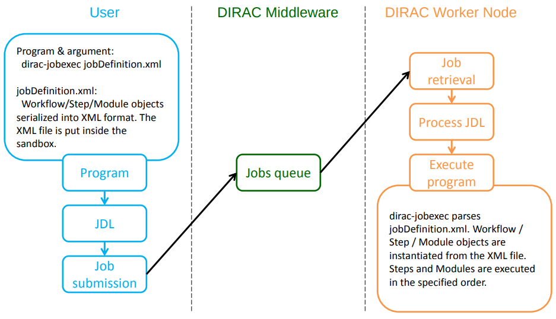
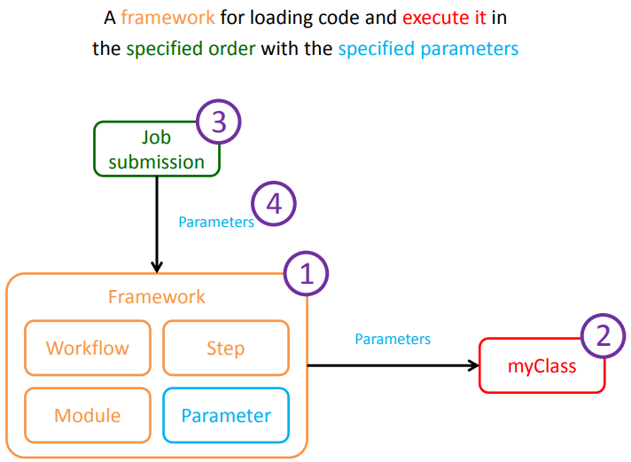
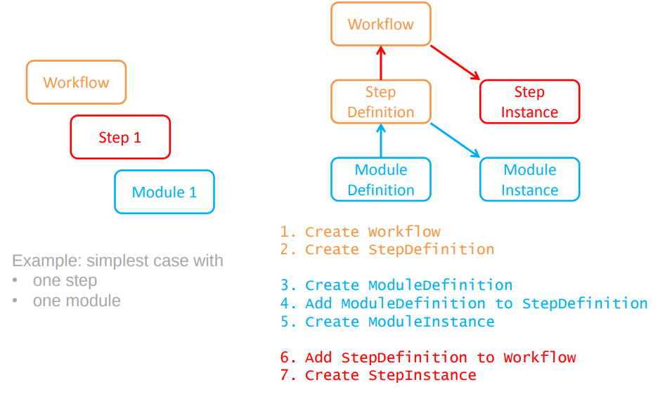
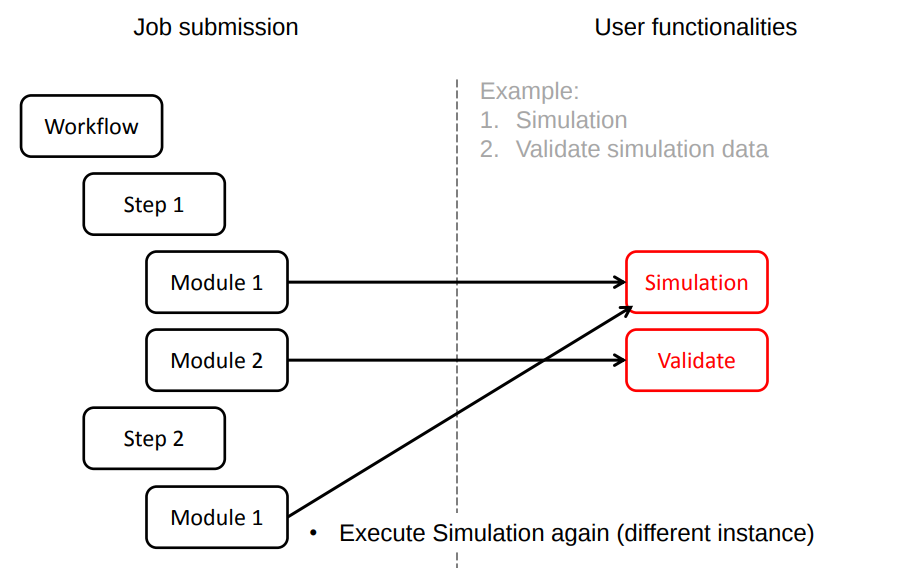

========
Workflow
========

[Please see this `presentation <https://indico.in2p3.fr/event/5271/contributions/33942/attachments/27190/33434/20110512_Ching_Bon_Lam.pdf>`_ for originals of the figures reported here.]

The DIRAC Workflow is not properly a DIRAC system, in the sense that it doesn't implement any DB, nor service, nor agent.

The DIRAC Workflow is instead a way to describe DIRAC jobs. Every job created with DIRAC APIs is, in fact, a DIRAC workflow.

Using DIRAC workflows, users may load code and execute it in a specified order with specified parameters.

A DIRAC workflow is represented in XML format, but also in python format,
meaning that DIRAC may access names and variables definded in the workflow directly from python.
This may sound quite weird, or unclear, so let's go through a figure:

`dirac-jobexec` is the standard executable of DIRAC jobs. The jobDefinition.xml (usually called jobDescription.xml) is the workflow in XML format.

One more picture looking inside the contect of a workflow:

So, a workflow is made of steps, modules, and each of them may have parameters. A workflow is a container of steps. A step is a container for modules.
Steps, and modules, are ordered. There's only a linear order possible (no DAGs). Workflows are not limited in the number of steps or modules that they can execute.

The following figure contains a graphical representation of the content of a workflow.

Modules are executed as python modules, when the job runs - i.e. the job executes the content of the workflow via dirac-jobexec, 
and the content of the workflow (the modules) is executed as standard python modules.

The package DIRAC/Workflow/Modules contain some base modules -- the "Script" module can be used to execute any script or command.

Parameters can be added to Workflow, StepDefinition, StepInstance, ModuleDefinition and ModuleInstance. The Workflow framework is the product of
a natural evolution from simple jobs to complex jobs.
