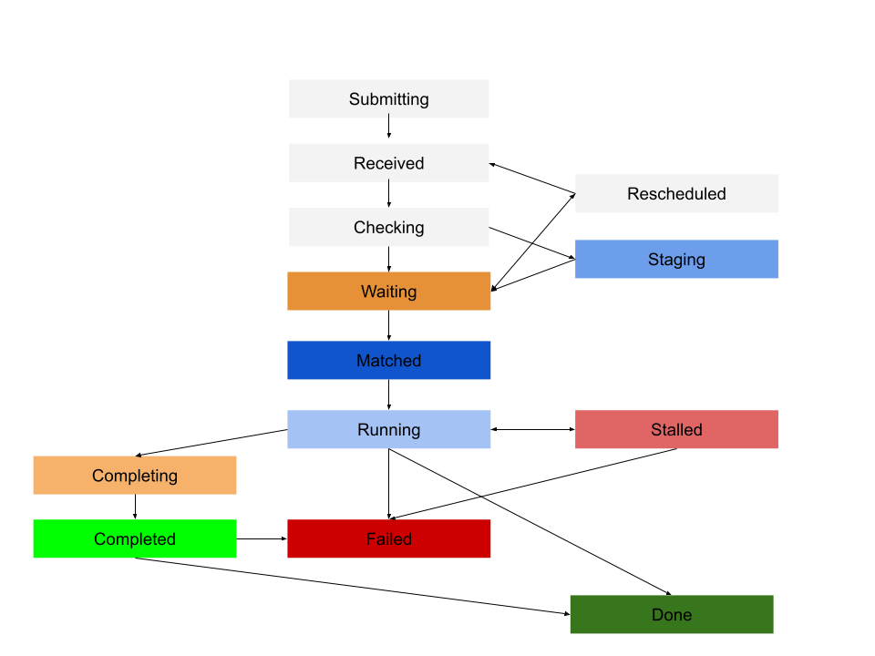

.. _jobs:

========================
DIRAC jobs: definitions
========================

Some definitions for DIRAC jobs:

- *payload* or *workflow*: the executed code. A payload describes how to run one or more application step.
- *payload executor*: a script that runs the payload (e.g. dirac-jobexec)
- *JDL*: a container of payload requirements
- *DIRAC job*: a JDL to which it is assigned a unique identifier inside the DIRAC WMS
- *JobWrapper*: a software module for running a DIRACJob in a controlled way
- *multi-processor payload [job]*: a payload application that will try to use multiple cores on the same node
- *computing slot*: resource allocated by a provider where a pilot wrapper is running (batch job)
- *multi-processor [computing] slot*: allocated resource has more than one OS CPU core available in the same slot as opposed to a *single-processor [computing] slot*

Applications properties are reflected in payload properties.

The DIRAC `APIs <http://dirac.readthedocs.io/en/latest/CodeDocumentation/Interfaces/API/API_Module.html>`_ can be used to create and submit jobs.
Specifically, objects of type :py:mod:`~DIRAC.Interfaces.API.Job` represents a job. The API class :py:mod:`~DIRAC.Interfaces.API.Dirac` and more specifically the call to :py:func:`~DIRAC.Interfaces.API.Dirac.Dirac.submitJob` submits jobs to the DIRAC WMS.

The job status of a successful job proceeds in the following order:

- Submitting (only for parametric jobs),
- Received,
- Checking,
- Waiting,
- Matched,
- Running,
- Completing,
- Completed,
- Done.

Jobs which return no heartbeat have a status of *Stalled* and jobs where any workflow modules return an error status are classed as *Failed*.

The basic flowchart describing the evolution of a job's status follows

