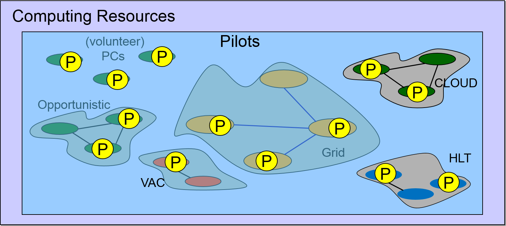

.. _pilots:

========================
DIRAC pilots
========================

.. meta::
   :keywords: Pilots3, Pilot3, Pilot

This page describes what are DIRAC pilots, and how they work.
To know how to develop DIRAC pilots, please refer to the Developers documentation

Pilot development is done in https://github.com/DIRACGrid/Pilot

What's a DIRAC Pilot
====================

First of all, a definition:

- A *pilot* is what creates the possibility to run jobs on a worker node. Or, in other words:
- a script that, at a minimum, setup (VO)DIRAC, sets the local DIRAC configuration, launches the an entity for matching jobs (e.g. the JobAgent)

A pilot can be sent, as a script to be run. Or, it can be fetched.

A pilot can run on every computing resource, e.g.: on CREAM Computing elements,
on DIRAC Computing elements, on Virtual Machines in the form of contextualization script,
or IAAC (Infrastructure as a Client) provided that these machines are properly configured.

A pilot has, at a minimum, to:

- install DIRAC
- configure DIRAC
- run the JobAgent

A pilot has to run on each and every computing resource type, provided that:

- Python 2.6+ on the WN
- It is an OS onto which we can install a DIRAC client (basically: SLC6 or CentOS7)
  - if that's not possible, we plan to add support for singularity

The same pilot script can be used everywhere.

In more details the DIRAC WMS with Pilot Jobs is described
`here <http://iopscience.iop.org/article/10.1088/1742-6596/898/9/092024>`_.

Definitions that help understanding what's a Pilot
==================================================

- *TaskQueue*: a queue of JDLs with similar requirements.
- *JobAgent*: a DIRAC agent that matches a DIRAC local configuration with a TaskQueue, and extracts a JDL from it (or more than one).
- *pilot wrapper*: a script that wraps the pilot script with conditions for running the pilot script itself (maybe multiple times).
- *pilot job*: a pilot wrapper sent to a computing element (e.g. HTCondor, ARC).

The *pilot* is a "standardized" piece of code. The *pilot wrapper* might not be standardized.

The :py:mod:`~DIRAC.WorkloadManagementSystem.Agent.SiteDirector` agent creates the *pilot wrapper*,
then sends it to a Computing Element as a *pilot job*.

But, if you don't have the possibility to send a pilot job (e.g. the case of a Virtual Machine in a cloud),
you can still find a way to start the pilot script by encapsulating it in a pilot wrapper that will be started at boot time,
e.g. by supplying the proper contextualization to the VM.

Administration
==============

The following CS section is used for administering the DIRAC pilots::

   Operations/<Setup>/Pilot

These parameters will be interpreted by the WorkloadManagementSystem/SiteDirector agents, and by the WorkloadManagementSystem/Matcher.
They can also be accessed by other services/agents, e.g. for syncing purposes.

Inside this section, you should define the following options, and give them a meaningful value (here, an example is given)::

   # Needed by the SiteDirector:
   Version = v7r2p1  # DIRAC version(s)
   Project = myVO  # Your project name: this will end up in the /LocalSite/ReleaseProject option of the pilot cfg, and will be used at matching time
   Extensions = myVO # The DIRAC extension (if any)
   Installation = mycfg.cfg # For an optional configuration file, used by the installation script.
   # For the Matcher
   CheckVersion = False # True by default, if false any version would be accepted at matching level (this is a check done by the WorkloadManagementSystem/Matcher service).

Further details:

- *Version* is the version of DIRAC that the pilots will install. Add the version of your DIRAC extension if you have one. A list of versions can also be added here, meaning that all these versions will be accepted by the Matcher (see below), while only the first in the list will be the one used by the pilots for knowing which DIRAC version to install (e.g. if Version=v7r0p2,v7r0p1 then pilots will install version v7r0p2)
- *Project* is, normally, the same as *Extensions*
- When the *CheckVersion* option is "True", the version checking done at the Matcher level will be strict, which means that pilots running different versions from those listed in the *Versions* option will refuse to match any job. There is anyway the possibility to list more than one version in *Versions*; in this case, all of them will be accepted by the Matcher.

Pilot Commands
==============

The system works with "commands", as explained in the `RFC 18 <https://github.com/DIRACGrid/DIRAC/wiki/Pilots-2.0:-generic,-configurable-pilots>`_.
Any command can be added. If your command is executed before the "InstallDIRAC" command, pay attention that DIRAC functionalities won't be available.

Basically, pilot commands are an implementation of the `command pattern <https://en.wikipedia.org/wiki/Command_pattern>`_.
Commands define a toolbox of pilot capabilities available to the pilot script. Each command implements one function, like:

- Check the environment
- Get the pilot version to install
- Install (VO)DIRAC
- Configure (VO)DIRAC
- In fact, there are several configuration commands
- Configure CPU capabilities
- Run the *dirac-wms-cpu-normalization* script, which calculates the CPU power of the node
- Run the JobAgent

A custom list of commands can be specified using the *--commands* option to the pilot, or set in the Pilots' configuration,
but if nothing is selected then the following list will be run::

   'GetPilotVersion', 'CheckWorkerNode', 'InstallDIRAC', 'ConfigureBasics', 'CheckCECapabilities',
   'CheckWNCapabilities', 'ConfigureSite', 'ConfigureArchitecture', 'ConfigureCPURequirements',
   'LaunchAgent'

Communities can easily extend the content of the toolbox, adding more commands.
If necessary, different computing resources types can run different commands.

Pilot options
=============

The pilot can be configured to run in several ways.
Please, refer to https://github.com/DIRACGrid/Pilot/blob/master/Pilot/pilotTools.py
for the full list.

Python3 and Pilots
==================

Since DIRAC v7r3, Pilots are installing python3 DIRAC clients.

For keeping installing python2 DIRAC clients, you can:

- add the "--pythonVersion=27" *ExtraPilotOptions* option per Computing Element (see :ref:`resourcesComputing`)
- add a per-SiteDirector option "Python3Pilots=False" in the CS

Pilot extensions
================

In case your VO only uses Grid resources, and the pilots are only sent by SiteDirector agents,
and you don't plan to have any specific pilot behaviour, you can stop reading here.

Instead, in case you want, for example, to install DIRAC in a different way, or you want your pilot to have some VO specific action,
you should carefully read the RFC 18, and what follows.

Pilot commands can be extended. A custom list of commands can be added starting the pilot with the -X option.

Pilots started when not controlled by the SiteDirector
======================================================

You should keep reading if your resources include IAAS and IAAC type of resources, like Virtual Machines.
If this is the case, then you need to:

- provide a certificate, or a proxy, to start the pilot;
- such certificate/proxy should have the `GenericPilot` property;
- in case of multi-VO environment, the Pilot should set the `/Resources/Computing/CEDefaults/VirtualOrganization` (as done e.g. by `VMDIRAC <https://github.com/DIRACGrid/VMDIRAC/blob/9c6ef192d400686431e42c09de7086d49dda7575/VMDIRAC/WorkloadManagementSystem/Bootstrap/vm-pilot#L124>`_);
- find a way to start the pilots: VMDIRAC extension will make sure to create VirtualMachine contextualized to start Pilot3.

We have introduced a special command named "GetPilotVersion" that you should use,
and possibly extend, in case you want to send/start pilots that don't know beforehand the (VO)DIRAC version they are going to install.
In this case, you have to provide a json file freely accessible that contains the pilot version.
This is tipically the case for VMs in IAAS and IAAC.

The files to consider are in https://github.com/DIRACGrid/Pilot

The main file in which you should look is dirac-pilot.py
that also contains a good explanation on how the system works.

You have to provide in this case a pilot wrapper script (which can be written in bash, for example) that will start your pilot script
with the proper environment. If you are on a cloud site, often contextualization of your virtual machine is done by supplying
a script like the following: https://github.com/DIRACGrid/Pilot/blob/master/Pilot/user_data_vm

A simpler example using the LHCbPilot extension follows::

  #!/bin/sh
  #
  # Runs as dirac. Sets up to run dirac-pilot.py
  #

  date --utc +"%Y-%m-%d %H:%M:%S %Z vm-pilot Start vm-pilot"

  for i in "$@"
  do
  case $i in
      --dirac-site=*)
      DIRAC_SITE="${i#*=}"
      shift
      ;;
      --lhcb-setup=*)
      LHCBDIRAC_SETUP="${i#*=}"
      shift
      ;;
      --ce-name=*)
      CE_NAME="${i#*=}"
      shift
      ;;
      --vm-uuid=*)
      VM_UUID="${i#*=}"
      shift
      ;;
      --vmtype=*)
      VMTYPE="${i#*=}"
      shift
      ;;
      *)
      # unknown option
      ;;
  esac
  done

  # Default if not given explicitly
  LHCBDIRAC_SETUP=${LHCBDIRAC_SETUP:-LHCb-Production}

  # JOB_ID is used by when reporting LocalJobID by DIRAC watchdog
  #export JOB_ID="$VMTYPE:$VM_UUID"

  # We might be running from cvmfs or from /var/spool/checkout
  export CONTEXTDIR=`readlink -f \`dirname $0\``

  export TMPDIR=/scratch/
  export EDG_WL_SCRATCH=$TMPDIR

  # Needed to find software area
  export VO_LHCB_SW_DIR=/cvmfs/lhcb.cern.ch

  # Clear it to avoid problems ( be careful if there is more than one agent ! )
  rm -rf /tmp/area/*

  # URLs where to get scripts, that for Pilot3 are copied over to your WebPortal, e.g. like:
  DIRAC_PILOT='https://lhcb-portal-dirac.cern.ch/pilot/dirac-pilot.py'
  DIRAC_PILOT_TOOLS='https://lhcb-portal-dirac.cern.ch/pilot/pilotTools.py'
  DIRAC_PILOT_COMMANDS='https://lhcb-portal-dirac.cern.ch/pilot/pilotCommands.py'
  DIRAC_PILOT_LOGGER='https://lhcb-portal-dirac.cern.ch/pilot/PilotLogger.py'
  DIRAC_PILOT_LOGGERTOOLS='https://lhcb-portal-dirac.cern.ch/pilot/PilotLoggerTools.py'
  DIRAC_PILOT_MESSAGESENDER='https://lhcb-portal-dirac.cern.ch/pilot/MessageSender.py'
  LHCbDIRAC_PILOT_COMMANDS='https://lhcb-portal-dirac.cern.ch/pilot/LHCbPilotCommands.py'

  #
  ##get the necessary scripts
  wget --no-check-certificate -O dirac-pilot.py $DIRAC_PILOT
  wget --no-check-certificate -O pilotTools.py $DIRAC_PILOT_TOOLS
  wget --no-check-certificate -O pilotCommands.py $DIRAC_PILOT_COMMANDS
  wget --no-check-certificate -O PilotLogger.py $DIRAC_PILOT_LOGGER
  wget --no-check-certificate -O PilotLoggerTools.py $DIRAC_PILOT_LOGGERTOOLS
  wget --no-check-certificate -O MessageSender.py $DIRAC_PILOT_MESSAGESENDER
  wget --no-check-certificate -O LHCbPilotCommands.py $LHCbDIRAC_PILOT_COMMANDS

  #run the dirac-pilot script
  python dirac-pilot.py \
   --setup $LHCBDIRAC_SETUP \
   --project LHCb \
   --Name "$CE_NAME" \
   --name "$1" \
   --cert \
   --certLocation=/scratch/dirac/etc/grid-security \
