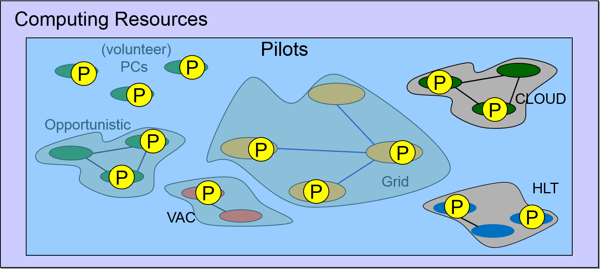
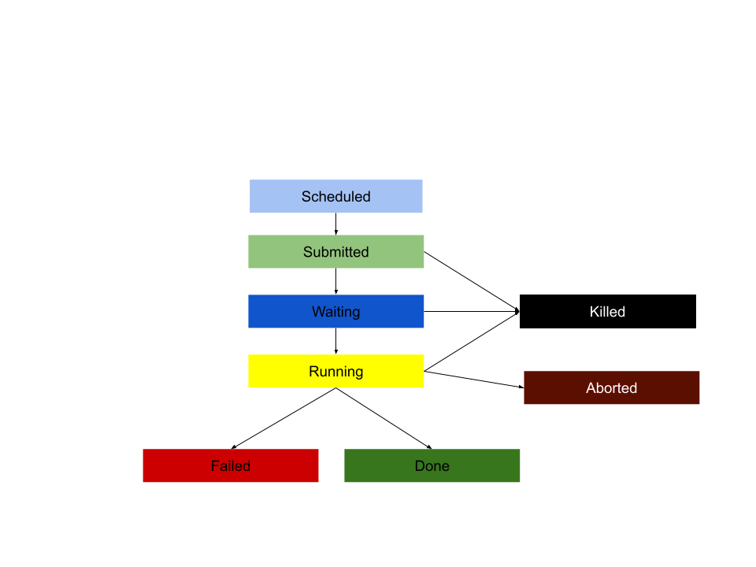

.. _pilots:

========================
DIRAC pilots
========================

.. meta::
   :keywords: Pilots3, Pilot3, Pilot

This page describes what are DIRAC pilots, and how they work.
To know how to develop DIRAC pilots, please refer to the Developers documentation.

Pilot development is done in https://github.com/DIRACGrid/Pilot

What's a DIRAC Pilot
====================

First of all, a definition:

- A *pilot* is what creates the possibility to run jobs on a worker node. Or, in other words:
- a script that, at a minimum, setup (VO)DIRAC, sets the local DIRAC configuration, launches the an entity for matching jobs (e.g. the JobAgent)

A pilot can be sent, as a script to be run. Or, it can be fetched.

A pilot can run on every computing resource, e.g.: on HTCondor Computing elements,
on DIRAC Computing elements, on Virtual Machines in the form of contextualization script,
or IAAC (Infrastructure as a Client) provided that these machines are properly configured.

A pilot has, at a minimum, to:

- install or setup DIRAC, or an extension of it
- configure DIRAC
- run the JobAgent

where:

- install means installing DIRAC like described in :ref:`dirac_install`
- setup means that DIRAC code can already be found in the current file system, and it is only a matter of invoking a rc file that would add DIRAC paths
- configure means adding dirac specific configuration files (which, at a minimum, should include the location of a DIRAC configuration service)

A pilot has to run on each and every computing resource type, provided that Python 2.6+ is on the WN.
The same pilot script can be used everywhere.

In more details the DIRAC WMS with Pilot Jobs is described
`here <http://iopscience.iop.org/article/10.1088/1742-6596/898/9/092024>`_.

Definitions that help understanding what's a Pilot
==================================================

- *TaskQueue*: a queue of JDLs with similar requirements.
- *JobAgent*: a DIRAC agent that matches a DIRAC local configuration with a TaskQueue, and extracts a JDL from it (or more than one).
- *pilot wrapper*: a script that wraps the pilot script with conditions for running the pilot script itself (maybe multiple times).
- *pilot job*: a pilot wrapper sent to a computing element (e.g. HTCondor, ARC).

The *pilot* is a "standardized" piece of code. The *pilot wrapper* might not be standardized.

The :py:mod:`~DIRAC.WorkloadManagementSystem.Agent.SiteDirector` agent creates the *pilot wrapper*,
then sends it to a Computing Element as a *pilot job*.

But, if you don't have the possibility to send a pilot job (e.g. the case of a Virtual Machine in a cloud),
you can still find a way to start the pilot script by encapsulating it in a pilot wrapper that will be started at boot time,
e.g. by supplying the proper contextualization to the VM.

Administration
==============

The following CS section is used for administering the DIRAC pilots::

   Operations/Defaults/Pilot

These parameters will be interpreted by the WorkloadManagementSystem/SiteDirector agents, and by the WorkloadManagementSystem/Matcher.
They can also be accessed by other services/agents, e.g. for syncing purposes.

Inside this section, you should define the following options, and give them a meaningful value (here, an example is given)::

   # For the SiteDirector:
   Version = 8.0.32  # DIRAC version(s) -- a comma-separated list can be provided
   Project = myVO  # Your project name: this will end up in the /LocalSite/ReleaseProject option of the pilot cfg, and will be used at matching time
   Extensions = myVO # The DIRAC extension (if any)
   Installation = mycfg.cfg # For an optional configuration file, used by the installation script.
   PreInstalledEnv = /cvmfs/some/where/specific/bashrc # A specific rc file to source for setting up DIRAC
   PreInstalledEnvPrefix = /cvmfs/some/where/ # Location where DIRAC installations can be found. The Pilot will then try and find the following: /cvmfs/some/where/{Version/}{platform}/diracosrc
   CVMFS_locations = /cvmfs/some/ # Comma-separated list of locations where DIRAC installations, CAs and CRLs can be found. The Pilot will then try and find the following: /cvmfs/some/{releaseProject}dirac/{Version/}{platform}/diracosrc and /cvmfs/some/etc/grid-security/certificates. Those same locations will also be used by the Pilot Wrapper to try and find the pilot files in /cvmfs/some/{releaseProject}dirac/pilot/.
   # For the Matcher
   CheckVersion = False # True by default, if false any version would be accepted at matching level (this is a check done by the WorkloadManagementSystem/Matcher service).

Further details:

- *Version* is the version of DIRAC that the pilots will install. Add the version of your DIRAC extension if you have one. A list of versions can also be added here, meaning that all these versions will be accepted by the Matcher (see below), while only the first in the list will be the one used by the pilots for knowing which DIRAC version to install (e.g. if Version=v7r0p2,v7r0p1 then pilots will install version v7r0p2)
- *Project* is, normally, the same as *Extensions*
- When the *CheckVersion* option is "True", the version checking done at the Matcher level will be strict, which means that pilots running different versions from those listed in the *Versions* option will refuse to match any job. There is anyway the possibility to list more than one version in *Versions*; in this case, all of them will be accepted by the Matcher.
- DIRAC versions are pre-installed on CVMFS in the following location: `/cvmfs/dirac.egi.eu`. From there `/cvmfs/dirac.egi.eu/dirac` contains DIRAC installations, like `/cvmfs/dirac.egi.eu/dirac/v8.0.32`, which can be sourced with `. /cvmfs/dirac.egi.eu/dirac/v8.0.32/Linux-x86_64/diracosrc`

Pilot Commands
==============

The system works with "commands", as explained in the `RFC 18 <https://github.com/DIRACGrid/DIRAC/wiki/Pilots-2.0:-generic,-configurable-pilots>`_.
Any command can be added. If your command is executed before the "InstallDIRAC" command, pay attention that DIRAC functionalities won't be available.

Basically, pilot commands are an implementation of the `command pattern <https://en.wikipedia.org/wiki/Command_pattern>`_.
Commands define a toolbox of pilot capabilities available to the pilot script. Each command implements one function, like:

- Check the environment
- Get the pilot version to install
- Install (VO)DIRAC
- Configure (VO)DIRAC
- In fact, there are several configuration commands
- Configure CPU capabilities
- Run the *dirac-wms-cpu-normalization* script, which calculates the CPU power of the node
- Run the JobAgent

A custom list of commands can be specified using the *--commands* option to the pilot, or set in the Pilots' configuration,
but if nothing is selected then the following list will be run::

   'GetPilotVersion', 'CheckWorkerNode', 'InstallDIRAC', 'ConfigureBasics', 'CheckCECapabilities',
   'CheckWNCapabilities', 'ConfigureSite', 'ConfigureArchitecture', 'ConfigureCPURequirements',
   'LaunchAgent'

Communities can easily extend the content of the toolbox, adding more commands.
If necessary, different computing resources types can run different commands.

Pilot options
=============

The pilot can be configured to run in several ways.
Please, refer to https://github.com/DIRACGrid/Pilot/blob/master/Pilot/pilotTools.py
for the full list.

Pilot status
============

The pilot status of a successful pilot proceeds in the following order:

- Submitted: the pilot goes from DIRAC to a remote site
- Waiting: the pilot is waiting in a batch system queue of a site
- Running: the pilot runs a payload on a worker node
- Done: the pilot finished its execution

The basic flowchart describing the evolution of a pilot's status follows

Pilot extensions
================

In case your VO only uses Grid resources, and the pilots are only sent by SiteDirector agents,
and you don't plan to have any specific pilot behaviour, you can stop reading here.

Instead, in case you want, for example, to install DIRAC in a different way, or you want your pilot to have some VO specific action,
you should carefully read the RFC 18, and what follows.

Pilot commands can be extended. A custom list of commands can be added starting the pilot with the -X option.

Pilots started when controlled by the SiteDirector
==================================================

The :py:mod:`~DIRAC.WorkloadManagementSystem.Agent.SiteDirector` is a central component in DIRAC,
responsible for managing and optimizing the submission of pilot jobs to various computing resources. It features:

- *Parallel Submission*: Capable of submitting pilot jobs in parallel across different Computing Elements (CEs) to enhance throughput.
- *Monitoring and Accounting*: Features parallel monitoring and accounting for efficient tracking and management of pilot jobs.
- *Pilot Wrapping*: Creates pilot wrappers that facilitate the execution of pilot scripts in diverse environments, including Grid, cloud, and virtualized resources.
- *Resource Status Handling*: Integrates with the Resource Status System to ensure that pilots are only submitted to operational and enabled resources.

The Site Director is controlled through different parameters set in the DIRAC configuration. More details in :py:mod:`~DIRAC.WorkloadManagementSystem.Agent.SiteDirector`.

Pilots started when not controlled by the SiteDirector
======================================================

You should keep reading if your resources include IAAS and IAAC type of resources, like Virtual Machines.
If this is the case, then you need to:
- provide a certificate, or a proxy, to start the pilot;
- such certificate/proxy should have the `GenericPilot` property;
- in case of multi-VO environment, the Pilot should set the `/Resources/Computing/CEDefaults/VirtualOrganization` (as done e.g. by `vm-pilot <https://github.com/DIRACGrid/DIRAC/blob/integration/src/DIRAC/WorkloadManagementSystem/Utilities/CloudBootstrap/vm-pilot#L122>`_);
- find a way to start the pilots: DIRAC will make sure to create VirtualMachine contextualized to start DIRAC Pilots.

We have introduced a special command named "GetPilotVersion" that you should use,
and possibly extend, in case you want to send/start pilots that don't know beforehand the (VO)DIRAC version they are going to install.
In this case, you have to provide a json file freely accessible that contains the pilot version.
This is typically the case for VMs in IAAS and IAAC.

The files to consider are in https://github.com/DIRACGrid/Pilot

The main file in which you should look is dirac-pilot.py
that also contains a good explanation on how the system works.

You have to provide in this case a pilot wrapper script (which can be written in bash, for example) that will start your pilot script
with the proper environment.
A simple example using the LHCbPilot extension follows::

  #!/bin/sh
  #
  # Runs as dirac. Sets up to run dirac-pilot.py
  #

  date --utc +"%Y-%m-%d %H:%M:%S %Z vm-pilot Start vm-pilot"

  for i in "$@"
  do
  case $i in
      --dirac-site=*)
      DIRAC_SITE="${i#*=}"
      shift
      ;;
      --ce-name=*)
      CE_NAME="${i#*=}"
      shift
      ;;
      --vm-uuid=*)
      VM_UUID="${i#*=}"
      shift
      ;;
      --vmtype=*)
      VMTYPE="${i#*=}"
      shift
      ;;
      *)
      # unknown option
      ;;
  esac
  done

  # JOB_ID is used by when reporting LocalJobID by DIRAC watchdog
  #export JOB_ID="$VMTYPE:$VM_UUID"

  # We might be running from cvmfs or from /var/spool/checkout
  export CONTEXTDIR=`readlink -f \`dirname $0\``

  export TMPDIR=/scratch/
  export EDG_WL_SCRATCH=$TMPDIR

  # Needed to find software area
  export VO_LHCB_SW_DIR=/cvmfs/lhcb.cern.ch

  # Clear it to avoid problems ( be careful if there is more than one agent ! )
  rm -rf /tmp/area/*

  # URLs where to get scripts, that for Pilot3 are copied over to your WebPortal, e.g. like:
  DIRAC_PILOT='https://lhcb-portal-dirac.cern.ch/pilot/dirac-pilot.py'
  DIRAC_PILOT_TOOLS='https://lhcb-portal-dirac.cern.ch/pilot/pilotTools.py'
  DIRAC_PILOT_COMMANDS='https://lhcb-portal-dirac.cern.ch/pilot/pilotCommands.py'
  LHCbDIRAC_PILOT_COMMANDS='https://lhcb-portal-dirac.cern.ch/pilot/LHCbPilotCommands.py'

  #
  ##get the necessary scripts
  wget --no-check-certificate -O dirac-pilot.py $DIRAC_PILOT
  wget --no-check-certificate -O pilotTools.py $DIRAC_PILOT_TOOLS
  wget --no-check-certificate -O pilotCommands.py $DIRAC_PILOT_COMMANDS
  wget --no-check-certificate -O LHCbPilotCommands.py $LHCbDIRAC_PILOT_COMMANDS

  #run the dirac-pilot script
  python dirac-pilot.py \
   --project LHCb \
   --Name "$CE_NAME" \
   --name "$1" \
   --cert \
   --certLocation=/scratch/dirac/etc/grid-security \

Centralised Pilot Logging
===========================
The pilot jobs generate log files which are primarily accessed for debugging if
there are issues with a particular resource; these (*classic*) log files are stored in a
resource dependent manner. On a grid CE, the pilot writes logs to stdout/stderr
which are captured by the batch system and can later be retrieved using a CE
specific tool. For a cloud resource the logs are typically written to a file on
a given virtual machine instance where there is no standard or simple way for
them to be retrieved.

The centralised (*remote*) pilot logging system offers a new resource agnostic logging
to ensure that the pilot logs are captured and made readily accessible for all
resources as an extra debugging facility in parallel with the existing CE-based
logging system. It also offers the ability to preview logs while the pilot
is running.

The design of the new pilot logging system for DIRAC is based around having the
pilot jobs periodically send their logs back to a central storage service based on the
Tornado web server. For this to work *TornadoPilotLoggingHandler* has to be installed on Tornado.
Further processing of the log entries is done by a back-end plugin;
the plugin to use is selected by the collector service configuration. Currently only
a plugin which stores logs in a file on Tornado is implemented (*FileCacheLoggingPlugin*).
When a pilot job marks a log file finalised, it can be copied by the *PilotLoggingAgent*
to a selected SE.

The centralised logger can be enabled on a VO-by-VO basis. In addition a CE whitelist can
also be provided to restrict pilot logging to those CEs.

Remote logger *FileCacheLoggingPlugin* requires following obligatory configuration parameters set in *Operations/<vo_name>/Pilot* or *Operations/Defaults/Pilot*:

- *RemoteLogging* - Enable remote logging (default False - disabled).
- *RemoteLoggerURL* - to be set to the Tornado endpoint, e.g. *https://<host.name>:8443/WorkloadManagement/TornadoPilotLogging*.
- *UploadSE* - Dirac SE name, where complete logs will be periodically uploaded to by the *PilotLoggingAgent*.
- *UploadPath* - VO-specific upload path on the SE (e.g. */<vo_name>/pilotlogs/*).

To fine-tune the logger the following parameters could also be adjusted, if necessary:

- *PilotLogLevel* - log level, default INFO.
- *RemoteLoggerBufsize* - client-side buffer size in lines; default=1000. If the buffer is full it is flushed, causing log records
  to be sent to the server.  The buffer
  is also flushed when an initial pilot activity is finished (i.e. before pilot commands are run) and when a pilot command
  finishes (successfully ot not).
- *RemoteLoggerTimerInterval* - a client-side timer interval in seconds. The logs are
  periodically flushed. Default: 0 - disabled. The idea behind this option is to make logs available for inspection, should a pilot get stuck.
- *RemoteLoggerCEsWhiteList* - a list of CEs for which the logger records are sent.
  Default: no CE restriction.
- *RemoteLogsPriority* - which logs to get first, default False; this will attempt to retrieve
  classic logs first.

*PilotLoggingAgent* configuration:

- in *Operations* - *Shifter/DataManager* User and Group of a shifter proxy used to upload data.

Agent's options:

- *ClearPilotsDelay* -  logs lifetime in days on Tornado document area, default: 30.
- *proxyTimeleftLimit*  -  time limit in seconds, before we get a new one; default: 600.

The administrator interface for retrieving pilot log files has also been
connected to the collector. When the admin requests a pilot log from the DIRAC
PilotManager service, the default resource-based method for fetching the log
file is tried first; if for any reason this fails (e.g. log not available or
the resource is offline) then the remote log collector is queried instead. The
collector uses the configured plugin to try to retrieve the log file from the
store. The order of the log sources is configurable by the DIRAC administrator (see
*RemoteLogsPriority* flag above)
allowing the collector to be queried before the resource-based system. This
fallback mechanism is completely transparent to the administrator, the log is
simply fetched from whichever source has it available.
