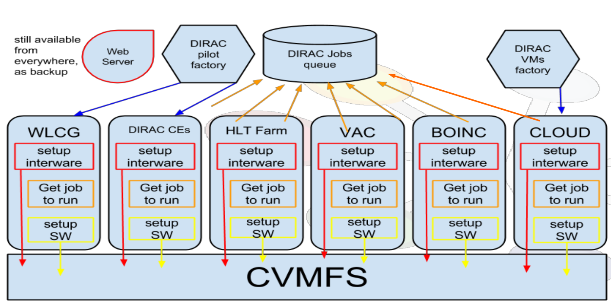

.. _WMS:

================================
Workload Management System (WMS)
================================

The DIRAC Workload Management System (WMS) realizes the task scheduling paradigm with Generic :ref:`Pilot <pilots>` Jobs.
This task scheduling method solves many problems of using unstable distributed computing resources which are
available in computing grids. In particular, it helps the management of the user activities in large Virtual
Organizations such as LHC experiments. In more details the DIRAC WMS with Pilot Jobs is described
`here <http://iopscience.iop.org/article/10.1088/1742-6596/898/9/092024>`__.

The WMS provides high user jobs efficiency, hiding the heterogeneity of the the underlying computing resources.

Within :ref:`DIRAC jobs <jobs>` users specify at least an executable, and maybe some argument, that DIRAC will start on the Worker Node.
Jobs are not sent directly to the Computing Elements, nor to any Computing resource.
Instead, their description and requirements are stored in the DIRAC WMS DataBase
(using the JDL grammar - Job Description Language) and added to a Task Queue
of jobs with same or similar requirements. Jobs will start running when their JDL is picked up by a pilot job.

Pilot jobs are submitted to computing resources by specialized Pilot Directors.
After the start, Pilots check the execution environment and form the resource description (OS, capacity, disk space, software, etc)
The resources description is presented to the Matcher service, which chooses the most appropriate user job from the Task Queue.
The user job description is delivered to the pilot, which prepares its execution environment and executes the user application

One evident advantage is that the users’ payloads are starting in an already verified environment.
The environment checks can be tailored for specific needs of a particular community by customizing the pilot operations.

For the users all the internal WMS/pilots machinery is completely hidden.
They see all the DIRAC operated computing resources as single large batch system.

The following video shows a simplified view of how the system works

.. raw:: html

   <iframe width="560" height="315" src="https://www.youtube.com/embed/t7BAnbE4glA" frameborder="0" allow="accelerometer; autoplay; encrypted-media; gyroscope; picture-in-picture" allowfullscreen></iframe>

The following definitions apply:

- Sites: Administrative units that expose Grid resources
- Computing Element (CE): Sites managed computing resources entry points
- Worker Node (WN): a computing node where Pilots and Jobs run
- computing slot: a resource allocated by a resource provider for a community usage on a WN (a batch job slot, a VM slot...)

DIRAC alone can send pilots to several types of computing element, and recognizes several types of batch systems.
You can find a presentation highlighting these concepts `here <https://indico.cern.ch/event/658060/contributions/2943568/attachments/1623665/2584839/DIRAC.pdf>`__.

In case more than one type of resource is available, specifically VM-based resources,
the pilots scheduling should happen with other means then SiteDirectors, as exemplified in the following picture:

DIRAC alone does not administer directly clouds or any VM-based systems.
A different mechanism should be used for starting pilots and jobs on worker nodes that can't be reached via Computing Elements.
One mechanism for starting pilots on Clouds is using the :py:mod:`~DIRAC.WorkloadManagementSystem.Agent.CloudDirector` agent.

(Over-)simplified workflow
==========================
DIRAC WMS basically works as follows:

1. Users define and submit jobs. Jobs have requirements. Job descriptions are stored in DIRAC's :py:mod:`~DIRAC.WorkloadManagementSystem.DB.JobDB`.
2. DIRAC agent :py:mod:`~DIRAC.WorkloadManagementSystem.Agent.SiteDirector` submit pilot jobs to Computing Elements (:ref:`CE`).
   - Pilots are "just scripts" and can also be started on worker nodes in a different way, without SiteDirectors.
3. Pilots will try to match the worker nodes' capabilities to Jobs requirements.
4. Jobs are started on WNs. DIRAC monitors its progress.

References
==========

For more info on how the WMS work, please refer to this `presentation <https://indico.cern.ch/event/676817/contributions/2770712/attachments/1653260/2645342/WMS_Resources.pdf>`_.

The following sections add some detail for the WMS systems.

.. toctree::
   :maxdepth: 1

   architecture
   Pilots/index
   Pilots/Pilots3
   Jobs/index
   JobsPriorities
   JobsMatching
   tagsAndJobs
   multiProcessorJobs
   InputDataResolution
