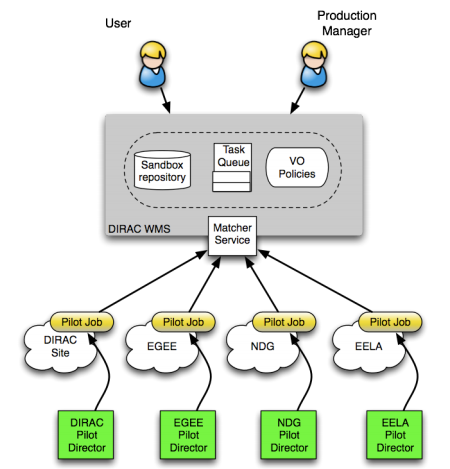

================================
Workload Management System (WMS)
================================

The DIRAC Workload Management System (WMS) realizes the task scheduling paradigm with Generic Pilot Jobs ( or Agents ).
This task scheduling method solves many problems of using unstable distributed computing resources which are
available in computing grids. In particular, it helps the management of the user activities in large Virtual
Organizations such as LHC experiments. In more details the DIRAC WMS with Pilot Jobs is described
`here <http://iopscience.iop.org/article/10.1088/1742-6596/898/9/092024>`_.

The WMS provides high user jobs efficiency, hiding the heterogeneity of the the underlying computing resources.

Jobs are not sent directly to the Computing Elements, or to any Computing resource.
Instead, their description and requirements are stored in the DIRAC WMS (in a JDL, Job Description Language).
JDLs are then matched by pilots running on the Worker Nodes.

The following picture shows a simplified view of how the system works

The computing resources that DIRAC can administer can be of different types.

In any case, the following definitions apply:

- Sites: Administrative units that expose Grid resources
- Computing Element (CE): Sites managed computing resources entry points
- Worker Node (WN): a computing node where Pilots and Jobs run
- computing slot: a resource allocated by a resource provider for a community usage on a WN (a batch job slot, a VM slot...)

DIRAC alone can send pilots to several types of computing element, and recognizes several types of batch systems.
You can find a presentation highlighting these concepts `here <https://indico.cern.ch/event/658060/contributions/2943568/attachments/1623665/2584839/DIRAC.pdf>`_.

In case more than one one type of resource is available, specifically VM-based resources,
the pilots scheduling should happen with other means then SiteDirectors, as exemplified in the following picture:

.. image:: WMS-Pilots2.png
   :alt: WMS-Pilots.
   :align: center

DIRAC alone does not administer directly clouds or any VM-based systems.
A different mechanism should be used for starting pilots and jobs on worker nodes that can't be reached via Computing Elements.

The following sections add some detail for the WMS systems.

.. toctree::
   :maxdepth: 1

   Pilots/index
   Pilots/Pilots3
   PilotsLogging/index
   Jobs/index
   JobPriorities/index
