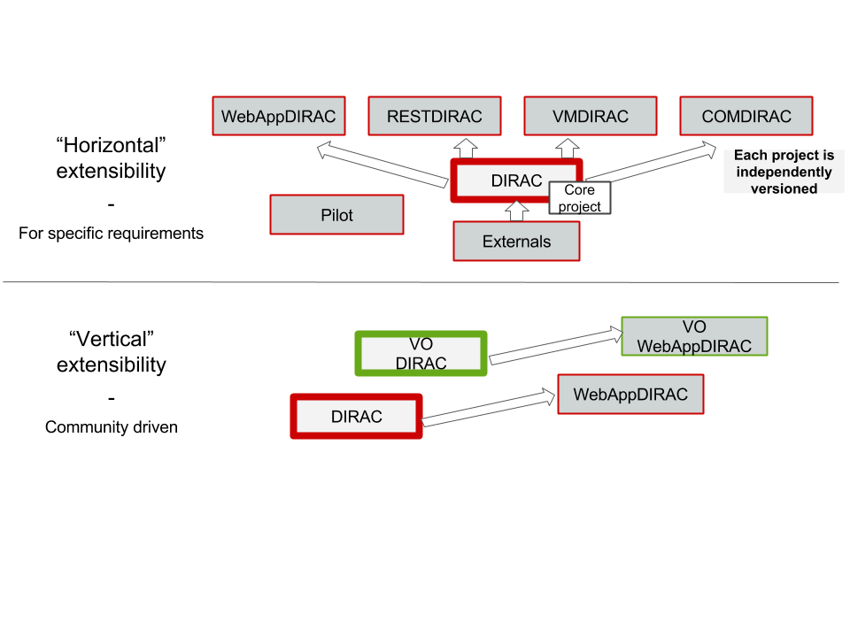

===================
Administrator Guide
===================

DIRAC has been developed with extensibility and flexibility in mind. A DIRAC release is composed by few projects, like in the following picture.
This administration documentation refers to the "Core" DIRAC project.

.. toctree::
   :maxdepth: 1

   SetupStructure/index
   InstallingDIRACService/index
   InstallingWebAppDIRAC/index
   InstallingVMDIRAC/index
   SystemAdministratorInterface/index
   InstallingAndConfiguringBasics/index
   Configuration/index
   Authentication/index
   Systems/index
   Resources/index
   DIRACSites/index
   MultiVO/index
   CommandReference/index
   scalingAndLimitations
   Tutorials/index
   centralizedLogging
   pitExport
