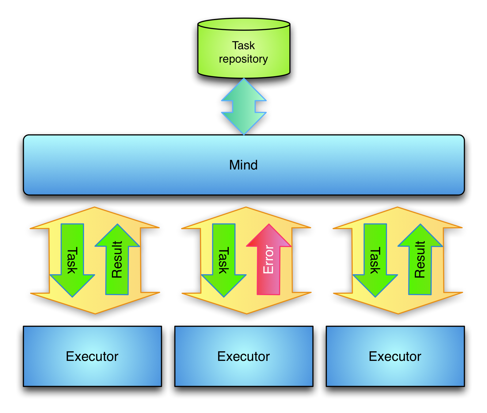

======================================
Developing Executors
======================================

The *Executor framework* is designed around two components. The *Executor Mind* knows how to retrieve, store and dispatch tasks. And *Executors* are the working processes that know what to do depending on the task type. Each *Executor* is an independent process that connects to the *Mind* and waits for tasks to be sent to it. The mechanism used to connect to the *Executors* is described in section :ref:`about stable connections <stable_connections>`. A diagram of both components can been seen in the diagram.

The *Mind* is a *DIRAC* service. It is the only component of the *Executor* framework that needs write-access to the database. It loads tasks from the database and writes the results back. The *Mind* can periodically query a database to find new tasks, but it can also receive new tasks from other components. *Executors* don't keep or store the result of any task. If an *Executor* dies without having finished a task, the *Mind* will simply send the task to another *Executor*.

When the *Mind* receives a task that has been properly processed by an *Executor*, the result will have to be stored in the database. But before storing it in the database the *Mind* needs to check that the task has not been modified by anyone else while the executor was processing it. To do so, the *Mind* has to store a task state in memory and check that this task state has not been modified before committing the result back to the database. The task state will be different for each type of task and has to be defined in each case.

When an *Executor* process starts it will connect to the *Mind* and send a list of task types it can process. The acts as task scheduler and dispatcher. When the *Mind* has a task to be processed it will look for an idle *Executor* that can process that task type. If there is no idle *Executor* or no can process that task type, the *Mind* will internally queue the task in memory. As soon a an *Executor* connects or becomes idle, the *Mind* will pop a task from one of the queues that the can process and send the task to it. If the *Executor* manages to process the task, the *Mind* will store back the result of the task and then it will try to fill the *Executor* again with a new task. If the *Executor* disconnects while processing a task, the *Mind* will assume that the *Executor* has crashed and will reschedule the task to prevent any data loss.

Tasks may need to go through several different steps before being completely processed. This can easily be accomplished by having one task type for each step the task has to go through. Each *Executor* can then publish what task types it knows how to process. For each step the task has to go through, the *Mind* will send the task to an *Executor* that can process that type of task, receive and store the result, change the task to the next type and then send the task to the next *Executor*. The *Mind* will repeat this mechanism until the task has gone through all the types.

This architecture allows to add and remove *Executors* at any time. If the removed *Executor* was processing a task, the *Mind* will send the task to another *Executor*. If the task throughput is not enough, new *Executors* can be started and the *Mind* will send them tasks to process. Although *Executors* can be added and removed at any time, the *Mind* is still a single point of failure. If the *Mind* stops working the whole system will stop working.

Implementing an Executor module
================================

Implementing an executor module is quite straightforward. It just needs 4 methods to be implemented. Here's an example:

.. literalinclude:: PingPongExecutor.py
   :language: python
   :linenos:

All *Executor* modules need to know to which mind they have to connect. In the *initialize* method we define the mind to which the module
will connect. This method can also have any other initialization required by the *Executor*.

Function *processTask* does the task processing. It receives the task to be processed already deserialized. Once the work is done it can
to return the modified task or just and empty *S_OK*.

The last two methods provide the knowledge on how to serialize and deserialize tasks when receiving and sending them to the *Mind*.

Running an Executor
=====================

*Executor* modules are run by the *dirac-executor* script. This allows to run more than one module by the same process. Jusk invoke
*dirac-executor* passing as parameter all the required modules. It will group all the modules by *Mind* and create just one connection to
the each requested *Mind*. *Minds* will know how to handle *Executors* running more than one module.

Implementing a Mind
======================

The *Mind* is a bit more complex. It has to:

* Dispatch tasks to executors that can handle them. A *Mind* can have more than one type of *Executor* module connected. So it has to decide
  which module type will handle the task. For instance there may be two *Executor* modules connected, the task has to be processed by module
  1 and then by module 2. So the mind has to decide to send the task first to module 1, and once it comes back then send it to module 2.
* It has to either get notified or check some resource to start executing a task. Once the task has been processed it has to store back the
  result to the database or to wherever the result has to go.

A simple example follows:

.. literalinclude::  PingPongMindHandler.py
   :language: python
   :linenos:

As shown in the example, *Minds* are *DIRAC* services so they can use any capability available. In the example we define a message called
'StartReaction'. Each time the *Mind* receives that message it will add a task to be processed. For this example, a task is just a
dictionary with one key having one number as value. This number will define how many times the task will go to an *Executor* to be
processed. Each time an *Executor* processes a task we will just reduce the number of bounces left.

The *Mind* also has two methods to react when an *Executor* connects or disconnects. Keep in mind that each *Executor* can have more than
one module as explained in section `Running an Executor`_. The connect callback will give the *Mind* the list of modules the *Executor* has.

The *exec_dispatch* method is quite important. It decides which *Executor* module has to process the task. Returning an empty *S_OK* means
that no module has to process this task and thus that this task can now be forgotten. In the example *exec_dispatch* will just look at the
number of bounces our task has done. If there are still bounces to do it will just say that the *Framework/PingPong* Executor has to
process the task and no module if there are no bounces left to do.

Methods *exec_serialize* and *exec_deserialize* have to provide a mechanism for packing and unpacking tasks from byte arrays. *Executors*
have the same mechanism in methods *serialize* and *deserialize*. In fact, it is highly recommended that *Executors* and their *Minds* share
this methods.

Method *exec_prepareToSend* allows the *Mind* to prepare before sending a task. It is not required to overwrite this method. It's there in
case some *Mind* needs it.

All that's left are callbacks for when tasks come back from *Executors*:

* **exec_taskDone** will be called if the task has been processed without error. In this method the *Mind* can save the new state into a
  database, notify a resource...
* **exec_taskError** wil be called if the *Executor* has found any error while processing the task. After this method the *Mind* will forget
  about the task.
* **exec_taskFreeze** will be called if the *Executor* requests to freeze the task for some time. For instance an *Executor* can process a
  task and decide that it has to be retried later. It can just freeze the task for a certain amount of time. The *Mind* will keep this tast
  for **at least** that amount of time. It can keep it for more time if there aren't free *Executors* to handle it.
