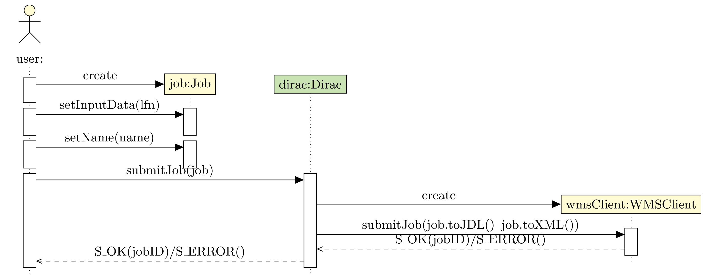
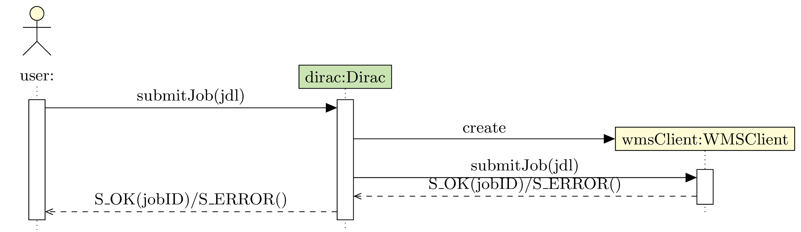
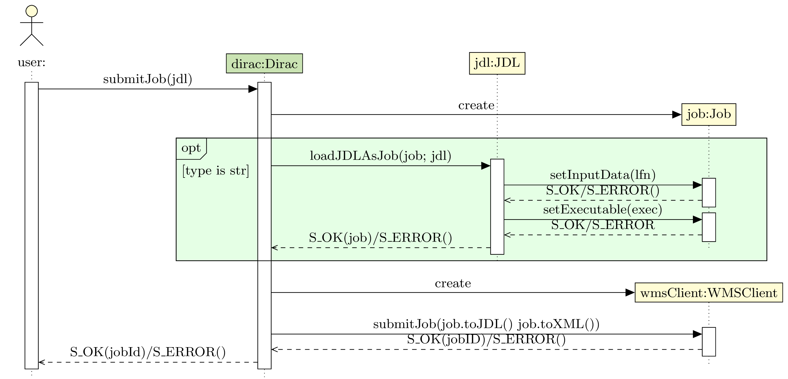

=====================
Developing Interfaces
=====================

What is an interface?
---------------------

An interface is a module that provides a standardized way for different components of the DIRAC system to communicate with each other.

In other words, an interface is a set of rules and protocols that allow two different parts of the system to exchange information and perform actions in a coordinated way.

For example, a database interface might define how different parts of the system can query and update the database, while a messaging interface might define how different parts of the system can send and receive messages.

Why are interfaces important?
-----------------------------

Interfaces are a key part of the DIRAC architecture because they allow different components of the system to be developed and maintained independently, as long as they conform to the same interface specifications. This makes it easier to build and evolve complex distributed systems, such as those used in scientific research or data processing.

Interfaces in DIRAC:
--------------------

DIRAC has n different interfaces :
* Dirac, to manage grid storage, submit jobs (locally or remotely), monitor them and retrieve outputs
* DiracAdmin, for administrators to manage the system, for example banning and unbanning sites, uploading WMS proxies, etc.
* Job, to create jobs
* Transformation, for creating and managing transformations

Those interfaces are made to be generic and suitable for any VO. However, they can be extended to add new functionalities, or to adapt them to a specific VO's needs.

Extending the Job interface:
----------------------------

Creating a Job is best illustrated by an example. Let's say we want to create a new type of Job, called "CustomJob", that will be used to run a specific application on the grid.

.. code-block:: python

    from DIRAC.Interfaces.API.Job import Job

    class CustomJob(Job):

        def __init__(self):
            super().__init__(stdout="custom.out", stderr="custom.err")
            self.setName("CustomJob")

        def setInputData(self, lfns: list[str]):
            return super().setInputData(lfns.append("LFN:/some/file.lfn"))

        def setCustomElement(self, element: str):
            self._addJDLParameter("CustomElement", element)

Note that each method, class and module should have its own docstring. This is important for the documentation to be generated correctly.

In our example, our newly created CustomJob inherits from the Job class. This means that it will have all the methods and attributes of Job, and that we can add new ones to it.

The first method is the constructor, i.e the ``__init__`` method. The first call is the constructor of the super Job class, in which we're able to set the standard output and error files to "custom.out" and "custom.err" respectively. Then, we also set the name of the job to "CustomJob" by calling one of the Job method. This allow to avoid code duplication and any breakage in case of a change of implementation to the setName method implementation.

The second method ``setInputData`` shows that VOs can override some methods of the Job class, here by adding some file when setting the input data. This is done by calling the super method and appending the new LFN to the list of LFNs.

Finally, the third method ``setCustomElement`` shows that VOs can add new methods to the Job class. Here, we add a new JDL parameter called "CustomElement" and set it to the value of the element parameter. This is done by calling the ``_addJDLParameter`` method, which is not recommended. If you really need to add some custom JDL parameters, more steps may be needed.

In DIRAC, a user has two ways to create jobs.

The first one is by using the Job API :

The second one is by using the JDL format, documented here :doc:`../../../UserGuide/Tutorials/JDLsAndJobManagementBasic/index`

However, as you may see, the WMSClient class is not called with the same arguments in both cases. This is because the Job API class is also responsable for creating a Workflow file. To unify the two submission methods, a ``loadJDLAsJob`` has been added. The sequence diagram below shows how the Dirac API uses this new method to transform JDL jobs into jobs with a workflow script.

If VOs want to support the creation of custom jobs directly from the JDL format, they must implement in their own Dirac interface a way to transform their custom jdls into custom job objects. The sequence diagram below shows how this can be done.

.. warning::
    Starting in 8.2, the ``loadJDLAsJob`` method will return ``S_ERROR`` if the JDL contains unknown fields. This is to warn the user in case some specified fields has not been parsed by the Job API. Therefore, in your custom Dirac interface, you should remove any parsed field from the JDL before passing it to the ``loadJDLAsJob`` method.
