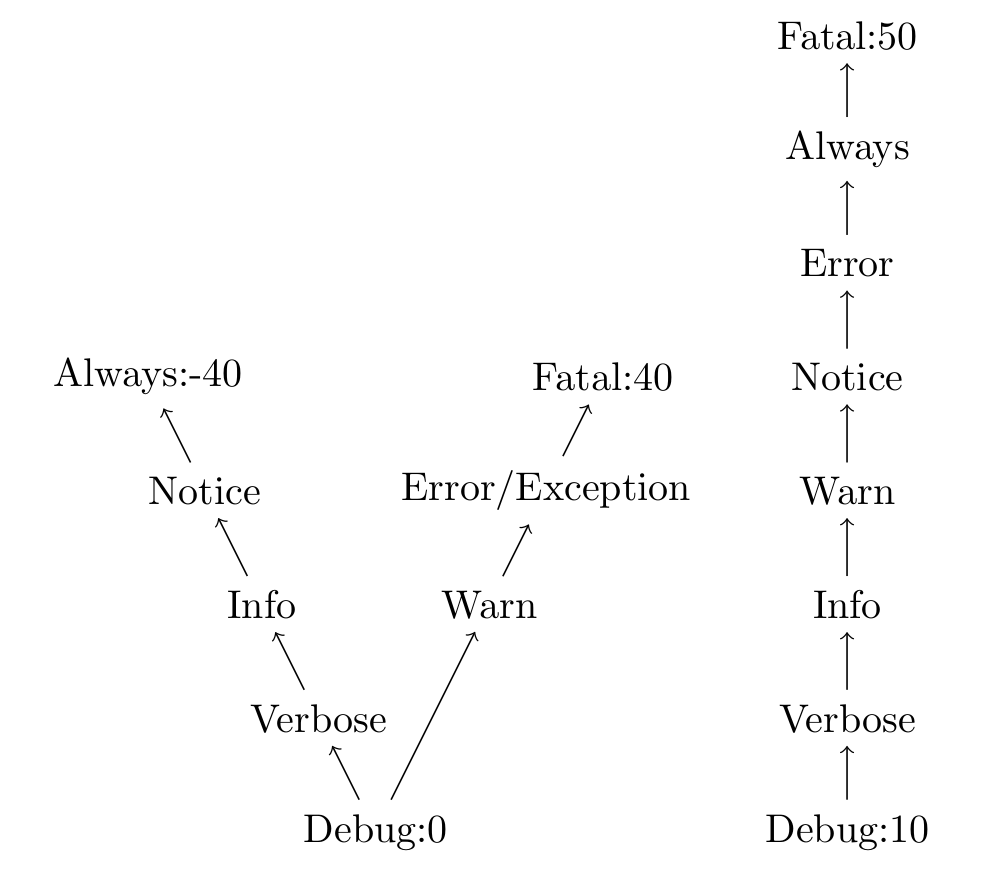

.. _gLogger_changes:

Changes
=======

Here is a list of the different changes due to the replacement of *gLogger*.

Vocabulary changes
------------------

Now, *Logger* objects are renamed *Logging*. In the same way, a sub
*Logger* becomes a child *Logging*. To finish, a message becomes a log
record.

Logger creation
---------------

*child* attribute in the *getSubLogger* method
~~~~~~~~~~~~~~~~~~~~~~~~~~~~~~~~~~~~~~~~~~~~~~

There is no possibility to remove the system and the component names
from the log record anymore. In this way, the *child* attribute becomes
totally useless and should not be used. Here is the only way to create a
child *Logging* now:

::

    gLogger.getSubLogger("logger")

*Logging* and child *Logging*
~~~~~~~~~~~~~~~~~~~~~~~~~~~~~

Before the update, when a sub *Logger* got a sub *Logger*, we had always
the same display:

::

    log = gLogger.getSubLogger("log")
    sublog = log.getSubLogger("sublog")
    log.always("message")
    sublog.always("message")
    # ... Framework/log ALWAYS: message
    # ... Framework/log ALWAYS: message

Now, the child *Logging* keeps this name in the display, and the one of
all its parents:

::

    log = gLogger.getSubLogger("log")
    sublog = log.getSubLogger("sublog")
    log.always("message")
    sublog.always("message")
    # ... Framework/log ALWAYS: message
    # ... Framework/log/sublog ALWAYS: message

Levels
------

Level system
~~~~~~~~~~~~

There are still 9 different levels in DIRAC, but the system changes. In
fact, the old *gLogger* was composed by a *V* level model from *Always*
to *Fatal*. Now, the level system becomes linear. Here is a figure
presenting the old level system at the left, and the new at the right:

You can notice that the *exception* level disappears, but it still
possible to create *exception* log records. They will appear as an
*error* message with an additional stack trace.

*setLevel()* functionality
~~~~~~~~~~~~~~~~~~~~~~~~~~

If the developer does not have set a level to his *Logging*, this one
takes the level of its parent by default. In this way, each time the
parent level is modified, the level of its children changes too. It is a
propagation:

::

    gLogger.setLevel('notice')
    log = gLogger.getSubLogger('log')
    sublog = log.getSubLogger('sublog')
    gLogger.getLevel()
    log.getLevel()
    sublog.getLevel()
    # > NOTICE
    # > NOTICE
    # > NOTICE

    gLogger.setLevel('error')
    gLogger.getLevel()
    log.getLevel()
    sublog.getLevel()
    # > ERROR
    # > ERROR
    # > ERROR

It is possible to limit this propagation setting the level of a
*Logging* with the *setLevel()* method. Thus, even if the parent level
change, the level of the *Logging* will stay the same. See this example based
on the previous snippet:

::

    # gLogger, log, sublog level: ERROR
    log.setLevel('verbose')
    gLogger.getLevel()
    log.getLevel()
    sublog.getLevel()
    # > ERROR
    # > VERBOSE
    # > VERBOSE

    gLogger.setLevel('debug')
    gLogger.getLevel()
    log.getLevel()
    sublog.getLevel()
    # > DEBUG
    # > VERBOSE
    # > VERBOSE

Message
-------

*lExcInfo* and *lException* attributes
~~~~~~~~~~~~~~~~~~~~~~~~~~~~~~~~~~~~~~

As the *child* attribute, these attributes are now useless and should
not be used. Here is the only way to create an exception log record now:

::

    gLogger.exception("message")

Display
-------

Multiple line messages
~~~~~~~~~~~~~~~~~~~~~~

The old *gLogger* allowed the developers to create log records on
multiple lines with a prefix on each line:

::

    2017-04-25 15:51:01 UTC Framework/log ALWAYS: this is a message
    2017-04-25 15:51:01 UTC Framework/log ALWAYS: on multiple lines

Now, this functionality does not exist anymore. The prefix is only
present on the first line:

::

    2017-04-25 15:51:01 UTC Framework/log ALWAYS: this is a message
    on multiple lines

Exception message display
~~~~~~~~~~~~~~~~~~~~~~~~~

There is also a minor change on the *exception* messages. At the top,
there is the old exception display, at the bottom the new:

::

    ... EXCEPT: message
    ... EXCEPT: == EXCEPTION == ZeroDivisionError
    ... EXCEPT: File "....py", line 119, in ...
    ... EXCEPT: a = 1 / 0
    ... EXCEPT:
    ... EXCEPT: ZeroDivisionError: integer division or modulo by zero
    ... EXCEPT: ===============

::

    ... ERROR: message
    Traceback (most recent call last):
    File "....py", line 32, in <module>
    a = 1/0
    ZeroDivisionError: integer division or modulo by zero

*registerBackends()* for all loggers
~~~~~~~~~~~~~~~~~~~~~~~~~~~~~~~~~~~~

Now, each *Logging* can use the *registerBackends* method for their own
needs. In this way, you can easily isolate log records from a specific
*Logging* object.

Nevertheless, all log records from a child *Logging* are sent to the
parent *Logging* which displays these log records if it can and send
these ones to its parent and so on. Thus, all log records from all
*Logging* objects go to *gLogger* which displays every log messages:

::

    # gLogger has no Backend, DEBUG level
    gLogger.registerBackends(['stdout'])

    log = gLogger.getSubLogger('log')
    log.registerBackends(['stderr', 'stdout'])

    sublog = log.getSubLogger('sublog')

    subsublog = sublog.getSubLogger('sublog')
    subsublog.registerBackends(['file'])

    subsublog.verbose("message")
    # file 
    # > ...VERBOSE: message
    # stderr
    # > ...VERBOSE: message
    # stdout
    # > ...VERBOSE: message
    # > ...VERBOSE: message

As you can see, the subsublog message goes up in the chain and is
displayed by all of its parents. You can also notice its double presence
in *stdout*.

Local *showHeaders* and *showThreadIDs*
~~~~~~~~~~~~~~~~~~~~~~~~~~~~~~~~~~~~~~~

Before, the *showHeaders* and the *showThreadIDs* options were globals,
and any logger could change their values and this could impact all the
loggers. This is not the case anymore since these options are locals to
the *Logging* objects. It works exactly like the *setLevel()* method.

If the developer does not have set a format to his *Logging*, this one
takes the format of its parent by default. In this way, each time the
parent format is modified, the format of its children changes too. It is
a propagation:

::

    # gLogger has a stdout Backend, DEBUG level
    gLogger.showHeaders(True)
    log = gLogger.getSubLogger('log')
    log.registerBackends(['stderr'])
    log.verbose("message")
    # stdout
    # > ...VERBOSE: message
    # stderr
    # > ...VERBOSE: message

    gLogger.showHeaders(False)
    log.verbose("message")
    # stdout
    # > message
    # stderr
    # > message

It is possible to limit this propagation setting the format of a
*Logging* with the *showHeaders()* or *showThreadIDs()* methods. Thus,
even if the parent format changes, the format of the *Logging* object
will stay the same:

::

    # gLogger has a stdout Backend, DEBUG level
    gLogger.showHeaders(True)
    log = gLogger.getSubLogger('log')
    log.registerBackends(['stderr'])
    log.showHeaders(True)
    log.verbose("message")
    # stdout
    # > VERBOSE: message
    # stderr
    # > VERBOSE: message

    gLogger.showHeaders(False)
    log.verbose("message")
    # stdout
    # > message
    # stderr
    # > VERBOSE: message

Multiple processes and threads
------------------------------

Multiple threads
~~~~~~~~~~~~~~~~

*gLogger* is now thread-safe. This means that you have the possibility
to write safely in one file with two different threads.
