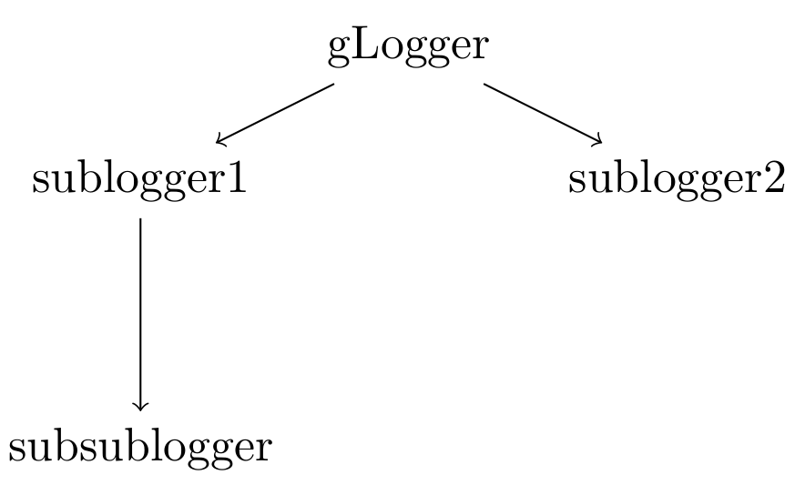
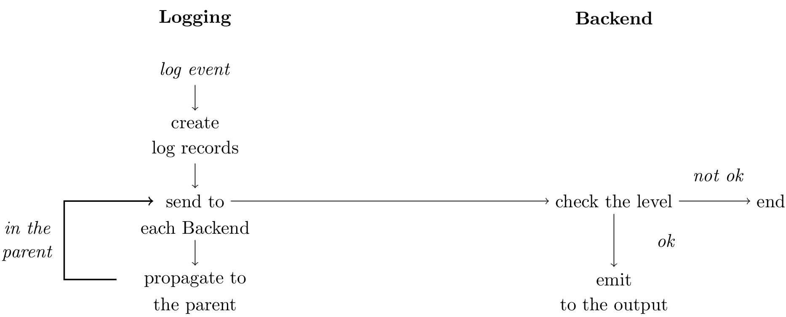

.. _gLogger_gLogger_advanced:

Advanced use
============

Get a children tree
-------------------

As we said in the :ref:`gLogger_gLogger_basics` part, all *Logging* objects can own a list of children and
a parent, and is part of a *Logging* tree like this:

Here is a snippet presenting the creation of the tree seen above:

::

    # level 1
    logger = gLogger.getSubLogger("logger")
    # level 2
    sublogger1 = logger.getSubLogger("sublogger1")
    sublogger2 = logger.getSubLogger("sublogger2")
    # level 3
    subsublogger = sublogger1.getSubLogger("subsublogger")

Set a child level
-----------------

The level propagation
~~~~~~~~~~~~~~~~~~~~~

As every *Logging* object is part of a tree, the level of a parent can
be propagated to its children. Thus, we do not have to set all the
children levels:

::

    # gLogger level: NOTICE
    logger = gLogger.getSubLogger("logger")
    print logger.getLevel()
    # > NOTICE

While the children levels are not defined by the user, they are modified
according to the parent level:

::

    logger = gLogger.getSubLogger("logger")
    sublogger = logger.getSubLogger("sublogger")
    print logger.getLevel()
    print sublogger.getLevel()
    # > NOTICE
    # > NOTICE
    logger.setLevel("error")
    print logger.getLevel()
    print sublogger.getLevel()
    # > ERROR
    # > ERROR

The only way to stop the propagation is to use the *setLevel* method on
a *Logging*. For instance, in the previous example, *logger* has now its
own level, and it can not be changed by its parent:

::

    logger = gLogger.getSubLogger("logger")
    print logger.getLevel()
    # > NOTICE
    logger.setLevel("error")
    print logger.getLevel()
    # > ERROR
    gLogger.setLevel("debug")
    print logger.getLevel()
    # > ERROR

Nevertheless, the propagation is still existing for the children of
*logger*:

::

    logger = gLogger.getSubLogger("logger")
    sublogger = logger.getSubLogger("sublogger")
    print logger.getLevel()
    print sublogger.getLevel()
    # > NOTICE
    # > NOTICE
    logger.setLevel("error")
    print logger.getLevel()
    print sublogger.getLevel()
    # > ERROR
    # > ERROR
    gLogger.setLevel("debug")
    print gLogger.getLevel()
    print logger.getLevel()
    print sublogger.getLevel()
    # > DEBUG
    # > ERROR
    # > ERROR
    logger.setLevel("verbose")
    print gLogger.getLevel()
    print logger.getLevel()
    print sublogger.getLevel()
    # > DEBUG
    # > VERBOSE
    # > VERBOSE

To summarize, a *Logging* receives its parent level until the user sets
its level with the *setLevel* method.

Add a *Backend* object on a child *Logging*
-------------------------------------------

*registerBackend(s)* presentation
~~~~~~~~~~~~~~~~~~~~~~~~~~~~~~~~~

Now, it is possible to add some *Backend* objects to any *Logging* via
the *registerBackend* method. This method takes two parameters, a name of a
*Backend* objects, and a dictionary of attribute
names and their values associated. Here is an example of use:

::

    logger = gLogger.getSubLogger("logger")
    logger.registerBackend('stdout')
    logger.registerBackend('file', {'FileName': 'file.log'})
    # An alternative:
    # logger.registerBackends(['stdout', 'file'], {'FileName': 'file.log'})

This, will create *stdout* and *file Backend* objects in *logger*. The alternative method
named *registerBackends* takes a *Backend* objects list as first argument. This method can be really efficient
to add some *Backend* objects in one time but also restrictive due to the unicity of the dictionary keys.

Log records propagation
~~~~~~~~~~~~~~~~~~~~~~~

Obviously, each log record created by a child *Logging* goes up in its
parent if the true *Logging* level allowed it, but as it is always at
*debug*, it goes up anyway. The log record goes up until *gLogger* and
it is displayed in all the *Backend* objects encounter in the parents if
the level allowed it.

In this way, *gLogger* display every log records of every *Logging*
object, even if you add *Backend* objects in a child, the log record
will appears multiple times in this case. Here is an example:

::

    # gLogger has a stdout Backend
    logger = gLogger.getSubLogger("logger")
    logger.registerBackend('stdout')
    logger.verbose("message")
    # > 2017-04-25 15:51:01 UTC Framework/Atom/logger VERBOSE: message
    # > 2017-04-25 15:51:01 UTC Framework/Atom/logger VERBOSE: message
    gLogger.info("message")
    # > 2017-04-25 15:51:01 UTC Framework/Atom/logger INFO: message

We can also notice that the log records do not go down in the tree.

The *registerBackend(s)* utility
~~~~~~~~~~~~~~~~~~~~~~~~~~~~~~~~

This functionality gives the possibility to isolate some log records
from a specific *Logging* or isolate log records above a specific level.
For example, we want only, at minimum, *error* log records providing by
a specific child named *logger* in a file named *file.log*. Here is a
snippet of this example:

::

    # gLogger: stdout Backend, NOTICE level
    logger = gLogger.getSubLogger("logger")
    logger.registerBackend('file', {'FileName': 'file.log'})
    logger.setLevel("error")
    logger.verbose("appears only in stdout")
    logger.notice("appears only in stdout")
    logger.error("appears in stdout and in file.log")
    # in stdout:
    # > ... UTC Framework/Atom/logger VERBOSE: appears only in stdout
    # > ... UTC Framework/Atom/logger NOTICE: appears only in stdout
    # > ... UTC Framework/Atom/logger ERROR: appears in stdout, in file.log
    # in file.log:
    # > ... UTC Framework/Atom/logger ERROR: appears in stdout, in file.log

Modify a display for different *Logging* objects
------------------------------------------------

*showHeaders/TimeStamps/Contexts/ThreadIDs* propagation
~~~~~~~~~~~~~~~~~~~~~~~~~~~~~~~~~~~~~~~~~~~~~~~~~~~~~~~

We also have the possibility to modify the log format by calling the methods
from any existing *Logging* object methods.

Thus, these methods function exactly as the *setLevel* method, so they
can be propagated in the children if the options are not modified by the
user.

*showHeaders/TimeStamps/Contexts/ThreadIDs* utility
~~~~~~~~~~~~~~~~~~~~~~~~~~~~~~~~~~~~~~~~~~~~~~~~~~~

Here, the utility is to modify the display format of the isolate log
records from a specific *Logging* to not be embarrassed with extra
information that we do not want for example:

::

    # gLogger: stdout Backend, NOTICE level, showHeaders at True
    logger = gLogger.getSubLogger("logger")
    logger.setLevel("error")
    logger.showHeaders(True)
    logger.showTimeStamps(False)
    logger.showContexts(False)
    logger.verbose("appears only in stdout")
    # in stdout:
    # > VERBOSE: appears only in stdout

The *LogColor* case
~~~~~~~~~~~~~~~~~~~~~~~~~~~~~~~~~~~~~~

This option can not be modified in the children of *gLogger*, even by
*gLogger* itself after the configuration, so the children receive
the *gLogger* configuration.

Some examples and summaries
---------------------------

Summary diagram
~~~~~~~~~~~~~~~

Here is a diagram showing the complete path of a log record from its
creation to its emission in an output:

