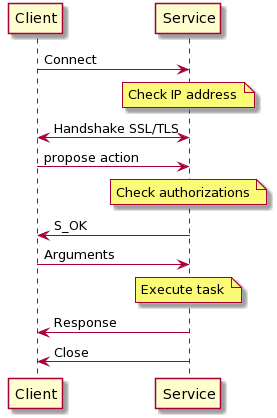
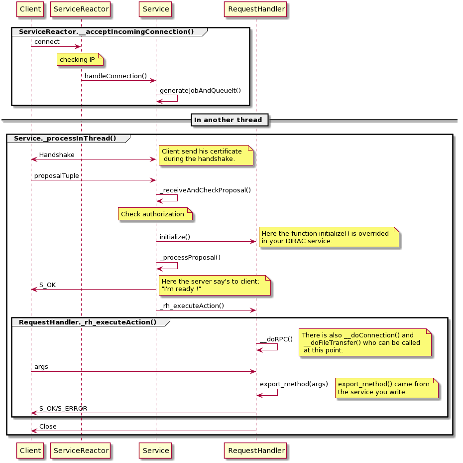

===========================
Client Service Interactions
===========================

*******
Clients
*******

The client can interact with services using RPC calls. DIRAC provides an abstraction which allows to easily add new clients.

.. graphviz::

   digraph {
   YourClient -> Client [label=inherit];
   Client -> RPCClient [label=use];
   RPCClient -> InnerRPCClient [label=use];
   TransferClient -> BaseClient [label=inherit];
   InnerRPCClient -> BaseClient [label=inherit];
   BaseClient -> Transports [label=use];

   YourClient  [shape=polygon,sides=4];
   Client  [shape=polygon,sides=4, label = "DIRAC.Core.Base.Client"];
   RPCClient  [shape=polygon,sides=4, label = "DIRAC.Core.DISET.RPCClient"];
   InnerRPCClient  [shape=polygon,sides=4, label = "DIRAC.Core.DISET.private.InnerRPCClient"];
   TransferClient  [shape=polygon,sides=4, label = "DIRAC.Core.DISET.private.TransferClient"];
   BaseClient [shape=polygon,sides=4, label = "DIRAC.Core.DISET.private.BaseClient"] ;
   Transports [shape=polygon,sides=4];
   }

The BaseClient class contains the low level logic to discover the URLs from System/Component, the connection retry and failover mechanism, the discovery of the credentials to use, and the mechanism to initialize actions with the server. It relies on a Transport class to actually perform the communication.

InnerRPCClient inherits from BaseClient, and just contain the logic to perform an RPC call: it proposes to the server an RPC action. TransferClient implements the FileTransfer logic.

RPCClient translates non existing methods into RPC calls. It does this by using an InnerRPCClient.

the Client class contains a similar logic to emulate methods, but parses specific arguments at each call (url, rpc and timeout) to instantiate an RPCClient. All parameters given to it at initialization will be passed to RPCClient, and propagated down to BaseClient.

Refer to the code documentation of each class for more details. It is good to know however that many connection details can be specified at the creation of the client, and are not necessarily taken from the environment, like the proxy to use.

Here is a rough overview of what is happening when you are calling a method from a client.

.. code-block:: python

   from DIRAC.Core.Base.Client import Client

   c = Client()
   c.serverURL('DataManagement/FileCatalog') # The subclient would have to define it themselves as well

   # This returns a function pointing to Client.executeRPC
   pingMethod = c.ping
   # Calling <class 'DIRAC.Core.Base.Client.Client'>.__getattr__(('ping',))

   # When performing the executiong, the whole chain happens
   pingMethod()

   # Calling <class 'DIRAC.Core.Base.Client.Client'>.executeRPC(): this parses the specific arguments URL and  timeout
   #   if given in the call parameters
   # Calling <class 'DIRAC.Core.Base.Client.Client'>._getRPC(False, '', 120): we generate an RPCClient
   # Calling <class 'DIRAC.Core.DISET.RPCClient.RPCClient'>.__getattr__('ping'): we forward the call to the RPCClient
   # Calling <class 'DIRAC.Core.DISET.RPCClient.RPCClient'>.__doRPC('ping',()): the RPCClient emulates the existance of the
   #   function and forwards it to the InnerRPCClient
   # Calling <class 'DIRAC.Core.DISET.private.InnerRPCClient.InnerRPCClient'>.executeRPC('ping', ()): the RPC call is finally
   #   executed

ThreadConfig
============

This special class is to be used in case you want to execute an operation on behalf of somebody else. Typically the WebApp uses it. This object is a singleton, but all its attributes are thread local. The host/identity wanting to use that requires the TrustedHost property.

Let's take an example

.. code-block:: python

      from DIRAC.Core.DISET.RPCClient import RPCClient
      rpc = RPCClient('System/Component')

      rpc.ping()

In the previous code, the code will be executed as whatever is set in the environment: host certificate or proxy.

.. code-block:: python

      from DIRAC.Core.DISET.RPCClient import RPCClient
      from DIRAC.Core.DISET.ThreadConfig import ThreadConfig

      thConfig = ThreadConfig()
      thConfig.setDN('/Whatever/User')

      rpc = RPCClient('System/Component')
      rpc.ping()

In that case, the call will still be performed using whatever is set in the environment, however the remote service will act as if the request was done by ``/Whatever/user`` (providing that the TrustedHost property is granted).
And because of the ``threading.local`` inheritance, we can have separate users actions like below.

.. code-block:: python

     import threading
     from DIRAC.Core.DISET.RPCClient import RPCClient
     from DIRAC.Core.DISET.ThreadConfig import ThreadConfig

     thConfig = ThreadConfig()

     class myThread (threading.Thread):

       def __init__(self, name):
          super(myThread, self).__init__()
          self.name = name

       def run(self):
          thConfig.setDN(self.name)
          rpc = RPCClient('DataManagement/FileCatalog')
          rpc.ping()

     threads = []

     thread1 = myThread("/Whatever/user1")
     thread2 = myThread("/Whatever/user2")

     thread1.start()
     thread2.start()

     # Add threads to thread list
     threads.append(thread1)
     threads.append(thread2)

     # Wait for all threads to complete
     for t in threads:
        t.join()

*******
Service
*******
Here a simplified sequence diagram of client-server communication.

In most of the cases, a RPC call follows this diagram. Before starting anything, the service checks the IP.
Then the client sends his certificate during the handshake and right after he sends the remote procedure
who need to be called. The service checks the authorization and sends a signal to client when ready. The client sends
all arguments that the service needs and finally the service execute its task. Below you can find
a more complete diagram. Before calling the request handler, if the IP is banned, the service closes the connection.
For other steps if an error occurred the service sends S_ERROR before closing connection.

Complete path of packages are not on the diagram for readability:

 - serviceReactor: :py:class:`DIRAC.Core.DISET.ServiceReactor`
 - service: :py:class:`DIRAC.Core.DISET.private.Service`
 - requestHandler: :py:class:`DIRAC.Core.DISET.RequestHandler`

You can see that the client sends a proposalTuple, proposalTuple contain (service, setup, ClientVO) then (typeOfCall, method) and finaly extra-credentials.
e.g.::

  (('Framework/serviceName', 'DeveloperSetup', 'unknown'), ('RPC', 'methodName'), '')

You have to notice that the service can call __doFileTransfer() but functions relative to file transfer are not implemented and always return S_ERROR. If needed you can implement these functions by overwriting methods from :py:class:`DIRAC.Core.DISET.RequestHandler` in your service. Here the methods you have to overwrite::

  def transfer_fromClient(self, fileId, token, fileSize, fileHelper):
  def transfer_toClient(self, fileId, token, fileHelper):
  def transfer_bulkFromClient(self, bulkId, token, bulkSize, fileHelper):
  def transfer_bulkToClient(self, bulkId, token, fileHelper):
  def transfer_listBulk(self, bulkId, token, fileHelper):

Client must send ('FileTransfer', direction) instead of ('RPC', method), direction can be "fromClient",
"toClient", "bulkFromClient", "bulkToClient" or "listBulk".

*************
About timeout
*************

.. warning:: This section is true when using M2Crypto. If you are still using pyGSI, good luck.

Timeouts are in general a very delicate topic. The way DIRAC handles them for client/server interactions is through socket timeouts. Basically, each blocking operation of a socket has a timeout. However, executing an RPC call requires multiple socket operations (see diagram above). A lot more details are available in :py:mod:`~DIRAC.Core.DISET.private.Transports.M2SSLTransport` but important information are summarized here.

Client timeout
==============

When executing an RPC call, the client can specify a timeout

.. code-block:: python

      from DIRAC.Core.Base.Client import Client

      c = Client()
      c.serverURL('DataManagement/FileCatalog')

      c.doSomethingVeryLong(timeout=123)

In practice, this timeout value is set to the socket, which can perform long blocking operations essentially twice:

* when sending the arguments
* when receiving the results

This means that the real timeout of the whole operation is twice the value given as parameters.

However, in reality, when there is no network issues, performing the transfers is fast, so the only real timeout is the one that waits for the server reply.

Note that a client cutting the socket does not stop the server from performing the operation it started!

Server timeout
==============

As for the client, the server sets the timeout at the socket level. Given the interaction diagram above, the only option we have is to set an upper limit for the time it takes to transfer a given chunk of argument/response. It is set, as an (generous) upper limit to the default RPC timeout.

Default values
==============

Details in  :py:mod:`~DIRAC.Core.DISET`

KeepAlive
=========

Keep alive is enabled on the connections, with the default values. That means that a dead peer/broken connection would be detected after ~ 2h and 10mn, providing we are not in a blocking operation (in which case, the timeout specified above are applied).