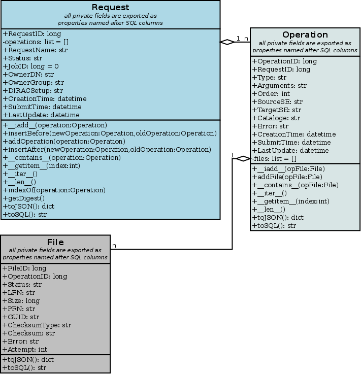
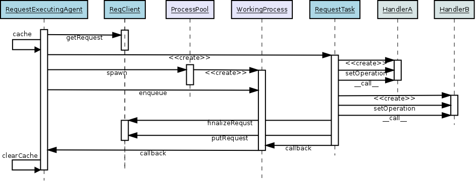

.. _devRMS:

-------------------------
Request Management System
-------------------------

System Overview
---------------

The Request Management System (RMS) is designed for management of simple operations that are performed
asynchronously on behalf of users - owners of the requests. The RMS is used for multiple purposes: failure
recovery (failover system), data management tasks and some others. It is designed as an open system easily
extendible for new types of operations.

Architecture and functionality
------------------------------

The core of the Request Management System is a `ReqDB` database which holds requests records together with
all related data: operations that have to be performed in the defined order and possibly a set of files
attached. All avaiable and useful queries to the `ReqDB` are exposed to the request client (`ReqClient`)
through `ReqManager` service.

.. image:: ../../../_static/Systems/RMS/ReqDBSchema.png
   :alt: ReqDB schema.
   :align: center

Each table in the `ReqDB` has a corresponding class in the new API fully supporting CRUD operations. Each table column
is exposed as a property in the related class.

The record class is instrumented with the internal observer for its children (a `Request` instance is observing
states for all defined `Operations`, each `Operation` is observing
states of all its `Files`) and built in state machine, which automatizes state propagation:

 * state machine for `Request`

   .. image:: ../../../_static/Systems/RMS/RequestSTM.png
      :alt: State machine for Request.
      :align: center

 * state machine for `Operation`

   .. image:: ../../../_static/Systems/RMS/OperationSTM.png
      :alt: State machine for operation.
      :align: center

 * state machine for `File`

   .. image:: ../../../_static/Systems/RMS/FileSTM.png
      :alt: State machine for File.
      :align: center

User is allowed to change only `File` statuses and in case of specific `Operation`'s types - `Operation` statuses,
as `Request` builtin observers will automatically propagate and update statues of parent objects.

CRUD
----

Create
^^^^^^

Construction of a new request is quite simple, one has to create a new `Request` instance::

  >>> from DIRAC.RequestManagementSystem.Client.Request import Request
  >>> from DIRAC.RequestManagementSystem.Client.Operation import Operation
  >>> from DIRAC.RequestManagementSystem.Client.File import File
  >>> request = Request() # # create Request instance
  >>> request.RequestName = "foobarbaz"
  >>> operation = Operation() # # create new operation
  >>> operation.Type = "ReplicateAndRegister"
  >>> operation.TargetSE = [ "CERN-USER", "PIC-USER" ]
  >>> opFile = File() # #  create File instance
  >>> opFile.LFN = "/foo/bar/baz" # # and fill some bits
  >>> opFile.Checksum = "123456"
  >>> opFile.ChecksumType = "adler32"
  >>> operation.addFile( opFile ) # # add File to Operation
  >>> request.addOperation( operation ) # # add Operation to Request

Invoking `Request.addOperation` method will enqueue operation to the end of operations list in the request. If you need
to modify execution order, you can use `Request.insertBefore` or `Request.insertAfter` methods.
Please notice there is no limit of `Operations` per `Request`, but it is not recommended to keep over there
more than a few. In case of `Files` in a single `Operation` the limit is set to one hundred, which seems to
be a reasonable number. In case you think this is not enough (or too much), please patch the code
(look for `MAX_FILES` in `Operation` class).

The `Request` and `Operation` classes are behaving as any iterable python object, i.e. you can loop over operations
in the request using::

  >>> for op in request: print op.Type
  ReplicateAndRegister
  >>> for opFile in operation: print opFile.LFN, opFile.Status, opFile.Checksum
  /foo/bar/baz Waiting 123456
  >>> len( request ) # # number of operations
  1
  >>> len( operation ) # # number of files in operation
  1
  >>> request[0].Type # # __getitem__, there is also __setitem__ and __delitem__ defined for Request and Operation
  'ReplicateAndRegister'
  >>> operation in request # # __contains__ in Request
  True
  >>> opFile in operation # # __contains__ in Operation
  True

Once the request is ready, you can insert it to the `ReqDB`::

  >>> from DIRAC.RequestManagementSystem.Client.ReqClient import ReqClient
  >>> rc = ReqClient() # # create client
  >>> rc.putRequest( request ) # # put request to ReqDB

.. warning::

  Even though it is tempting, you cannot reuse a File object in multiple Operations, even if they are the same LFN. After all, they are different entries in the DB...

Read
^^^^

Reading request back can be done using two methods defined in the `ReqClient`:

  * for reading::

      >>> from DIRAC.RequestManagementSystem.Client.ReqClient import ReqClient
      >>> rc = ReqClient() # # create client
      >>> rc.peekRequest( "foobarbaz" ) # # get request from ReqDB for reading

  * for execution (request status on DB side will flip to 'Assigned')::

      >>> from DIRAC.RequestManagementSystem.Client.ReqClient import ReqClient
      >>> rc = ReqClient() # # create client
      >>> rc.getRequest( "foobarbaz" ) # # get request from ReqDB for execution

If you don't specify request name in `ReqClient.getRequest` or `ReqClient.peekRequest`, the one with "Waiting"
status and the oldest `Request.LastUpdate` value will be chosen.

Update
^^^^^^

Updating the request can be done by using methods that modify operation list::

  >>> del request[0] # # remove 1st operation using __delitem__
  >>> request[0] = Operation() # # overwrite 1st operation using __setitem__
  >>> request.addOperation( Operation() ) # # add new operation
  >>> request.insertBefore( Operation(), request[0] ) # # insert new operation at head
  >>> request.insertAfter( Operation(), request[0] ) # # insert new opration after 1st

To make those changes persistent you should of course put modified and say dirty request back
to the `ReqDB` using `ReqClient.putRequest`.

Delete
^^^^^^

Nothing special here, just execute `ReqClient.deleteRequest( requestName )` to remove whole request from `ReqDB`.

Request validation
------------------

The validation of a new Request that is about to enter the system for execution is checked by the `RequestValidator`
helper class - a gatekeeper checking if request is properly defined.
The `validator` is blocking insertion of a new record to the `ReqDB` in case of missing or
malformed attributes and returning `S_ERROR` describing the reason for rejection, i.e.::

      >>> from DIRAC.RequestManagementSystem.private.RequestValidator import gRequestValidator
      >>> from DIRAC.RequestManagementSystem.Client.Request import Request
      >>> invalid = Request()
      >>> gRequestValidator.validate( invalid )
      {'Message': 'RequestName not set', 'OK': False}
      >>> invalid.RequestName = "foobarbaz"
      >>> gRequestValidator.validate( invalid )
      {'Message': "Operations not present in request 'foobarbaz'", 'OK': False}
      >>> from DIRAC.RequestManagementSystem.Client.Operation import Operation
      >>> invalid.addOperation( Operation() )
      {'OK': True, 'Value': ''}
      >>> gRequestValidator.validate( invalid )
      {'Message': "Operation #0 in request 'foobarbaz' hasn't got Type set", 'OK': False}
      >>> invalid[0].Type = "ForwardDISET"
      >>> gRequestValidator.validate( invalid )
      {'Message': "Operation #0 of type 'ForwardDISET' is missing Arguments attribute.", 'OK': False}

A word of caution has to be clearly stated over here: the validation is not checking if
actual value provided during `Request` definition makes sense, i.e. if you put to the `Operation.TargetSE` unknown
name of target storage element from the validation point of view your request will be OK, but  it will
miserably fail during execution.

Request execution
-----------------

The execution of the all possible requests is done in only one agent: `RequestExecutingAgent` using special set
of handlers derived from `OperationHandlerBase` helper class.
The agent will try to execute request as a whole in one go.

The `RequestExecutingAgent` is using the `ProcessPool` utility to create slave workers (subprocesses running `RequestTask`)
designated to execute requests read from `ReqDB`. Each worker is processing request execution using following steps:

  * downloading and setting up request's owner proxy
  * loop over waiting operations in the request
  * creating on-demand and executing specific operation handler
  * if operation status is not updated after treatment inside the handler, worker jumps out the loop
    otherwise tries to pick up next waiting `Operation`
  * The Operation executions are attempted several times, and the delay between retry increments

Outside the main execution loop worker is checking request status and depending of its value finalizes request
and puts it back to the ReqDB.

Extending
---------

At the moment of writing following operation types are supported:

  * DataManagement (under DMS/Agent/RequestOperations):

    - `PhysicalRemoval`: Remove files from an SE
    - `PutAndRegister`: Upload local files to an SE and register it
    - `RegisterFile`: Register files
    - `RemoveFile`: Remove files from all SEs and the catalogs
    - `RemoveReplica`: Remove replicas from an SE and the catalog
    - `ReplicateAndRegister`: Replicate a file to an SE and register it

  * RequestManagement (under RMS/Agent/RequestOperation)

    - `ForwardDISET`: Asynchronous execution of DISET call

Note that all the DataManagement operation support an extra parameter in their respective Handler sections: `TimeOutPerfile`.
The timeout for the operation is then calculated from this value and the number of files in the Operation.

The `ReplicateAndRegister` section accepts extra attributes, specific to FTSTransfers:
  * FTSMode (default False): if True, delegate transfers to FTS
  * FTSBannedGroups: list of DIRAC group whose transfers should not go through FTS.

This of course does not cover all possible needs for a specific VO, hence all developers are encouraged to create and keep
new operation handlers in VO spin-off projects. Definition of a new operation type should be easy within the context of
the new RequestManagementSystem. All you need to do is to put in place operation handler (inherited from `OperationHandlerBase`) and/or
extend `RequestValidator` to cope with the new type. The handler should be a functor and should override two methods:
constructor (__init__) and () operator ( __call__)::

    """ KillParrot operation handler """
    from DIRAC import gMonitor
    from DIRAC.RequestManagementSystem.private.OperationHandlerBase import OperationHandlerBase
    import random

    class KillParrot( OperationHandlerBase ):
      """ operation handler for 'KillParrot' operation type

      see OperationHandlerBase for list of methods and DIRAC tools exposed

      please notice that all CS options defined for this handler will
      be exposed there as read-only properties

      """
      def __init__( self, request = None, csPath = None ):
        """ constructor -- DO NOT CHANGE its arguments list """
        # # AND ALWAYS call BASE class constructor (or it won't work at all)
        OperationHandlerBase.__init__(self, request, csPath )
        # # put there something more if you need, i.e. gMonitor registration
        gMonitor.registerActivity( "ParrotsDead", ... )
        gMonitor.registerActivity( "ParrotsAlive", ... )

      def __call__( self ):
        """ this has to be defined and should return S_OK/S_ERROR """
        self.log.info( "log is here" )
        # # and some higher level tools like ReplicaManager
        self.replicaManager().doSomething()
        # # request is there as a member
        self.request
        # # ...as well as Operation with type set to Parrot
        self.operation
        # # do something with parrot
        if random.random() > 0.5:
          self.log.error( "Parrot is still alive" )
          self.operation.Error = "It's only sleeping"
          self.operation.Status = "Failed"
          gMonitor.addMark( "ParrotsAlive" , 1 )
        else:
          self.log.info( "Parrot is stone dead")
          self.operation.Status = "Done"
          gMonitor.addMark( "ParrotsDead", 1)
        # # return S_OK/S_ERROR (always!!!)
        return S_OK()

Once the new handler is ready you should also update config section
for the `RequestExecutingAgent`::

    RequestExecutingAgent {
      OperationHandlers {
         # # Operation.Type
         KillParrot {
           # # add Location for new handler w.r.t. PYTHONPATH settings
           Location = VODIRAC/RequestManagementSystem/Agent/RequestOperations/KillParrot
           ParrotsFoo = True
           ParrotsBaz = 1,2,3
         }
      }
    }

Please notice that all CS options defined for each handler is exposed in it as read-only property. In the above example
`KillParrot` instance will have boolean `ParrotsFoo` set to `True` and `ParrotsBaz` list set to `[1,2,3]`. You can access
them in the handler code using `self.ParrotsFoo` and `self.ParrotsBaz`, nothing special, except you can only read their values.
Any write attempt will raise `AttributeError` bailing out from request execution chain.

From now on you can put the new request to the `ReqDB`::

  >>> request = Request()
  >>> operation = Operation()
  >>> operation.Type = "KillParrot"
  >>> request.addOperation( operation )
  >>> reqClient.putRequest( request )

and your brand new request with a new operation type would be eventually picked up and executed by the agent.

Installation
------------

1. Login to host, install `ReqDB`::

    dirac-install-db ReqDB

2. Install `ReqProxyHandler`::

    dirac-install-service RequestManagement/ReqProxy

Modify CS by adding::

  Systems {
    RequestManagement {
      URLs {
       ReqProxyURLs = dips://<hostA>:9191/RequestManagement/RequestProxy
      }
    }
  }

You need at least one of these - they are backing up new requests in case the `ReqManagerHandler` is down. Full description can be found in `ReqManager and ReqProxies`_.

3. Install `ReqManagerHandler`::

     dirac-install-service RequestManagement/ReqManager

4. Install `CleanReqDBAgent`::

     dirac-install-agent RequestManagement/CleanReqDBAgent

5. Install `RequestExecutingAgent`::

     dirac-install-agent RequestManagement/RequestExecutingAgent

In principle, several `RequestExecutingAgent` can work in parallel, but be aware that their are race conditions
that might lead to requests being executed multiple time.

-------------------------
ReqManager and ReqProxies
-------------------------

Overview
--------

The `ReqManager` service is a handler for `ReqDB` using DISET protocol. It exposes all CRUD operations on requests (creating, reading,
updating and deleting) plus several helper functions like getting requests/operation attributes, exposing some useful information
to the web interface/scripts and so on.

The `ReqProxy` is a simple service which starts to work only if `ReqManager` is down for some reason and newly created requests cannot be
inserted to the `ReqDB`. In such case the `ReqClient` is sending them  to one of the `ReqProxies`, where
the request is serialized and dumped to the file in the local file system for further processing. A separate background thread in the
`ReqProxy` is periodically trying to connect to the `ReqManager`, forwarding saved requests to the place they can
be eventually picked up for execution.

.. image:: ../../../_static/Systems/RMS/RequestProxy-flow.png
   :alt: Request's forwarding in DIRAC.
   :align: center

Installation
------------

For the proper request processing there should be only one central instance of the `ReqManager`
service up and running - preferably close to the hosts on which request processing agents are running.

For the `RequestProxies` situation is quite opposite: they should be installed in the several different places
all over the world, preferably close to the biggest CEs or SEs used by the community. Take the LHCb VO as
an example, where each of Tier1 is running its own `ReqProxy`. Notice that you have to have at least one `ReqProxy`
running somewhere for normal operation, preferably not sharing the host used by the `ReqManager` service.

Example configuration::

  Systems {
    RequestManagement {
      Services {
        RequestManager {
          LogLevel = INFO
          HandlerPath = DIRAC/RequestManagementSystem/Service/RequestManagerHandler.py
          Port = 9143
          Protocol = dips
          Backend = mysql
          Authorization {
            Default = authenticated
          }
        RequestProxy {
          LogLevel = INFO
          HandlerPath = DIRAC/RequestManagementSystem/Service/RequestProxyHandler.py
          Port = 9161
          Protocol = dips
          Authorization {
            Default = authenticated
          }
        }
      }
      URLs {
        ## the only instance of RequestManagerHandler
        RequestManager = dips://<central>:9143/RequestManagement/RequestManager
        ## comma separated list to all RequestProxyHandlers
        RequestProxyURLs = dips://<hostA>:9161/RequestManagement/RequestProxy, dips://<hostB>:9161/RequestManagement/RequestProxy
      }
    }
  }

Don't forget to put correct FQDNs instead of <central>, <hostA>, <hostB> in above example!
