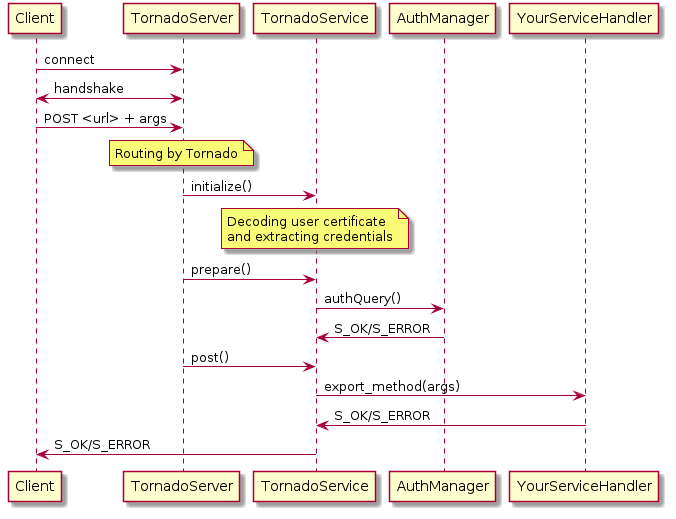

.. _httpsTornado:

===========================
HTTPS Services with Tornado
===========================

.. contents::

************
Presentation
************

This page summarizes the changes between DISET and HTTPS. You can all also see these presentations:

- `Presentation of HTTPS in DIRAC  <https://docs.google.com/presentation/d/1t0hVpceXgV8W8R0ef5raMK3sUgXWnKdCmJUrG_5LsT4/edit?usp=sharing>`_.
- `Presentation of HTTPS migration <https://docs.google.com/presentation/d/1NZ8iKRv3c0OL1_RTXL21hP6YsAUXcKSCqDL2uhkf8Oc/edit?usp=sharing>`_.
- `Summary presentation (latest) <https://indico.cern.ch/event/945474/>`_.

*******
Service
*******

.. graphviz::

   digraph {
   TornadoServer -> YourServiceHandler [label=use];
   YourServiceHandler ->  TornadoService[label=inherit];

   TornadoServer  [shape=polygon,sides=4, label = "DIRAC.Core.Tornado.Server.TornadoServer"];
   TornadoService  [shape=polygon,sides=4, label = "DIRAC.Core.Tornado.Server.TornadoService"];
   YourServiceHandler  [shape=polygon,sides=4];

   }

Service returns to Client S_OK/S_ERROR encoded in JSON

Each service exposes only one route of the form ``System/Component`` with a ``POST`` handler. The semantic of the ``POST`` call is described bellow.

*********************************************************
Important changes between DISET server and Tornado Server
*********************************************************

Internal structure
******************

- :py:class:`~DIRAC.Core.DISET.ServiceReactor` is now :py:class:`~DIRAC.Core.Tornado.Server.TornadoServer`
- :py:class:`~DIRAC.Core.DISET.private.Service` and :py:mod:`~DIRAC.Core.DISET.RequestHandler` are now merge into :py:class:`~DIRAC.Core.Tornado.Server.TornadoService`
- CallStack from S_ERROR are deleted when they are returned to client.
- Common config for all services, there is no more specific config/service. But you can still give extra config files in the command line when you start a HTTPS server.
- Server returns HTTP status codes like ``200 OK`` or ``401 Forbidden``. Not used by client for now but open possibility for usage with external services (like a REST API)

How to write service
********************

Nothing better than an example::

  from DIRAC.Core.Tornado.Server.TornadoService import TornadoService
  class yourServiceHandler(TornadoService):

    @classmethod
    def initializeHandler(cls, infosDict):
      ## Called 1 time, at first request

    def initializeRequest(self):
      ## Called at each request

    auth_someMethod = ['all']
    def export_someMethod(self):
      ## Insert your method here, don't forget the return should be serializable
      ## Returned value may be an S_OK/S_ERROR
      ## You don't need to serialize in JSON, Tornado will do it

Writing a service for tornado and DISET is similar. You have to define your method starting with ``export_``, and your initialization method is a class method called ``initializeHandler``.
Main changes in tornado are:

- Service are initialized at first request
- You **should not** write a method called ``initialize`` because Tornado already use that name, so the ``initialize`` from DISET handlers became ``initializeRequest``
- ``infosDict``, arguments of initializedHandler is not really the same as for DISET: all transport related matters are removed.
-  There is no parameter type check any more: attributes like ``types_yourMethod`` are ignored.
- Auth attributes are still there (``auth_yourMethod``).

The interface of the DISET request handler was preserved, in particular:

* ``getCSOption``
* ``getRemoteAddress``
* ``getRemoteCredentials``
* ``srv_getCSOption``
* ``srv_getRemoteAddress``
* ``srv_getRemoteCredentials``
* ``srv_getFormattedRemoteCredentials``
* ``srv_getServiceName``
* ``srv_getURL``.

How to start server
*******************

The easy way, use ``DIRAC/Core/Tornado/script/tornado-start-all.py`` it will start all services registered in configuration ! To register a service you just have to add the service in the CS and ``Protocol = https``. It may look like this::

  DIRAC
  {
    Setups
    {
      Tornado = DevInstance
    }
  }

  Systems {
    Tornado
    {
      DevInstance
      {
        Port = 443
      }
    }
    Framework
    {
      DevInstance
      {
        Services
        {
          DummyTornado
          {
            Protocol = https
          }
        }
      }
    }
  }

But you can also control more settings by launching tornado yourself::

  from DIRAC.Core.Tornado.Server.TornadoServer import TornadoServer
  serverToLaunch = TornadoServer(youroptions)
  serverToLaunch.startTornado()

Options available are:

- services, should be a list, to start only these services
- debugSSL, True or False, activate debug mode of Tornado (includes autoreload) and SSL, for extra logs use -ddd in the command line
- port, int, if you want to override value from config. If it's also not defined in config, it use 443.

This start method can be useful for developing new service or create starting script for a specific service, like the Configuration System (as master).

MasterCS special case
*********************

The master CS is different because it uses the same global variable (``gConfig``) but uses it also to write config. Because of that, it needs to run in a separate process. In order to do so:

* Do NOT specify ``Protocol=https`` in the service description, otherwise it will be ran with all the other Tornado services
* If you run on the same machine as other TornadoService, specify a ``Port`` in the service description

Finally, there is no automatic installations script. So just install a CS as you normally would do, and then edit the ``run`` file like that::

  diff --git a/run b/run.new
  index d45dce1..f5f3b55 100755
  --- a/run
  +++ b/run.new
  @@ -7,6 +7,6 @@
    [ "service" = "agent" ] && renice 20 -p $$
    #
    #
  -  exec python $DIRAC/DIRAC/Core/scripts/dirac-service.py Configuration/Server --cfg /opt/dirac/pro/etc/Configuration_Server.cfg < /dev/null
  +  exec python $DIRAC/DIRAC/Core/Tornado/scripts/tornado_start_CS.py -ddd

TransferClient
**************

There is no specific client for transfering files anymore. In fact, the whole idea of directly serving file will eventually disapear and be replaced with redirections to real content streaming server. In the meantine, in order to keep some compatibility, the features were implemented, but require some changes on the server side:

- ``transfer_toClient`` needs to be renamed ``export_streamToClient``
- It needs to return the whole file content at once
- The parameter ``fileHelper`` is removed

For example::

  def transfer_toClient(self, myFileToSend, token, fileHelper):

    # Do whatever with the token

    with open(myFileToSend, 'r') as fd:
      ret = fileHelper.DataSourceToNetwork(fd)
      return ret

Simply becomes::

  def export_streamToClient(self, myFileToSend, token):

    # Do whatever with the token

    with open(myFileToSend, 'r') as fd:
      return fd.read()

From the client side, no change is needed since :py:meth:`DIRAC.Core.Tornado.Client.TornadoClient.TornadoClient.receiveFile` keeps the interface

This procedure is not optimized server side (see commented ``export_streamToClient`` implementation in :py:class:`DIRAC.Core.Tornado.Server.TornadoService.TornadoService`). 

The ``transfer_fromClient`` equivalent has not yet been implemented as it concerns only very few cases (basically DIRAC SE and SandboxStore)

******
Client
******

.. graphviz::

   digraph {
   TornadoClient -> TornadoBaseClient [label=inherit]
   TornadoBaseClient -> Requests [label=use]

   TornadoClient  [shape=polygon,sides=4, label="DIRAC.Core.Tornado.Client.TornadoClient"];
   TornadoBaseClient  [shape=polygon,sides=4, label="DIRAC.Core.Tornado.Client.private.TornadoBaseClient"];
   Requests [shape=polygon,sides=4]
   }

This diagram present what is behind TornadoClient, but you should use :py:class:`DIRAC.Core.Base.Client` ! The new client integrate a selection system which select for you between HTTPS and DISET client.

In your client module when you inherit from :py:class:`DIRAC.Core.Base.Client` you can define ``httpsClient`` with another client, it can be useful when you can't serialize some data in JSON. Here the step to create and use a JSON patch:

- Create a class which inherit from :py:class:`~DIRAC.Core.Tornado.Client.TornadoClient`
- For every method who need a JSON patch create a method with the same name as the service
- Use self.executeRPC to send / receive datas

You can also see this example::

  class ConfigurationServerJSON(TornadoClient):
    """
      The specific client for configuration system.
      To avoid JSON limitation the HTTPS handler encode data in base64
      before sending them, this class only decode the base64
      An exception is made with CommitNewData which ENCODE in base64
    """
    def getCompressedData(self):
      """
        Transmit request to service and get data in base64,
        it decode base64 before returning

        :returns str:Configuration data, compressed
      """
      retVal = self.executeRPC('getCompressedData')
      if retVal['OK']:
        retVal['Value'] = b64decode(retVal['Value'])
      return retVal

Behind :py:class:`~DIRAC.Core.Tornado.Client.TornadoClient` the `requests <http://docs.python-requests.org/>`_ library sends a HTTP POST request with:

- method : str with method name
- args: your arguments encoded in JSON
- clientVO: The VO of client
- extraCredentials: (if apply) Extra informations to authenticate client

Service is determined by server thanks to URL rooting, not with port like in DISET.

By default server listen on port 8443.

Contacting the service using ``DIRAC``::

  In [7]: from DIRAC.Resources.Catalog.FileCatalogClient import FileCatalogClient
    ...: FileCatalogClient().whoami()
    ...: 
  Out[7]: 
  {u'OK': True,
  u'Value': {u'DN': u'/C=ch/O=DIRAC/OU=DIRAC CI/CN=ciuser/emailAddress=lhcb-dirac-ci@cern.ch',
    u'group': u'dirac_user',
    u'identity': u'/C=ch/O=DIRAC/OU=DIRAC CI/CN=ciuser/emailAddress=lhcb-dirac-ci@cern.ch',
    u'isLimitedProxy': False,
    u'isProxy': True,
    u'issuer': u'/C=ch/O=DIRAC/OU=DIRAC CI/CN=ciuser/emailAddress=lhcb-dirac-ci@cern.ch',
    u'properties': [u'NormalUser'],
    u'secondsLeft': 86141,
    u'subject': u'/C=ch/O=DIRAC/OU=DIRAC CI/CN=ciuser/emailAddress=lhcb-dirac-ci@cern.ch/CN=2409820262',
    u'username': u'adminusername',
    u'validDN': False,
    u'validGroup': False},
  'rpcStub': (('DataManagement/FileCatalog',
    {'skipCACheck': True, 'timeout': 600}),
    'whoami',
    [])}

Contacting the service using ``requests``::

  In [20]: url = 'https://server:8443/DataManagement/TornadoFileCatalog'
      ...: cert = '/tmp/x509up_u1000'
      ...: kwargs = {'method':'whoami'}
      ...: caPath = '/home/dirac/ClientInstallDIR/etc/grid-security/certificates/'
      ...: with requests.post(url, data=kwargs, cert=cert, verify=caPath) as r:
      ...:     print r.json()
      ...:     
  {u'OK': True, u'Value': {u'DN': u'/C=ch/O=DIRAC/OU=DIRAC CI/CN=ciuser/emailAddress=lhcb-dirac-ci@cern.ch', u'username': u'adminusername', u'secondsLeft': 85846, u'group': u'dirac_user', u'isProxy': True, u'validGroup': False, u'validDN': False, u'issuer': u'/C=ch/O=DIRAC/OU=DIRAC CI/CN=ciuser/emailAddress=lhcb-dirac-ci@cern.ch', u'isLimitedProxy': False, u'properties': [u'NormalUser'], u'identity': u'/C=ch/O=DIRAC/OU=DIRAC CI/CN=ciuser/emailAddress=lhcb-dirac-ci@cern.ch', u'subject': u'/C=ch/O=DIRAC/OU=DIRAC CI/CN=ciuser/emailAddress=lhcb-dirac-ci@cern.ch/CN=2409820262'}}

*****************************
Client / Service interactions
*****************************

*****************************************************
Important changes between TornadoClient and RPCClient
*****************************************************

Internal structure
******************

- :py:class:`~DIRAC.Core.DISET.private.innerRPCClient` and :py:class:`~DIRAC.Core.DISET.RPCClient` are now a single class: :py:class:`~DIRAC.Core.Tornado.Client.TornadoClient`. Interface and usage stay the same.
- :py:class:`~DIRAC.Core.Tornado.Client.private.TornadoBaseClient` is the new :py:class:`~DIRAC.Core.DISET.private.BaseClient`. Most of code is copied from :py:class:`~DIRAC.Core.DISET.private.BaseClient` but some method have been rewrited to use `Requests <http://docs.python-requests.org/>`_ instead of Transports. Code duplication is done to fully separate DISET and HTTPS but later, some parts can be merged by using a new common class between DISET and HTTPS (these parts are explicitly given in the docstrings).
- :py:class:`~DIRAC.Core.DISET.private.Transports.BaseTransport`, :py:class:`~DIRAC.Core.DISET.private.Transports.PlainTransport` and :py:class:`~DIRAC.Core.DISET.private.Transports.SSLTransport` are replaced by `Requests <http://docs.python-requests.org/>`_
- keepAliveLapse is removed from rpcStub returned by Client because `Requests <http://docs.python-requests.org/>`_  manage it himself.
- Due to JSON limitation you can write some specifics clients who inherit from :py:class:`~DIRAC.Core.Tornado.Client.TornadoClient`, there is a simple example with :py:class:`~DIRAC.ConfigurationSystem.Client.ConfigurationClient.CSJSONClient` who transfer data in base64 to overcome JSON limitations

Connections and certificates
****************************
`Requests <http://docs.python-requests.org/>`_ library check more than DISET when reading certificates and do some stuff for us:

- Server certificate **must** have subject alternative names. Requests also check the hostname and you can have connection errors when using "localhost" for example. To avoid them add subject alternative name in certificate. (You can also see https://github.com/shazow/urllib3/issues/497 ).
- If server certificates are used by clients, you must add clientAuth in the extendedKeyUsage (requests also check that).
- In server side M2Crypto is used instead of GSI and conflict are possible between GSI and M2Crypto, to avoid them you can comment 4 lasts lines at ``DIRAC/Core/Security/__init__.py``
- ``_connect()``, ``_disconnect()`` and ``_purposeAction()`` are removed, ``_connect``/``_disconnect`` are now managed by `requests <http://docs.python-requests.org/>`_ and ``_purposeAction`` is no longer used is in HTTPS protocol.

**********************
How to install Tornado
**********************

Requirements
************

Two special python packages are needed:

* git+https://github.com/DIRACGrid/tornado.git@iostreamConfigurable : in place of the standard tornado. This adds configurable feature to tornado
* git+https://github.com/DIRACGrid/tornado_m2crypto.git: this allows to use tornado with M2Crypto

Install a service
*****************

``dirac-install-tornado-service`` is your friend. This will install a runit component running ``tornado-start-all``.
Nothing is ready yet to install specific tornado service, like the master CS.

Start the server
****************

To start the server you must define ``OPENSSL_ALLOW_PROXY_CERTS`` and run ``DIRAC/TornadoServices/Scripts/tornado-start-all.py`` (or ``tornado-start-CS.py`` if you try to run a configuration server)::

  OPENSSL_ALLOW_PROXY_CERTS=1 python /opt/dirac/DIRAC/TornadoServices/scripts/tornado-start-all.py

************
Launch tests
************

pytest
******
Because for now Tornado does not have "Real" services, you must use some fakes services to compare and test with DISET.
You need tornadoCredDict, diracCredDict, User, UserDirac to run tests. Each test explain how to configure in its docstring.

The only service available is the Configuration/Server, it will work with HTTPS and DISET services who needs to load configuration with a Configuration/Server.

Run performance tests
*********************
For performance test unset ``PYTHONOPTIMIZE`` if it is set in your environement::

  unset PYTHONOPTIMIZE

Then you have to start some clients (adapt the port)::

  cd /opt/dirac/DIRAC/test/Integration/TornadoServices
  multimech-run perf-test-ping -p 9000 -b 0.0.0.0

Modify first lines of ``DIRAC/TornadoServices/test/multi-mechanize/distributed-test.py`` and ``DIRAC/TornadoServices/test/multi-mechanize/plot-distributed-test.py`` (follow instruction of each files)

On the server start ``DIRAC/test/Integration/TornadoServices/getCPUInfos`` (redirect output to a file)

Run ``distributed-test.py [NameOfYourTest]`` at the end of execution, the command to plot is given. Before executing command, copy output of ``getCPUInfos`` on ``/tmp/results.txt`` (on your local machine).
