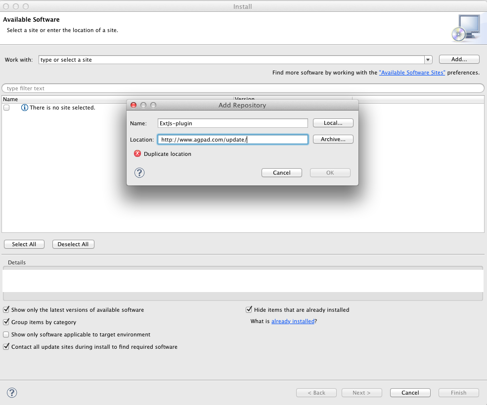
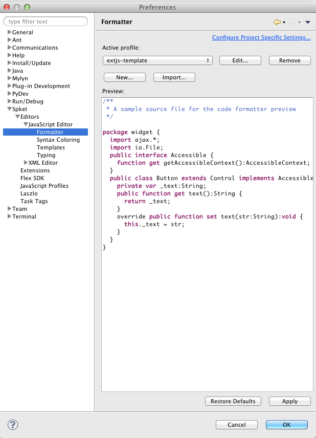

.. _webappdirac_setupeclipse:

=============
Setup Eclipse
=============

In this section we introduce the tools which can be used for developing web applications based on ExtJS.
You can use different editors to write javascript code such as PICO, VI, gEdit, etc.
I encourage you to do not use text editors, instead use an Integrated Development Environment (IDE).
You can found various IDEs in the market. We propose to use Eclipse as it provides lot of plugins, which
can help for debugging or coding javascript. In addition it is free.

    - `Using IDEs`_
    - `Install Eclipse`_
    - `Install ExtJS`_
    - `Eclipse and ExtJS`_

Using IDEs
----------

Text editors are used to write text, but they are not used to write efficient code.
We would like to highlight some disadvantages of the text editors:

   * code quality: It is not easy to have same code style.

   * missing the auto-complete feature

   * it is not easy to manage the code

Advantages of the IDEs:

   * code quality: Each developer can use the same template
   * auto-complete feature: When you type a class name and after press a dot the IDE show the possible methods as well as a short description of the method
   * easy to manage the code
   * it is easy to create tasks: When required to change some code in the comment we can add //TODO and text; This will appears a Tasks list
   * easy to navigate between classes. etc.

Install Eclipse
---------------

   * You can download from: `Eclipse IDE <https://www.eclipse.org>`_
   * installation instructions can be found: `Eclipse wiki <http://wiki.eclipse.org/Eclipse/Installation>`_

Install ExtJS
-------------

   * download from `Sencha page <http://www.sencha.com/products/extjs/>`_ and un-zip it. Note if you have installed WebAppDIRAC, you can found it under WebApp/static/extjs directory.

Eclipse and ExtJS
-----------------
We used the `DuckQuoc's blog <http://ducquoc.wordpress.com/2011/02/16/eclipse-extjs-jquery/>`_ to set up our
Eclipse. There is an other page when you can read about how to setup Eclipse in
`Spket page <http://www.spket.com/extjs.html>`_.

We use Indigo Eclipse and Spket plugin for developing better javascript code.

Install Spket plugin:
@@@@@@@@@@@@@@@@@@@@@

#. Click Help -> Install New software… The following form Install form will appears:

Please give a name and use the following link: `<http://www.agpad.com/update/>`_

#. Click Ok -> select all components

#. Accept the term and conditions -> Finish

#. Wait till the package will be downloaded and installed in case of warning click OK.

#. Restart Eclipse (If it will not restart automatically)

Create Spket profile for ExtJs (Configuration panel):
@@@@@@@@@@@@@@@@@@@@@@@@@@@@@@@@@@@@@@@@@@@@@@@@@@@@@

   * Click "Eclipse" -> "Preferences…" You will see the following configuration form:

   .. image:: images/spket.png
      :scale: 30 %
      :alt: Javascript Spket
      :align: center

   * select "Spket JavaScript Profile" and click to the New button and then type ExtJs.

     .. image:: images/spketprofile.png
        :scale: 30 %
        :alt: Spket profile
        :align: center

   * Click "Add Library" select ExtJs
   * Click "Add Folder" you have to add the path of the ExtJs folder (more details in <https://github.com/DIRACGrid/WebAppDIRAC/wiki/_preview#wiki-extjs>` section).

Make default JavaScript profile
@@@@@@@@@@@@@@@@@@@@@@@@@@@@@@@

   * In the same window ("Spket JavaScript Profile") click on the Extjs profile and after make it default by clicking on the "Default" button.
   * in the "Configuration panel" click on the "General"->"Editors"->"File Associations"

   .. image:: images/fileass.png
      :scale: 30 %
      :alt: Spket file associations
      :align: center

   * Please select \*.js and then select "Spket JavaScript Editor" and click on the "Default button"
   * Restart Eclipse.

Auto-complete feature
@@@@@@@@@@@@@@@@@@@@@

After the restart you can create a javascript file and try type Ext. and **Ctrl+Space**
`<https://zmathe.web.cern.ch/zmathe/spketauto.png>`_

Code convention
@@@@@@@@@@@@@@@

We use similar code convention to DIRAC. We have created a template used to format the code.
You can download from `<https://zmathe.web.cern.ch/zmathe/extjs-template.xml>`_.
In order to use the template you have to import to your Spket profile:

#. Click "Eclipse" -> "Preferences…"
#. In the "Preferences" window select "Spket->Editors->JavaScript Editor->Formatter"
#. Click on the "Import button"
#. Apply

NOTE:
@@@@@

If you encounter some problem, please check you java jdk.
We tested with jdk6 and jdk7. We did not discovered any problem using those versions.
