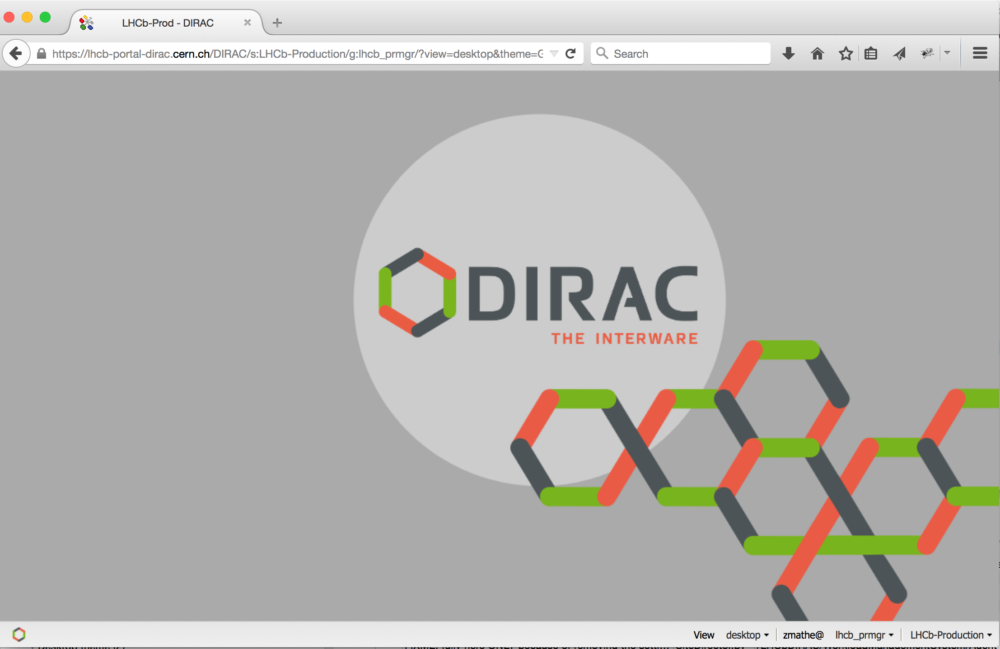
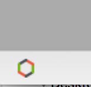
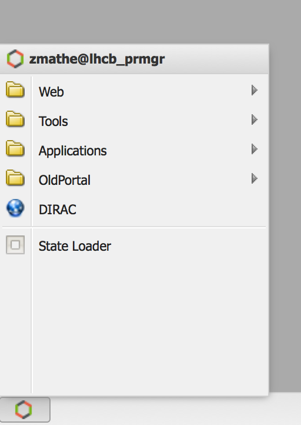
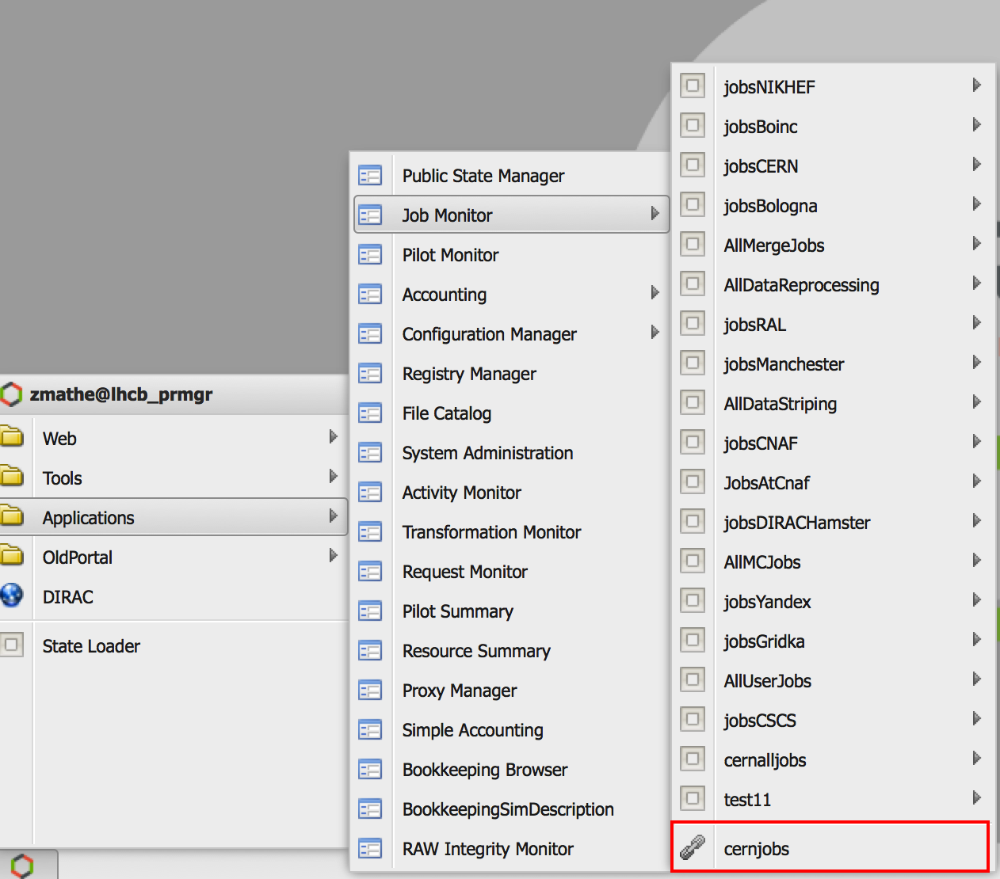
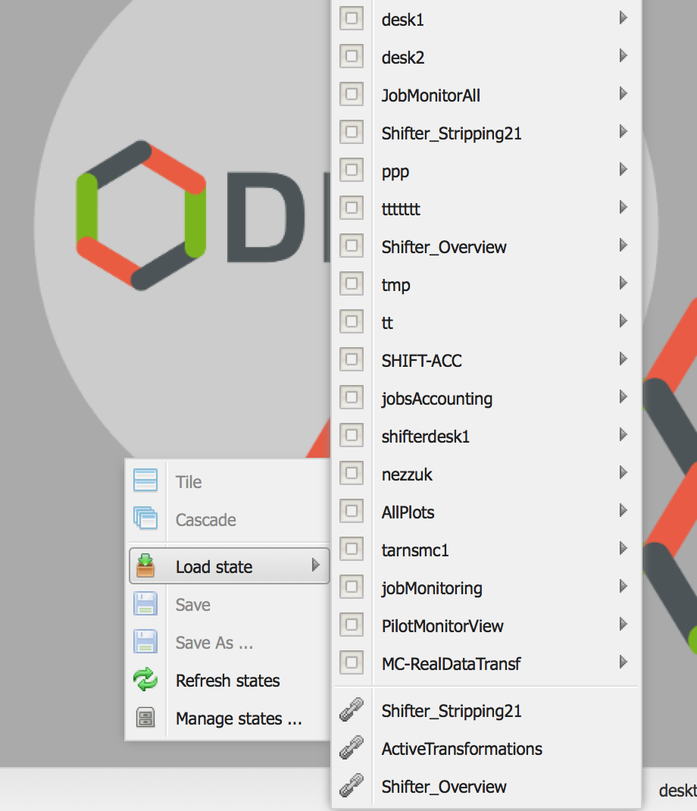
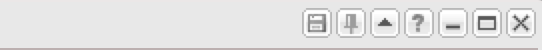
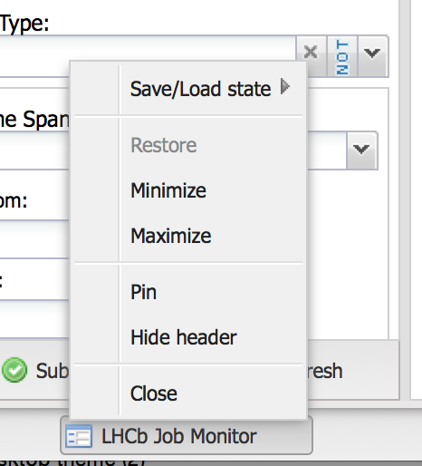
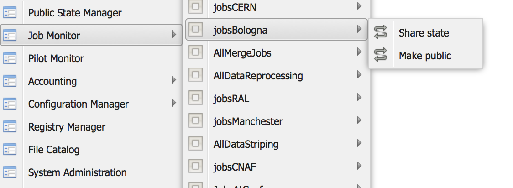
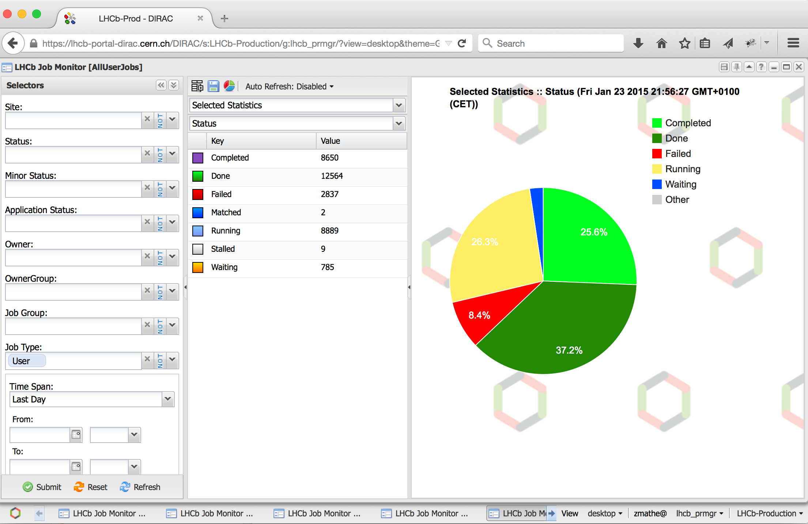
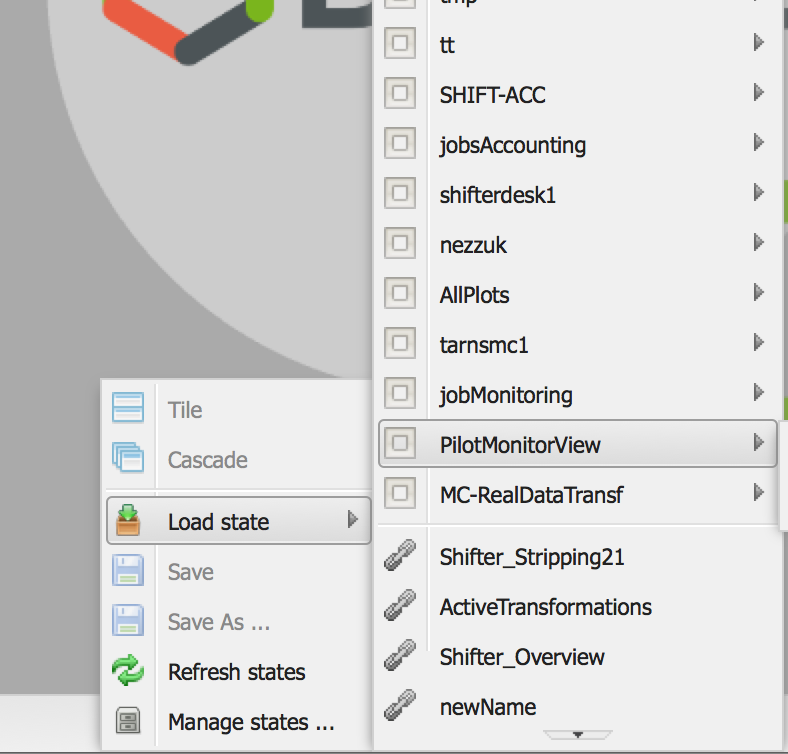

=============
Desktop theme
=============

In this section a detailed description of the Desktop theme is presented:

    - `Main widget`_
    - `Menu structure`_
    - `Manage application and desktop`_
    - `Share application and desktop`_
    

Main widget
-----------

When you open the web portal you will get an empty desktop.

   
In the left corner you can see an icon, which is the menu.

 
In the right corner you can see the settings.
 
.. image:: images/settings.png
   :scale: 50 %
   :alt: Settings
   :align: center
 
You can define the following:
      * You can switch between Tab and Desktop themes.
      * Group you can change the role
      * Setup: you can switch between different setups.
      
Menu structure
--------------

The menu structure:
   * Web : it contains external links
   * Tools : You can found DIRAC specific applications.
   * Applications: You can found DIRAC and VO specific applications.
   * OldPortal: It is link to the old portal.
   * DIRAC it is an external link to DIRAC portal
   * State Loader: It is used to load a state.
   

The states of the applications are available when you click on the application name.
 

   
The end of the list you can see the shared states of the selected application (You can see in the previous picture, indicated by red rectangle).

There is an other context menu which is available by right click on the desktop or on the task bar.

Manage application and desktop
------------------------------

**Applications**

You can manage the applications in two different ways.

**First way:** Each application has an associated menu:

* First icon:
   #. Load state: We can apply a state to the open application.
   #. Save: We can save the application.
   #. Save As...: We can duplicate the application
   #. Refresh states: We can refresh the states.
   #. Manage states... We can delete the state or shared states.
* Second icon: We can pin and unpin an application. It is used to create a customized desktop.
* Third icon: We can hide the application
* Fourth icon: You can write help to the current application. The rest icons are the usual icons: minimize, maximize and exit.
   

**Second way:** We have to click on the application icon which is on the task bar.

The menu is equivalent to previous menu.

**Desktops**

You have to right click on the task bar to manage the desktops. The menu items have similar functionality than the application described above.

Share application and desktop
-----------------------------

**Share an application/desktop**

You have to open the main menu more details: `Menu structure`_

   

You have to do:

   #. click on the menu item: Share
   #. copy the text (for example: desktop|zmathe|lhcb_prmgr|JobMonitorAll) and click OK on the pop up window:
   #. send the text (desktop|zmathe|lhcb_prmgr|JobMonitorAll) to the person

.. image:: ../TabTheme/images/share.png
   :scale: 50 %
   :alt: Share message box.
   :align: center
   
**Load a shared application or desktop**   
   
You have to use the *State Loader* menu item more details:`Menu structure`_

The State Loader widget is the following:

.. image:: ../TabTheme/images/loader.png
   :scale: 50 %
   :alt: Loader.
   :align: center

You have to provide the Shared State (for example: desktop|zmathe|lhcb_prmgr|JobMonitorAll) and a name (for example: newName).
You have tree different way to load a shared state:

   #. Load
   #. Create Link
   #. Load & Create Link
   
**Load**

If you click on Load, you load the shared desktop/application to you desktop. The name of the application will be the provided name. For example: newName.

**Create Link**

This save the application/desktop *Shared* menu item. Which mean it keeps a pointer(reference) to the original desktop/application. 
This will not load the application/desktop into your desktop.

**Load & Create Link**

The desktop/application will be loaded to your desktop and it is saved under the **Shared** menu item. 

**Delete shared applications/desktops**

You have to click on the *Manage states...* menu more details `Manage application and desktop`_ and then select application or desktop depending what you want to delete. 
For example: Let's delete the **newName** shared desktop.

.. image:: ../TabTheme/images/deletelink.png
   :scale: 50 %
   :alt: Delete link.
   :align: center  

You have to select what you want to delete state or a link. As it is a shared desktop what we want to delete we have to select *Links*. 
You have to click on the Delete button.
