==================
Web App User Guide
==================

  
The DIRAC WebApp is a user friendly interface allowing users to interact with the DIRAC services. 
It can be easily extended by particular VO or it can be integrated into some other portal. 

Terms:
-------

**Application** 

   A web page called application in the new portal, for example: Monitoring, Accounting, Production Management. 
   
**Desktop** 

   It is a container of different applications. Each application opens in a desktop. The desktop is your working environment. 

**State** 

   The State is the actual status of an application or a desktop. The State can be saved and it can be reused. A saved State can be shared within
   the VO or between users. 

Concepts:
---------

Two protocols are allowed: **http** and **https**. 
**http** protocol is very restricted. It only allows to access limited functionalities. It is recommended to the site administrators. 
The state of applications or desktops can not be saved.
**https** protocol allows to access all functionalities of DIRAC depending on your role (DIRAC group). 
The state of the application is not saved in the **URL**. The URL only contains the name of application or desktop. 
For example: ``https://lhcb-portal-dirac.cern.ch/DIRAC/s:LHCb-Production/g:lhcb_prmgr/?theme=Grey&url_state=1|AllPlots``

**Format of the URL**

Format of the URL:

#. https://: protocol
#. lhcb-portal-dirac.cern.ch/DIRAC/: host.
#. s:LHCb-Production: DIRAC setup.
#. g:lhcb_prmgr : role
#. theme=Grey: it is the look and feel.
#. &url_state=1: it is desktop or application.
#. AllPlots : it is the desktop name. the default desktop is **Default**. 
#. The state is a desktop: AllPlots 
#. The state is an application: *LHCbDIRAC.LHCbJobMonitor.classes.LHCbJobMonitor:AllUserJobs,*
   For example: desktop and application: AllPlots,*LHCbDIRAC.LHCbJobMonitor.classes.LHCbJobMonitor:AllUserJobs,* 

A video tutorial is available at `<https://www.youtube.com/watch?v=vKBpED0IyLc>`_.

Main panel
----------

The main panel consists of two widgets:

1. Menu
2. Desktop

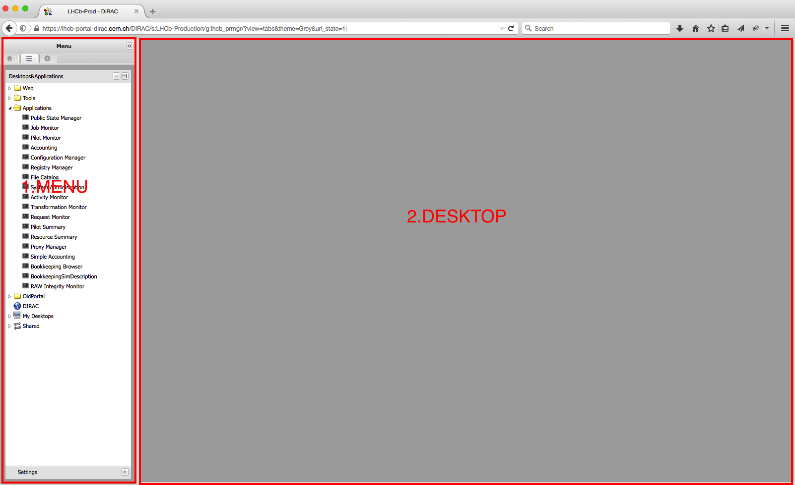

**Menu**

The menu contains three main sub-menus:

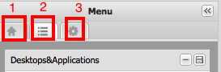

#. is the Intro panel
#. is the Main panel
#. is where you can find more information about DIRAC.

The default is 2. You can change it by clicking on the icons.

**Desktop**

The Desktop is a container which contains various applications on different desktops.

Menu structure
--------------

The menu consists of two widgets:

#. Desktops&Applications
#. Settings
   
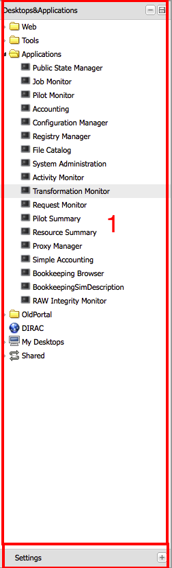
   
**Desktop&Applications**

You can manage your applications and desktops. The menu structure:

* Web: contains external links
* Tools: Here You can find DIRAC specific applications.
* Applications: Here You can find DIRAC and VO specific applications.
* DIRAC: is an external link to DIRAC portal
* My Desktops: contains all saved desktops. You can see a **Default** desktop which contains
  all applications which belongs to the **Default** desktop.
* Shared: It contains all Shared desktops and applications.

Manage application and desktop
------------------------------

You can manage the state of applications and desktops by clicking to the following menu.

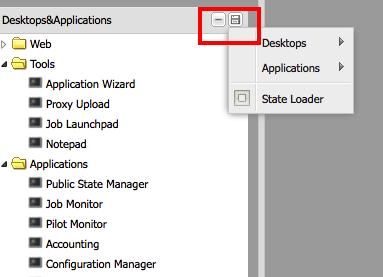

**Desktop**

The Desktop menu item contains:

* New Desktop: You can create an empty desktop.
* Save: You can save the desktop
* Save As you can duplicate your desktop.
* Delete You can delete different desktops.

If you click on the delete menu item, a pop up window will appear:

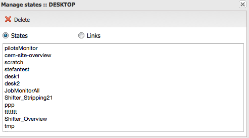

You can select the desktops to be deleted.

**Application**

The Application menu item contains:

* Save
* Save As
* Delete

These menu items have the same functionalities as the Desktop menu items.

**Context menu**

You have another possibility to manage applications and desktops. You have to right click on the application/desktop
what you want to modify.

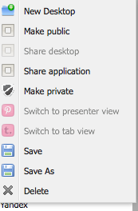

You have few additional menu items:

* Make public: Used to make public an application/desktop to everyone.
* Share desktop: Used to share the desktop within a specific user.
* Share application: Used to share the application within a specific user.
* Make private: revoke the access to the desktop/application.
* Switch to presenter view: The applications will be open in a single desktop.
* Switch to tab view: The applications opened in different tabs.

**Presenter view**

The application which belongs to a desktop will be opened in a single tab. You can change the layout of the desktop using the buttons in the right corner of the panel (The buttons are in the red rectangle).

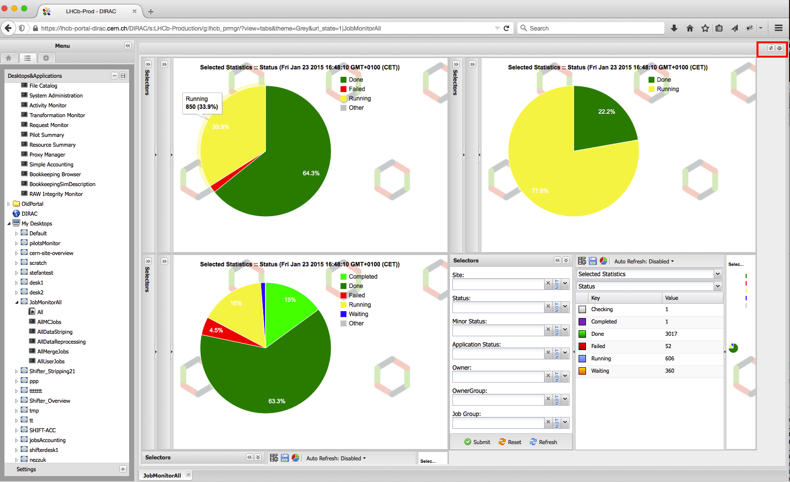

**Tab view**

The applications within a desktop will be opened in different tab.

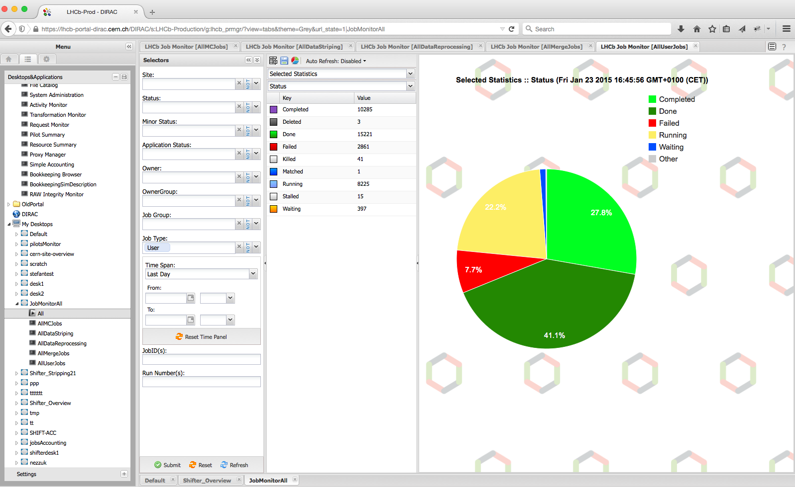

In the right corner of the Tab theme you can see two icons.

*First icon* You can access to a specific application by clicking on the first icon. This is very useful when you have lot of application open in a desktop.

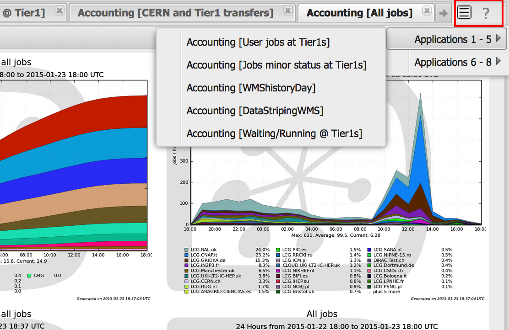

*Second icon* You can write help to the current application.

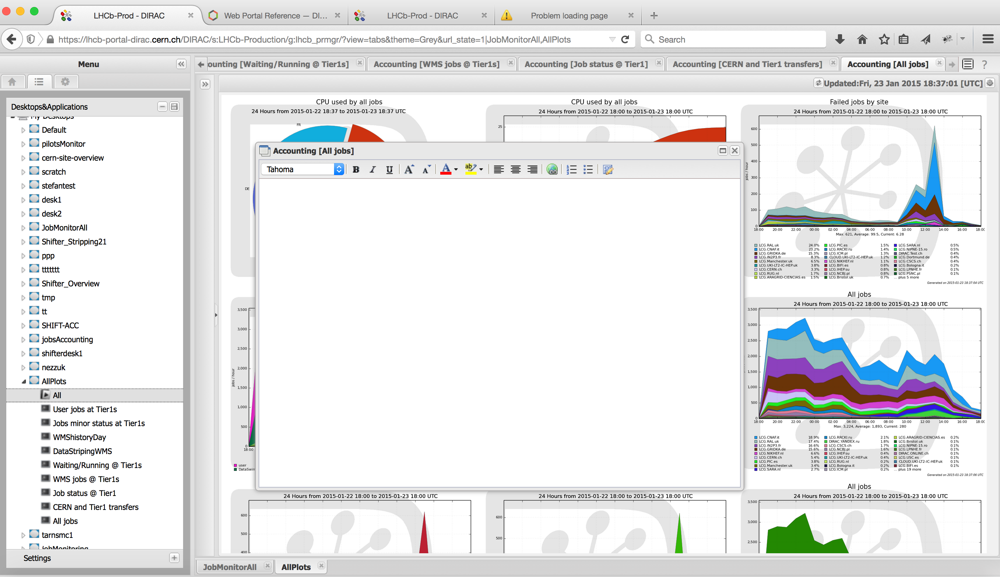

Share application and desktop
-----------------------------

The applications/desktops can be shared. You can share an application/desktop by right click on the application/desktop what
you want to share (more information above in the `Manage application and desktop`_).

**Share an application/desktop**

You have to do the following steps to share an application/desktop:

#. right click on the desktop/application what you want to share.
#. choose the menu item: Share desktop or Share Application.
#. copy the text (for example: desktop|jdoe|lhcb_prmgr|JobMonitorAll) and click OK on the pop up window:
#. send the text (desktop|jdoe|lhcb_prmgr|JobMonitorAll) to the person

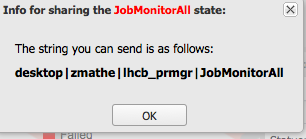

**Load a shared application or desktop**

You have to use the *State Loader* menu item:

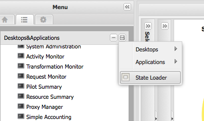

The State Loader widget is the following:

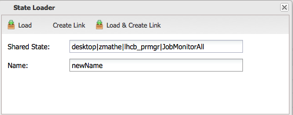

You have to provide the Shared State (for example: desktop|jdoe|lhcb_prmgr|JobMonitorAll) and a name (for example: newName).
You have three different way to load a shared state:

#. Load
#. Create Link
#. Load & Create Link

**Load**

If you click on Load, you load the shared desktop/application to you desktop. The name of the application will be the provided name. For example: newName.

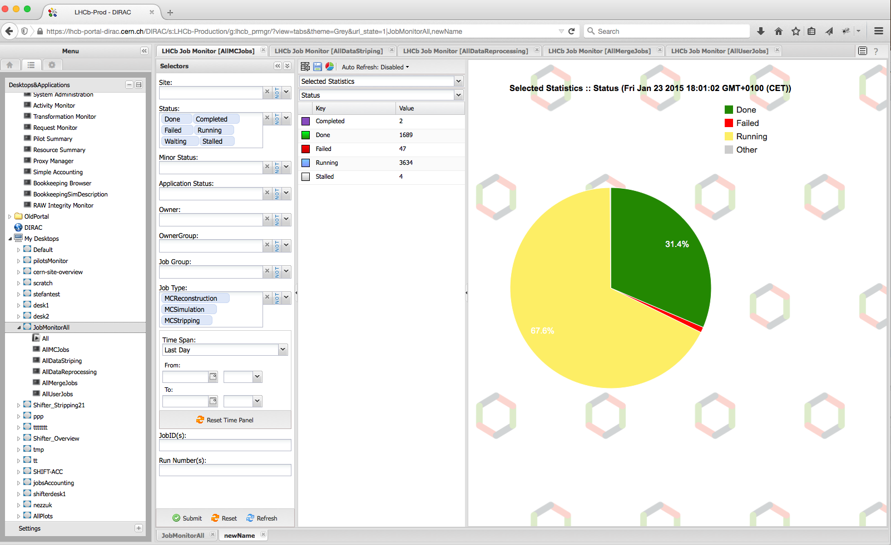

**Create Link**

This save the application/desktop *Shared* menu item. Which mean it keeps a pointer(reference) to the original desktop/application.
This will not load the application/desktop into your desktop.

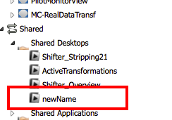

**Load & Create Link**

The desktop/application will be loaded to your desktop and it is saved under the **Shared** menu item.

**Delete shared applications/desktops**

You have to click on the menu `Manage application and desktop`_ and then select application or desktop depending what you want to delete.
For example: Let's delete the **newName** shared desktop.

.. image:: images/deletelink.png
   :scale: 50 %
   :alt: Delete link.
   :align: center

You have to select what you want to delete state or a link. As it is a shared desktop what we want to delete we have to select *Links*.
You have to click on the Delete button.

Settings panel
--------------

In the settings panel you can set up your portal.
You have to click on the **Settings** widget:

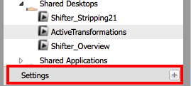

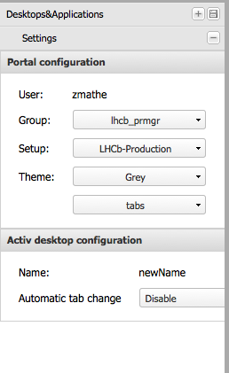

You can define the following:

* Group you can change the role
* Setup: you can switch between different setups.
* Theme you can change the look and feel and also you can switch between Tab and Desktop themes.

We have 3 look and feels:

#. Grey it is the default
#. Neptune
#. Classic

You can automatically change the applications using *Automatic tab change* Note: After you set it you have to save the desktop.
Consequently, you can not have automatic tab change in the *Default* desktop.

**Grey**

**Neptune**

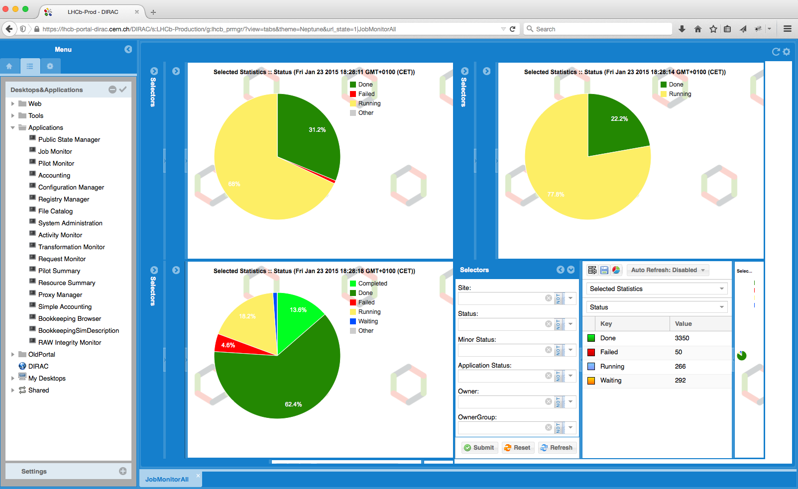

**Classic**

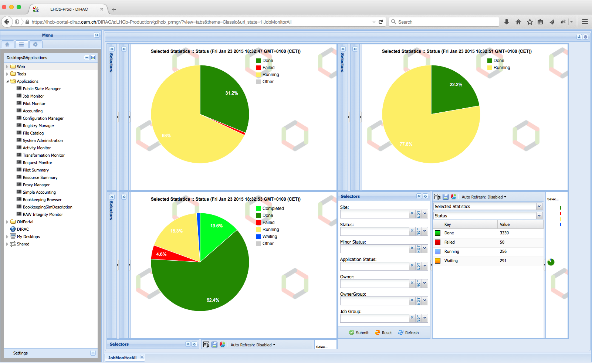

